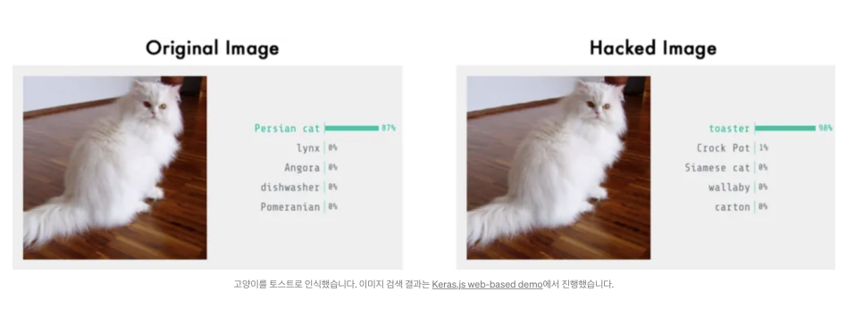

각 개념의 자세한 내용은 제 블로그에도 나와있습니다. Computer Vision 위주로.. 이미지 센싱 위주로 설명하고 있습니다.

Chat GPT와 MIT의 Goodfellow님의 책들을 참조했습니다. 제가 대학원에서 이 책으로 공부했거든요.

[https://www.deeplearningbook.org](https://www.deeplearningbook.org/)

​

이런거 다 알면서, 그리고 이런게 엄청나게 심화적인 내용은 아님에도 굳이굳이 정리하는 이유는,

제가 처음에 공부 할 때 어려웠고, 앞으로도 필요한 사람들이 있을 것 같아서요.

이 50가지 개념에 대해 각 예제는 검색엔진에 "Pytorch code"와 "matlab code"로 검색하시면 쉽게 찾을 수 있습니다.

​

그리고, 50가지 개념들은 아주 어렵습니다. 인공지능 관련 대화를 위한 50가지 용어집이라고 이해하시면 좋을 것 같습니다.

이 용어집을 다 익히면,

인공지능 관련 전공 석박사들이랑 대화나 관련 컨퍼런스에서 세미나 이해하는 것은 문제 없을겁니다.

​

시작합니다.

​

1. Adversarial Training (적대적 훈련)

Adversarial training은 머신러닝 모델을 훈련시키는 방법 중 하나입니다. 이걸 알아보기 전에, 왜 해야 하는지 알려면,

Adversarial attack에 대해 알면 더 쉽습니다.

​

Adversarial example는 작은 변화로도 모델의 잘못된 분류를 유도할 수 있습니다. 이를 이용한 Adversarial training은 모델이 잘못 분류하는 데이터에 대한 저항성을 높이는 데 효과적입니다.

​

요즘 아이폰이나 갤럭시 폰들은 얼굴인식 / 지문인식 등으로 잠금을 해제합니다. 얼굴이나 손이 붓거나, 각도가 살짝 변하거나, 얼굴에 트러블이 생겨도 잘 인식해주죠.

고양이 얼굴을 보여주면 인식을 못합니다.

근데 해커가 이 모델을 100% 이해했을 때, 각 픽셀마다 weight값을 계산하면..

고양이 얼굴에 노이즈를 추가하여 이런 잠금을 해제 할 수 있게 되는것이죠.

​

아래는 고양이 사진에 노이즈 픽셀을 추가하여, AI가 고양이를 토스터기로 잘못 인식하게 만든 사진입니다.

이런걸 악용하면,

어떻게 ATM기를 가짜 돈으로 진짜 돈으로 속일 수 있을지?

어떻게 자동차 신호위반을 하면서, 내 번호판을 다른 번호판으로 속일 수 있을지?

나중에 판사가 AI로 바뀐다면, 판사에게 어떻게 잘못된 판결을 내릴 수 있을지? 이런 것들이죠.

​

이런것들 때문에, 모델을 만들 때 일부러 트레이닝세트에 노이즈를 추가해서 모델을 좀 더 저항성을 높이는 것입니다.

관련 논문 :

[[1602.02697] Practical Black-Box Attacks against Machine Learning](https://arxiv.org/abs/1602.02697)

2. Autoencoder

Autoencoder는 입력을 압축하여 잠재 표현으로 인코딩한 후, 이를 다시 복원하여 원본 입력과의 재구성 오차를 최소화하도록 학습합니다. 이를 통해 Autoencoder는 입력 데이터의 중요한 특징을 추출하고, 잡음이나 불필요한 정보를 걸러내는 능력을 갖추게 됩니다.

오토인코더(Autoencoder)는 아래의 그림과 같이 입력을 압축하고, 출력으로 전파하는 다중 신경망입니다.

디지털 회로의 간단한 인코더/디코더가 아닌, 네트워크에 여러가지 방법으로 constraint를 줘서 오토인코더를 만들어주고, 이 오토인코더는 데이터의 차원을 축소하거나, 중요 특징을 추출하거나,노이즈를 걸러내거나 하여 데이터 출력 표현을 효율적으로 만드는 것에 대한 사용 목적이 있습니다.

​

​

3. Back propagation

Propagation 단계에서 입력 데이터를 통해 예측값을 계산하고,

Back-Propagation 단계에서 예측값과 실제값 사이의 오차를 역으로 전파하여 각 가중치의 기여도를 계산합니다.

이를 통해 오차를 최소화하는 방향으로 네트워크를 학습시키는데 사용됩니다.

​

4. RBM과 Energy Function RBM

RBM (Restricted Boltzmann Machine)은 비지도 학습을 위한 확률적 생성 모델로, 입력 데이터의 확률적 분포를 학습하는 인공 신경망 구조입니다. RBM은 입력층과 은닉층으로 구성되며, 각 노드는 이진값을 가집니다. 입력층과 은닉층 사이의 연결은 양방향으로 이루어져 있으며, 이를 통해 RBM은 데이터의 특징을 학습하고 잠재적인 상호작용을 모델링합니다. RBM은 노드의 활성화 상태에 기반하여 확률적인 샘플링을 수행하며, 이를 통해 새로운 데이터를 생성할 수 있습니다. RBM은 차원 축소, 특징 추출, 잡음 제거 등에 쓰입니다.

​

​

5. BPTT

BPTT (Backpropagation Through Time)는 순환 신경망 (Recurrent Neural Network, RNN)에서 사용되는 학습 알고리즘입니다. RNN은 시퀀스 데이터를 처리하는 데에 주로 사용되는데, BPTT는 RNN에서 시간의 흐름에 따라 역전파를 수행하여 가중치를 조정하는 방법입니다. BPTT는 RNN의 순전파 단계에서 입력 시퀀스를 처리하고, 역전파 단계에서 시간의 역순으로 오차를 전파합니다. 이를 통해 각 시간 단계에서의 오차 기여도를 계산하고, 가중치를 업데이트하여 모델을 학습시킵니다. BPTT는 RNN에서 시퀀스 데이터의 의존 관계를 고려하여 학습할 수 있게 해주는 중요한 알고리즘입니다.

​

6. Convolution and Pooling

Convolution과 Pooling은 컨볼루션 신경망 (Convolutional Neural Network, CNN)에서 사용되는 주요한 개념입니다. Convolution은 입력 데이터에 필터 또는 커널을 적용하여 특징 맵(feature map)을 생성하는 과정입니다. 이를 통해 이미지에서 특징을 추출할 수 있습니다. 필터는 작은 크기의 윈도우처럼 움직이면서 입력 데이터와의 합성곱을 계산하고, 이를 통해 특징 맵을 생성합니다. Convolution은 이미지의 공간적인 특징을 감지하고 추출하는 데에 사용됩니다. Pooling은 Convolutional Layer의 출력에서 중요한 정보를 보존하면서 공간적인 차원을 줄이는 작업입니다. 일반적으로 Max Pooling이 가장 많이 사용되며, 작은 윈도우 내에서 최대값을 선택하여 특징 맵을 다운샘플링합니다. 이를 통해 특징의 위치에 상대적인 불변성을 부여하고, 계산 비용을 줄이는 효과를 얻을 수 있습니다. Convolution과 Pooling은 CNN의 핵심 요소로, 이미지 처리와 컴퓨터 비전 작업에 주로 활용됩니다. Convolution은 특징 추출을 담당하고, Pooling은 공간적인 차원 축소와 불변성을 제공하는 역할을 수행합니다.

​

7.Convolutional Neural Networks

Convolutional Neural Networks (CNNs)는 주로 컴퓨터 비전 분야에서 이미지 인식, 객체 검출, 이미지 분할 등의 작업에 사용되는 신경망 구조입니다. CNN은 입력 데이터에 대해 합성곱 연산과 풀링 연산을 통해 특징을 추출하고, 이를 기반으로 분류나 회귀와 같은 작업을 수행합니다. CNN은 주로 Convolutional Layer, Pooling Layer, Fully Connected Layer로 구성됩니다. Convolutional Layer에서는 필터를 이용하여 입력 데이터와 합성곱 연산을 수행하여 특징 맵을 생성합니다. 이를 통해 이미지의 공간적인 특징을 추출합니다. Pooling Layer에서는 특징 맵의 공간적인 크기를 줄이고 중요한 정보를 보존합니다. Fully Connected Layer에서는 추출된 특징을 바탕으로 최종 출력을 계산하고, 분류나 회귀 등의 작업을 수행합니다. CNN은 특히 이미지 처리에 적합한 구조로, 지역적인 패턴 인식과 공간적인 구조를 잘 이해할 수 있는 능력을 갖추고 있습니다. 이를 통해 다양한 컴퓨터 비전 작업에서 뛰어난 성능을 발휘하며, 딥러닝 분야에서 가장 핵심적인 알고리즘 중 하나입니다.

​

8.Cross Entropy

Cross Entropy는 정보 이론과 확률 분포를 기반으로하는 손실 함수의 하나로, 두 확률 분포 간의 차이를 측정하는 방법입니다. 주로 분류 문제에서 예측값과 실제값 사이의 차이를 계산하는 데에 사용됩니다. Cross Entropy는 예측값의 확률 분포와 실제값의 확률 분포 사이의 차이를 계산하는데 적용됩니다. 예측값의 확률 분포는 소프트맥스 함수를 통해 얻어진 확률값이며, 실제값은 원-핫 인코딩된 벡터로 표현됩니다. Cross Entropy는 두 분포 사이의 차이를 계산하고, 이를 최소화하는 방향으로 모델의 가중치를 조정하여 분류 모델을 학습시킵니다. Cross Entropy는 분류 모델의 성능을 평가하거나, 모델의 학습을 지도하는 손실 함수로 널리 사용됩니다. 높은 Cross Entropy 값은 예측값과 실제값 간의 불일치를 나타내며, 낮은 Cross Entropy 값은 좋은 예측 성능을 나타냅니다. 따라서 Cross Entropy는 분류 모델의 학습과 평가에 중요한 지표로 활용됩니다.

​

9. Curse of Dimensionality

Curse of Dimensionality(차원의 저주)는 고차원 공간에서 데이터 분석 및 학습이 어려워지는 현상을 가리킵니다. 이는 데이터의 차원이 증가할수록 데이터 포인트 간의 거리가 멀어지고, 데이터의 특성 및 패턴을 파악하기 어려워지는 문제를 의미합니다. 차원이 증가하면 데이터 포인트의 수도 기하급수적으로 증가하며, 각 데이터 포인트 간의 거리도 멀어집니다. 이로 인해 데이터가 희소해지고, 샘플의 밀도가 감소하게 됩니다. 또한 고차원 공간에서는 거리 개념이 왜곡되어 유사성을 제대로 측정하기 어렵습니다. Curse of Dimensionality로 인해 고차원 데이터의 분석과 학습에는 데이터의 양이 많아야 하며, 차원 축소 기법 등의 전처리가 필요할 수 있습니다. 또한, 고차원 데이터에서는 모델의 복잡성이 증가하고, 과적합의 위험도 커지는 경향이 있습니다. 따라서 차원의 저주를 완화하기 위해 데이터의 차원을 적절히 선택하거나, 차원 축소 및 특성 선택 등의 방법을 활용하여 데이터 분석을 수행하는 것이 중요합니다.

​

10. DAE/CAE

DAE (Denoising Autoencoder)와 CAE (Contractive Autoencoder)는 Autoencoder의 변형된 형태로, 데이터의 특징을 학습하고 잡음 제거 또는 특징 추출에 활용됩니다. DAE는 입력 데이터에 일부 잡음을 도입하여 이를 원래 데이터로 복원하도록 학습하는 방식입니다. 잡음이 포함된 데이터를 입력으로 받아 원본 데이터를 복원하는 능력을 갖추게 됩니다. 이를 통해 DAE는 입력 데이터의 잡음을 제거하고, 더 깔끔한 특징을 추출할 수 있는 능력을 갖습니다. DAE는 데이터 잡음 제거, 데이터 압축 및 재구성, 특징 추출 등 다양한 응용 분야에서 활용됩니다. CAE는 입력 데이터의 차원을 축소하면서 중요한 특징을 보존하는 방식으로 학습하는 Autoencoder입니다. CAE는 입력 데이터를 저차원의 표현으로 인코딩하고, 다시 디코딩하여 원본 데이터를 재구성하는 과정을 거칩니다. 중요한 특징을 보존하기 위해 압축된 표현에 제약 조건을 부여하여 학습하며, 이를 통해 입력 데이터의 유의미한 특징을 추출할 수 있습니다. CAE는 특징 추출, 차원 축소, 데이터 압축 등의 작업에 유용하게 활용됩니다. 둘 다 Autoencoder의 변형으로, 데이터의 잡음 제거나 특징 추출에 효과적으로 사용됩니다.

​

​

11. Distributed Representation

Distributed Representation(분산 표현)은 정보를 고차원의 벡터로 표현하는 방법으로, 각 차원이 의미 있는 특징을 나타내는 방식입니다. 분산 표현은 개별 요소가 독립적인 의미를 갖는 희소 표현과는 달리, 벡터의 각 차원이 여러 개의 특징을 동시에 표현합니다. 분산 표현은 특징 공간에서 유사한 의미를 가진 요소들이 서로 가깝게 인코딩되는 특성을 가지고 있습니다. 예를 들어, 단어의 경우 특정 의미나 문맥과 관련된 차원들이 서로 근접하게 표현될 수 있습니다. 이를 통해 비슷한 의미를 가진 단어들이 유사한 벡터로 표현되어 정보를 보존하고 유추를 수행할 수 있는 장점을 가지게 됩니다. 분산 표현은 딥러닝에서 자주 사용되는 개념으로, Word2Vec, GloVe, BERT 등 다양한 모델에서 활용됩니다. 이러한 모델들은 텍스트, 이미지, 음성 등 다양한 데이터에서 분산 표현을 학습하여 의미를 내포한 잠재 공간을 구축하고, 다양한 자연어 처리, 이미지 인식, 문서 분류 등의 작업에 활용됩니다. 분산 표현은 효율적이고 의미론적으로 풍부한 표현 방법으로써 다양한 인공지능 애플리케이션에서 중요한 역할을 합니다.

​

12. Dropout Regularization

Dropout Regularization은 신경망의 과적합을 줄이기 위한 효과적인 정규화 방법 중 하나입니다. 학습 과정에서 랜덤하게 선택된 뉴런들을 제외시킴으로써 신경망의 일부를 무작위로 비활성화시키는 것입니다. Dropout은 각 학습 단계에서 입력층 또는 은닉층의 뉴런을 확률적으로 선택하여 제외시킵니다. 제외된 뉴런은 해당 학습 단계에선 계산에 참여하지 않으며, 신경망은 나머지 뉴런들만을 기반으로 예측 및 역전파를 수행합니다. 이를 통해 모든 뉴런에 의존하지 않고, 일부 뉴런들이 다른 뉴런들의 기능을 대신할 수 있도록 학습됩니다. Dropout은 신경망의 복잡성을 줄이고, 과적합을 억제하여 일반화 능력을 향상시킵니다. 뉴런들이 일부러 제외되는 것으로 인해 신경망은 더 강건한 특성을 학습하게 되며, 앙상블 효과를 얻을 수 있습니다. 또한, Dropout은 모델의 복잡성을 조절하면서 일반화 성능을 향상시킬 수 있는 간단하면서도 효과적인 방법으로 알려져 있습니다. 주의할 점은 테스트 단계에서는 Dropout을 적용하지 않고 모든 뉴런을 사용하여 예측을 수행해야 합니다.

​

13. Early Stopping

Early Stopping은 신경망 학습 과정에서 모델의 과적합을 방지하기 위해 사용되는 정규화 기법 중 하나입니다. 학습 과정에서 검증 데이터의 성능이 개선되지 않거나 하락하는 지점을 감지하여 학습을 조기 종료하는 방식입니다. 일반적으로 신경망은 학습 데이터에 대해서는 점차적으로 손실을 감소시키고 성능을 향상시키는 경향이 있지만, 과적합이 발생하면 검증 데이터에 대한 성능은 저조해집니다. Early Stopping은 이러한 현상을 이용하여 학습 중단 시점을 결정합니다. Early Stopping은 모델이 일정한 시간 동안 검증 데이터에 대한 성능이 향상되지 않을 때 학습을 종료합니다. 성능이 개선되지 않는 시점은 모델이 과적합되기 시작하는 시점으로 간주됩니다. 이를 통해 학습 과정을 일찍 중단함으로써 과적합을 방지하고, 일반화 성능을 향상시킬 수 있습니다. 주의할 점은 Early Stopping을 적용할 때는 학습 데이터, 검증 데이터, 테스트 데이터를 나누어야 합니다. 학습 데이터로 모델을 학습하고, 검증 데이터로 모델의 성능을 평가하며, 테스트 데이터로 최종 모델의 성능을 평가합니다. Early Stopping은 검증 데이터에 대한 성능을 모니터링하여 학습을 중단하는 방식이므로, 테스트 데이터는 최종 평가를 위해 별도로 보관되어야 합니다.

​

14. Ensemble Learning

Ensemble Learning은 여러 개의 학습 모델을 조합하여 더 강력한 예측 모델을 구축하는 기법입니다. 각 모델은 개별적으로 학습되지만, 예측 결과를 결합하여 보다 정확하고 안정적인 예측을 수행합니다. Ensemble Learning은 다양한 학습 알고리즘 또는 동일한 알고리즘의 다른 설정으로 학습된 모델들을 활용합니다. 대표적인 Ensemble Learning 방법으로는 배깅(Bagging), 부스팅(Boosting), 스태킹(Stacking) 등이 있습니다. 배깅은 학습 데이터를 부분적으로 무작위로 선택하여 서로 다른 모델들을 독립적으로 학습시키고, 예측 결과를 평균 또는 다수결로 결합합니다. 대표적인 알고리즘으로는 랜덤 포레스트(Random Forest)가 있습니다. 부스팅은 약한 학습기들을 순차적으로 학습시키고, 각 모델의 예측 오차에 가중치를 부여하여 모델을 강화시킵니다. 대표적인 알고리즘으로는 AdaBoost, Gradient Boosting, XGBoost, LightGBM 등이 있습니다. 스태킹은 다른 학습 모델들의 예측 결과를 입력으로 받아 마지막 단계에서 최종 예측을 수행하는 모델을 학습합니다. 스태킹은 여러 모델의 예측 결과를 종합하여 보다 정교한 예측을 가능하게 합니다. Ensemble Learning은 단일 모델보다 더 좋은 예측 성능과 일반화 능력을 가질 수 있습니다. 다양한 모델들의 다른 특징과 오차를 상쇄함으로써 예측의 정확성과 안정성을 향상시킬 수 있습니다.

​

15. Generative Adversarial Networks (GANs)

Generative Adversarial Networks (GAN)은 생성 모델 중 하나로, 생성자와 판별자라는 두 개의 신경망이 서로 대립하며 경쟁하는 구조를 가지고 있습니다. GAN은 생성자가 실제와 유사한 데이터를 생성하도록 학습하고, 판별자는 생성자가 생성한 데이터와 실제 데이터를 구분하는 능력을 갖추도록 학습합니다. 생성자는 초기에는 무작위한 노이즈를 입력으로 받아 가짜 데이터를 생성하며, 판별자는 이를 실제와 구분합니다. 학습이 진행됨에 따라 생성자는 점차 실제 데이터와 유사한 데이터를 생성하도록 발전하고, 판별자는 점차 더욱 정확하게 구분하도록 발전합니다. GAN은 생성자와 판별자가 서로 대립하며 경쟁하는 과정을 통해 안정적이고 실제와 유사한 데이터를 생성할 수 있습니다. 이를 통해 GAN은 이미지 생성, 음악 생성, 자연어 처리 등 다양한 분야에서 주목받고 있습니다. GAN은 이미지 생성에 특히 많이 활용되며, 실제로 실제 사진과 구별하기 힘든 가짜 이미지를 생성해내는 등 높은 수준의 생성 능력을 보여줍니다.

​

16. Generative Model

Generative Model(생성 모델)은 주어진 데이터의 분포를 학습하여 새로운 데이터를 생성하는 모델입니다. 이 모델은 주어진 데이터를 이해하고, 데이터의 패턴과 구조를 학습하여 새로운 샘플을 생성할 수 있습니다. 생성 모델은 데이터의 확률 분포를 모델링하고, 이를 기반으로 새로운 데이터를 샘플링하는 방식으로 동작합니다. 이를 통해 모델은 학습 데이터셋에 대한 특징과 통계적 구조를 파악하며, 새로운 데이터를 생성할 때에도 학습한 패턴을 따르도록 합니다. 생성 모델은 다양한 형태와 알고리즘으로 구현될 수 있습니다. 예를 들어, 확률적 생성 모델인 Gaussian Mixture Models(GMM), Variational Autoencoders(VAE), Generative Adversarial Networks(GAN) 등이 있습니다. 이러한 모델들은 이미지, 음성, 텍스트 등 다양한 데이터 유형에 대해 생성적인 능력을 갖추고 있습니다. 생성 모델은 데이터 생성, 데이터 보강, 이미지 생성, 음악 생성, 자연어 처리 등 다양한 응용 분야에서 사용됩니다. 또한, 생성 모델은 데이터 분포를 모델링하고 이를 통해 새로운 데이터를 생성하는 기능을 제공함으로써 창의적인 콘텐츠 생성과 데이터 생성에 활용될 수 있습니다.

​

17. Gradient Descent

Gradient Descent(경사 하강법)은 함수의 최솟값을 찾기 위해 사용되는 최적화 알고리즘입니다. 주어진 함수의 기울기(경사)를 이용하여 함수의 최솟값을 찾아가는 방법입니다. 경사 하강법은 함수의 기울기가 최솟값을 가리키는 방향으로 이동하는 것을 기반으로 합니다. 시작점에서 시작하여 현재 위치에서의 기울기를 계산하고, 그 방향으로 일정한 학습률(learning rate)을 곱한 만큼 이동합니다. 이 과정을 최솟값에 도달할 때까지 반복합니다. 경사 하강법은 학습률과 초기값에 따라 최솟값에 도달하는 속도와 정확도가 달라질 수 있습니다. 너무 큰 학습률을 사용하면 최솟값을 지나칠 수 있고, 너무 작은 학습률을 사용하면 수렴 속도가 느려질 수 있습니다. 또한, 초기값에 따라 다른 최솟값에 수렴할 수 있기 때문에 초기값 설정에 주의해야 합니다. 경사 하강법은 머신러닝에서 모델의 파라미터를 조정하고 손실 함수를 최소화하는 데 주로 사용됩니다. 모델의 파라미터를 조정하여 손실 함수를 최소화함으로써 모델을 학습시키는 과정에서 경사 하강법이 사용되는데, 이를 통해 모델의 성능을 향상시키는 것이 목표입니다.

​

18. Greedy Layer-Wise Unsupervised Traning

ChatGPT Greedy Layer-Wise Unsupervised Training은 비지도 학습 방법 중 하나로, 심층 신경망의 초기화를 위해 사용되는 기법입니다. 이 방법은 심층 신경망을 한 층씩 순차적으로 학습하여 전체 신경망을 구성하는 방식입니다. Greedy Layer-Wise Unsupervised Training은 각 층을 독립적인 오토인코더(Autoencoder) 또는 제한된 볼츠만 머신(Restricted Boltzmann Machine, RBM)과 같은 비지도 학습 모델로 사전 학습합니다. 각 층은 입력 데이터의 잠재적인 표현을 학습하여, 층별로 더 의미 있는 특징을 추출할 수 있도록 합니다. 각 층은 단일 오토인코더나 RBM으로 사전 학습되고, 그 다음에는 다음 층의 입력으로 사용됩니다. 이를 반복하여 모든 층이 사전 학습된 후에는 전체 심층 신경망을 구성하고, 전체 신경망을 역전파 알고리즘을 통해 미세 조정합니다. 이러한 Greedy Layer-Wise Unsupervised Training 방법은 초기화 단계에서 심층 신경망이 지역 최적해에 갇히지 않고 더 나은 전역 최적해로 수렴할 수 있도록 도와줍니다. 층별로 사전 학습을 수행하여 초기 가중치를 좋은 초기값으로 설정함으로써 전체 신경망의 성능과 수렴 속도를 향상시킬 수 있습니다.

​

19. KL Divergence/MLE

KL Divergence(Kullback-Leibler Divergence)은 두 개의 확률 분포 간의 차이를 측정하는 지표입니다. 주로 정보 이론에서 사용되며, 두 분포가 얼마나 다른지를 나타냅니다. KL Divergence는 주어진 확률 분포 P와 Q 간의 비교를 위해 사용됩니다. P와 Q가 완전히 동일한 분포라면 KL Divergence는 0이 됩니다. 하지만 P와 Q가 다를수록 KL Divergence는 증가합니다. KL Divergence는 비대칭적이며, 즉, KL(P||Q)와 KL(Q||P)는 서로 다를 수 있습니다. 최대 우도 추정(Maximum Likelihood Estimation, MLE)은 관측된 데이터를 기반으로 모델의 파라미터를 추정하는 통계적 방법입니다. MLE는 주어진 데이터에 대해 가장 가능성이 높은 모델 파라미터를 찾는 것을 목표로 합니다. KL Divergence는 MLE의 일부로 사용되는데, MLE에서는 모델의 예측 분포와 실제 분포 사이의 KL Divergence를 최소화하는 파라미터를 추정합니다. 이를 통해 모델을 실제 데이터에 가장 잘 적합시키는 것을 목표로 합니다. 따라서, KL Divergence는 두 분포 간의 차이를 측정하고, MLE는 KL Divergence를 활용하여 모델 파라미터를 추정하는 방법입니다. MLE는 확률적인 모델링에서 널리 사용되며, KL Divergence를 통해 모델의 적합도를 평가하고 개선할 수 있습니다.

​

20. K-Nearest Neighbors Algorithm

K-Nearest Neighbors(K-NN) 알고리즘은 분류(classification)와 회귀(regression) 문제에 사용되는 간단하고 직관적인 알고리즘입니다. 주어진 데이터셋 내에서 가장 가까운 K개의 이웃 데이터를 기반으로 새로운 데이터를 분류하거나 예측하는 방법입니다. K-NN 알고리즘은 주어진 데이터셋 내에서 새로운 데이터 포인트와 가장 가까운 이웃들을 찾습니다. 일반적으로 유클리디안 거리(Euclidean distance)를 사용하여 데이터 포인트 간의 거리를 계산합니다. 이웃 데이터 포인트들은 다수결 방식으로 분류 문제에서는 다수 클래스로 분류되고, 회귀 문제에서는 평균 또는 가중 평균을 사용하여 값을 예측합니다. K-NN 알고리즘은 비모수적이며, 학습 단계에서 모델을 구축하지 않습니다. 대신에 새로운 데이터가 주어질 때마다 거리 기반의 이웃들을 계산하고 분류 또는 회귀를 수행합니다. 이러한 특성은 K-NN을 간단하게 구현하고 이해하기 쉽게 만들어주는 장점입니다. K-NN 알고리즘은 데이터가 밀집된 지역에서는 좋은 성능을 보이지만, 데이터가 희소하거나 차원이 높은 경우에는 성능이 저하될 수 있습니다. 또한, 이웃의 개수(K)를 선택하는 것이 중요한데, 적절한 K 값 선택이 예측 성능에 영향을 미칩니다. K-NN 알고리즘은 간단하면서도 유용한 알고리즘이지만, 대량의 데이터셋에서는 계산 비용이 크고 예측 속도가 느릴 수 있으므로 데이터의 양과 특성에 적합한 사용법을 고려해야 합니다.

​

21. Learning Rate Decay

Learning Rate Decay(학습률 감소)는 학습 과정에서 사용되는 학습률(learning rate)을 점진적으로 감소시키는 기법입니다. 학습률은 모델의 파라미터를 업데이트할 때 사용되는 스케일링 요소로, 얼마나 크게 갱신할지를 결정합니다. 학습률 감소는 초기에는 큰 학습률로 시작하여 전역 최적점에 빠르게 수렴하고, 이후에는 작은 학습률로 조정함으로써 정확한 최적점 주변에서 더 세밀한 조정을 가능하게 합니다. 이를 통해 학습 과정에서 진동을 줄이고 수렴 속도를 향상시킬 수 있습니다. 학습률 감소 방법에는 여러 가지가 있습니다. 일반적으로는 두 가지 주요 접근 방식이 사용됩니다: Step Decay: 특정 epoch 또는 일정 간격마다 학습률을 고정된 비율로 감소시키는 방법입니다. 예를 들어, 매 10번째 epoch마다 학습률을 0.1배씩 줄이는 것입니다. Exponential Decay: 각 epoch 또는 일정 간격마다 학습률을 지수 함수 형태로 감소시키는 방법입니다. 예를 들어, 매 epoch마다 학습률을 초기 학습률에 지수 감소율을 적용하는 것입니다. 학습률 감소는 모델의 일반화 성능을 향상시키는 데 도움이 되며, 학습 과정에서 발생하는 오버피팅(overfitting)의 위험을 줄일 수 있습니다. 하지만 적절한 학습률 감소 스케줄을 선택하는 것은 중요하며, 문제에 따라 최적의 감소 방법이 달라질 수 있습니다.

​

22.Linear Separability

Linear Separability(선형 분리 가능성)은 다차원 공간에서 데이터 포인트들을 선형 경계로 완벽하게 분류할 수 있는지를 나타내는 개념입니다. 간단히 말해, 데이터 포인트들을 하나의 초평면으로 나눌 수 있는지 여부를 판단하는 것입니다. 선형 분리 가능한 데이터는 클래스 간의 경계가 선, 평면 또는 초평면으로 완전히 구분되어 분류할 수 있습니다. 이러한 경우, 선형 분류기(예: 선형 회귀, 로지스틱 회귀, 서포트 벡터 머신 등)를 사용하여 데이터를 분류할 수 있습니다. 그러나 선형 분리 가능성이 없는 경우에는 비선형 분류기를 사용해야 합니다. 비선형 분류기는 고차원 공간으로 데이터를 매핑하여 분류 경계를 만들거나, 커널 기법을 활용하여 데이터를 비선형적으로 분리할 수 있습니다. 선형 분리 가능성은 주어진 데이터셋이 선형 분류에 적합한지를 판단하는 데 사용되며, 분류 모델의 선택과 모델의 성능을 평가하는 데에 중요한 역할을 합니다.

​

23.Long Short-Term Memory Networks (LSTMs)

Long Short-Term Memory Networks (LSTMs)는 순환 신경망(Recurrent Neural Networks, RNN)의 한 종류로, 시퀀스 데이터에서 장기 의존성(Long-term dependencies)을 학습하는 데 효과적인 구조입니다. LSTM은 기존의 RNN 구조에서 발생할 수 있는 기울기 소실 문제(vanishing gradient problem)를 완화하기 위해 고안되었습니다. LSTM은 각 시간 단계에서 정보를 기억하고 전달하는 메모리 셀(memory cell)로 구성되어 있으며, 입력 게이트(input gate), 삭제 게이트(forget gate), 출력 게이트(output gate)라는 세 가지 게이트를 통해 정보의 흐름을 제어합니다. 입력 게이트는 현재 시간 단계의 입력을 얼마나 반영할지를 결정하고, 삭제 게이트는 이전 시간 단계의 메모리 셀 상태 중에서 어떤 정보를 삭제할지를 결정합니다. 출력 게이트는 현재 시간 단계의 출력을 얼마나 반영할지를 결정하여 최종 예측을 만듭니다. LSTM은 장기 의존성을 학습할 수 있는 능력을 갖추고 있어, 시퀀스 데이터에서 긴 의존성을 포착하고 이를 활용하여 다양한 작업에 적용할 수 있습니다. 자연어 처리, 음성 인식, 기계 번역 등 다양한 영역에서 LSTMs가 성공적으로 사용되고 있습니다.

​

24.Manifold

Manifold(다양체)는 공간에서 일반적으로 말하는 평면, 곡면 또는 고차원 구조를 의미합니다. 간단히 말해, Manifold는 데이터가 분포하는 공간의 형태를 설명하는 수학적 개념입니다. 데이터는 일반적으로 고차원 공간에서 표현되지만, 이러한 고차원 데이터를 이해하고 처리하기는 어려울 수 있습니다. Manifold 개념은 데이터가 실제로 고차원 공간에서 저차원 Manifold에 가깝게 분포되어 있다는 가정을 기반으로 합니다. 이렇게 저차원 Manifold에 데이터를 표현하면 데이터의 구조와 패턴을 더 잘 이해하고 모델링할 수 있습니다. Manifold 학습은 고차원 데이터를 저차원 Manifold로 매핑하는 방법을 찾는 것을 의미합니다. 이를 통해 데이터의 차원 축소, 시각화, 패턴 인식, 클러스터링 등 다양한 작업에 활용할 수 있습니다. 예를 들어, 주성분 분석(Principal Component Analysis, PCA)는 데이터의 주요한 변동성을 설명하는 Manifold를 찾는 데 사용되며, t-SNE(t-Distributed Stochastic Neighbor Embedding)는 고차원 데이터를 시각화하기 위해 Manifold 매핑을 수행합니다. Manifold 개념은 데이터 분석과 머신 러닝에서 중요한 개념으로, 데이터의 내재된 구조를 이해하고 모델링하는 데 도움을 줍니다.

​

25. Max Pooling

Max Pooling은 합성곱 신경망(Convolutional Neural Networks, CNN)에서 사용되는 풀링(pooling) 방법 중 하나입니다. 주로 이미지 처리에서 사용되며, 입력 영상의 공간적인 차원을 줄이고 중요한 정보를 추출하는 역할을 합니다. Max Pooling은 입력 영상을 격자 형태의 작은 영역으로 분할하고, 각 영역에서 가장 큰 값을 선택하여 출력 영상에 대응하는 위치에 저장하는 과정을 반복합니다. 이렇게 함으로써, 입력 영상의 공간적인 해상도를 줄이고 불필요한 세부 정보를 제거함으로써 계산 및 메모리 요구 사항을 줄이고, 특징의 위치에 상대적인 불변성을 제공합니다. Max Pooling은 특징 맵(feature map)의 크기를 줄이고 중요한 특징을 강조하는 효과가 있습니다. 작은 변화에 덜 민감해지는 효과로 인해 일반화 능력을 향상시키고, 모델의 과적합(overfitting)을 방지하는 역할을 합니다. 또한, 시각적인 변화에 대한 불변성을 제공하여 객체의 크기나 위치의 변화에 상관없이 동일한 특징을 추출할 수 있게 합니다. Max Pooling은 CNN의 일반적인 구조에서 자주 사용되는 연산 중 하나이며, 이미지 분류, 객체 검출, 이미지 분할 등 다양한 컴퓨터 비전 작업에서 유용하게 적용됩니다.

​

26. Mean Squared Error (MSE)

Mean Squared Error (MSE)는 예측 모델의 성능을 평가하는 데 사용되는 오차 측정 지표입니다. MSE는 예측 값과 실제 값 간의 차이를 제곱하여 평균화한 값입니다. MSE는 다음과 같은 공식으로 계산됩니다: MSE = (1/n) * Σ(y - ŷ)^2 여기서, n은 데이터 포인트의 수를 나타내며, y는 실제 값, ŷ는 예측 값입니다. MSE는 실제 값과 예측 값 간의 차이를 제곱하여 평균화하기 때문에 오차의 크기에 민감하게 반응합니다. MSE는 오차 제곱의 평균을 계산하므로, 오차가 클수록 더 큰 값으로 표현됩니다. 따라서 MSE가 작을수록 예측 모델의 성능이 좋다고 판단할 수 있습니다. MSE는 회귀 문제에서 자주 사용되며, 예측 값과 실제 값 사이의 평균적인 오차를 측정하는 데 유용합니다. 그러나 MSE는 오차 제곱에 의해 큰 오차에 민감하게 반응하기 때문에 이상치(outlier)에 민감할 수 있습니다. 이상치가 있는 경우 평균 제곱 오차가 크게 증가할 수 있으므로, 이를 감안하여 모델을 평가해야 합니다.

​

27. Mini-Batch Gradient Descent

Mini-Batch Gradient Descent는 경사 하강법(Gradient Descent)의 한 변종으로, 학습 과정에서 전체 데이터셋을 한 번에 처리하는 대신, 작은 미니 배치(mini-batch)로 데이터를 나누어 학습하는 방법입니다. Mini-Batch Gradient Descent는 다음과 같은 단계로 진행됩니다: 데이터셋을 미니 배치로 나눕니다. 각 미니 배치는 여러 개의 데이터 샘플로 구성됩니다. 각 미니 배치에 대해 경사 하강법을 수행합니다. 즉, 미니 배치에 속한 데이터 샘플들을 모델에 입력으로 주고, 손실 함수의 그래디언트를 계산하여 모델의 가중치를 업데이트합니다. 모든 미니 배치에 대한 경사 하강법 업데이트를 수행한 후, 다음 에포크(epoch)로 넘어갑니다. 에포크는 전체 데이터셋을 한 번 학습하는 단위입니다. Mini-Batch Gradient Descent는 전체 데이터셋을 한 번에 처리하는 경사 하강법보다 효율적인 학습을 가능하게 합니다. 작은 미니 배치를 사용함으로써 병렬 처리가 가능하며, 계산 및 메모리 요구 사항을 줄일 수 있습니다. 또한, 미니 배치의 임의성(randomness)은 모델의 일반화 성능을 향상시킬 수 있습니다. 미니 배치의 크기는 사용자가 지정해야 하는 하이퍼파라미터이며, 일반적으로 수십에서 수백 개의 데이터 샘플을 포함합니다. 미니 배치의 크기에 따라 학습 속도와 경사 하강법의 수렴 속도가 달라질 수 있으므로, 적절한 미니 배치 크기를 선택하는 것이 중요합니다.

​

28.Momentum Optimization Algorithm

Momentum Optimization Algorithm은 경사 하강법(Gradient Descent)의 한 변종으로, 기울기의 속도와 방향을 고려하여 모델의 가중치를 업데이트하는 방법입니다. 이 알고리즘은 경사 하강법의 수렴 속도를 개선하고 지역 최솟값(local minimum)에서 빠져나올 수 있는 특성을 가지고 있습니다.

Momentum은 물리학에서의 용어로, 물체가 가속도를 얻어서 관성을 가지고 움직이는 현상을 나타냅니다. Momentum Optimization Algorithm은 이 개념을 모델의 학습에 적용하여 이전의 업데이트 방향과 속도를 기억하고 활용합니다.

알고리즘은 다음과 같이 진행됩니다:

1. 이전 업데이트에서의 모멘텀(momentum) 값을 저장합니다. 초기에는 0 또는 작은 값으로 설정됩니다.

2. 각 가중치에 대해 현재의 기울기를 계산합니다.

3. 모멘텀 값에 기반하여 가중치 업데이트를 수행합니다. 이전 업데이트 방향과 현재의 기울기를 합친 값으로 업데이트합니다.

4. 다음 업데이트를 위해 모멘텀 값을 업데이트합니다.

Momentum Optimization Algorithm은 기울기의 크기가 큰 경우에는 모멘텀 값을 크게 설정하여 빠르게 이동하고, 기울기의 크기가 작은 경우에는 모멘텀 값을 작게 설정하여 부드럽게 이동합니다. 이를 통해 지역 최솟값에서 빠져나와 글로벌 최솟값(global minimum)을 찾는 데 도움을 줍니다.

Momentum Optimization Algorithm은 학습 속도를 향상시키고, 지역 최솟값에 빠지는 문제를 완화하는 효과가 있습니다. 특히, 고차원 공간에서 복잡한 함수를 최적화할 때 유용하게 사용됩니다.

​

29. Monte Carlo Simulation

Monte Carlo Simulation은 확률과 통계를 기반으로 한 수치 계산 방법 중 하나입니다. 이 방법은 확률적인 요소가 포함된 문제를 해결하거나, 불확실성을 다루는 데 사용됩니다.

Monte Carlo Simulation은 확률 모형을 구성하고, 이를 기반으로 임의의 난수를 생성하여 여러 번의 실험을 수행합니다. 이를 통해 수많은 가능성을 고려하고, 통계적인 결과를 추정하거나 예측할 수 있습니다.

실제로 Monte Carlo Simulation은 다음과 같은 과정으로 진행됩니다:

1. 문제의 확률 모형을 구성합니다. 이는 문제의 특성에 맞게 결정되며, 주로 확률 분포나 확률밀도함수를 사용하여 표현됩니다.

2. 정의된 확률 모형을 기반으로 난수를 생성합니다. 이는 문제의 확률 모형에 따라 적절한 난수 생성 방법을 사용합니다.

3. 생성된 난수를 이용하여 모형에 대한 실험을 수행합니다. 이는 확률 모형을 이용하여 필요한 변수를 결정하고, 문제에 대한 적절한 계산을 수행하는 과정입니다.

4. 실험을 여러 번 반복하여 통계적인 결과를 얻습니다. 이를 통해 평균, 분산, 신뢰구간 등을 추정하거나, 문제에 대한 예측을 수행할 수 있습니다.

Monte Carlo Simulation은 불확실성이나 확률적인 요소가 포함된 문제를 다루는 데 유용합니다. 예를 들어, 금융 분야에서는 주가 모델링, 옵션 가치 평가 등에 사용될 수 있습니다. 또한, 물리학, 공학, 운송 및 로직 시스템 등 다양한 분야에서도 널리 활용되고 있습니다.

​

30. multi-modal learning

Multi-modal learning은 다양한 종류의 데이터 또는 모달리티(modality)로부터 지식을 추출하고 통합하여 학습하는 방법입니다. 여기서 모달리티는 서로 다른 형태나 특성을 가진 데이터 유형을 의미합니다. 주로 시각적인 이미지, 음성, 텍스트 등 다양한 유형의 데이터가 결합되어 사용됩니다.

Multi-modal learning은 단일 유형의 데이터만 사용하는 단일 모달리티 학습과는 달리, 다양한 모달리티에서 정보를 수집하고 상호 연관성을 활용하여 더 풍부한 표현과 이해력을 갖는 학습을 가능하게 합니다. 이를 통해 데이터의 다양한 측면을 고려하고, 다중 모달리티의 상호작용을 이해하는 데 도움이 됩니다.

예를 들어, 동영상 분석에서는 비디오 데이터와 음성 데이터를 결합하여 객체 인식, 행동 인식, 감정 분석 등을 수행할 수 있습니다. 또한 자율 주행 자동차의 경우, 비디오 데이터, 라이다 데이터, 센서 데이터 등 다양한 모달리티를 활용하여 환경 인식과 주행 결정을 수행합니다.

Multi-modal learning은 각 모달리티로부터 추출된 특징을 통합하거나, 각 모달리티 간의 상호작용을 모델링하여 복합적인 학습 결과를 얻을 수 있습니다. 이는 효과적인 데이터 표현과 패턴 인식, 문제 해결에 도움을 줄 수 있습니다.

​

31. One-Shot Learning

One-Shot Learning은 매우 제한된 수의 학습 샘플로부터 새로운 클래스를 인식하거나 학습하는 머신러닝 기법입니다. 일반적으로 기존의 머신러닝 모델은 많은 양의 학습 데이터를 필요로 하지만, One-Shot Learning은 단 한 번의 학습 예제만으로도 새로운 클래스를 학습할 수 있습니다.

One-Shot Learning은 현실에서 우리가 직면하는 상황과 유사합니다. 우리는 일반적으로 새로운 개념을 학습할 때 많은 예제를 필요로 하지 않습니다. 예를 들어, 새로운 얼굴을 보고 해당 인물을 식별하는 것은 일반적으로 한 번의 관찰만으로 가능합니다.

One-Shot Learning은 다양한 방법으로 구현될 수 있습니다. 일반적인 접근 방법은 지능적인 특징 추출과 비교를 기반으로 합니다. 미리 학습된 모델을 사용하여 이미지나 텍스트 데이터의 특징을 추출하고, 새로운 입력과 이전의 학습 샘플 간의 유사성을 비교하여 분류 또는 인식을 수행합니다.

One-Shot Learning은 학습 데이터가 제한적인 상황에서 유용하며, 인식 또는 분류에 대한 빠른 응답이 필요한 경우에도 활용될 수 있습니다. 예를 들어, 의료 진단이나 보안 시스템에서 새로운 클래스의 인식이 필요한 경우에 유용하게 사용될 수 있습니다.

​

32. Overfitting and Underfitting

Overfitting과 Underfitting은 머신러닝 모델이 학습 데이터에 대해 과적합(overfitting) 또는 과소적합(underfitting)되는 현상을 나타냅니다.

Overfitting은 모델이 학습 데이터에 지나치게 맞추어져서, 학습 데이터에서는 높은 성능을 보이지만 새로운 데이터나 테스트 데이터에서는 성능이 저하되는 경우입니다. 이는 모델이 학습 데이터의 잡음이나 미세한 변동에 대해서도 과도하게 반응하여 일반화 능력이 떨어지게 됩니다.

Underfitting은 모델이 학습 데이터에 제대로 적합되지 못하여, 학습 데이터와 테스트 데이터에서 모두 성능이 낮은 경우입니다. 이는 모델이 학습 데이터의 패턴을 충분히 파악하지 못하거나, 모델의 복잡성이 너무 낮아서 데이터의 다양성을 충분히 표현하지 못하는 경우입니다.

Overfitting과 Underfitting은 모델의 일반화 능력을 해치는 문제로, 이를 최소화하기 위해 조정이 필요합니다. 일반적으로 Overfitting을 해결하기 위해 regularization 기법이나 데이터 augmentation, 모델의 복잡성 조절 등을 사용합니다. Underfitting은 모델의 복잡성을 높이거나, 데이터의 다양성을 증가시켜 해결할 수 있습니다.

적절한 모델의 복잡성과 데이터의 다양성을 고려하여 Overfitting과 Underfitting을 최소화하는 것이 중요합니다. 이를 통해 모델이 새로운 데이터에 대해서도 일반화된 성능을 보이고, 실제 문제에 대해 정확하고 신뢰할 수 있는 예측을 수행할 수 있습니다.

​

33. Pre-Conditioning

Pre-Conditioning은 데이터를 사전에 변환하여 학습 알고리즘의 수렴 속도를 향상시키거나 성능을 개선하는 기법입니다. 주어진 데이터를 더 적합한 형태로 가공하거나 스케일을 조정함으로써, 학습 알고리즘이 더 잘 작동하도록 돕는 것이 목적입니다.

Pre-Conditioning은 데이터 전처리 단계에서 수행될 수 있으며, 다양한 방법과 기법이 사용될 수 있습니다. 일반적으로 사용되는 Pre-Conditioning 기법으로는 다음과 같은 것들이 있습니다:

1. Feature Scaling: 데이터의 특징들을 동일한 범위로 스케일 조정합니다. 일반적으로 Min-Max 스케일링이나 표준화(Z-score normalization)를 사용하여 데이터를 표준 범위로 변환합니다.

2. Feature Transformation: 데이터의 특징들을 새로운 형태로 변환합니다. 주성분 분석(Principal Component Analysis, PCA)이나 선형 또는 비선형 변환 등을 사용하여 데이터의 차원을 축소하거나 새로운 표현으로 변환합니다.

3. 데이터 정제 및 이상치 처리: 데이터에서 결측치나 이상치를 제거하거나 대체하여 데이터의 품질을 향상시킵니다.

4. 데이터 증강: 기존 데이터를 변형하거나 합성하여 학습 데이터셋을 더 다양하고 풍부하게 만듭니다. 회전, 이동, 뒤집기 등의 변형을 적용하거나 생성 모델을 사용하여 새로운 데이터를 생성합니다.

Pre-Conditioning은 데이터의 특성과 문제의 성격에 따라 다양하게 적용될 수 있습니다. 적절한 Pre-Conditioning 기법을 선택하고 적용함으로써, 학습 알고리즘의 수렴 속도를 향상시키고 모델의 성능을 향상시킬 수 있습니다.

​

34. Principal Component Analysis (PCA)

주성분 분석(Principal Component Analysis, PCA)은 다차원 데이터의 차원을 축소하거나 데이터를 변환하는 기법 중 하나입니다. 주로 데이터의 특징 추출, 차원 축소, 데이터 시각화 등에 사용됩니다.

PCA는 주어진 데이터의 가장 중요한 변동성을 설명하는 주성분을 찾아내는 방법입니다. 주성분은 데이터의 분산을 최대화하는 축으로 정의됩니다. 즉, 가장 많은 정보를 유지하면서 데이터의 차원을 줄이는 것이 목표입니다.

PCA는 다음과 같은 단계로 수행됩니다:

1. 데이터의 중심을 원점으로 이동시킵니다.

2. 데이터의 공분산 행렬을 계산합니다.

3. 공분산 행렬의 고유값과 고유벡터를 구합니다.

4. 고유값을 기준으로 고유벡터를 정렬합니다.

5. 주성분을 선택하여 데이터를 새로운 공간으로 변환합니다.

PCA는 가장 큰 고유값에 해당하는 주성분부터 순서대로 선택하여 차원을 축소할 수 있습니다. 이렇게 축소된 차원은 원래 데이터의 변동성을 가능한 한 보존하면서도 차원을 줄이는 효과를 가지게 됩니다.

PCA는 차원 축소를 통해 데이터의 복잡성을 감소시키고, 노이즈나 상관관계가 낮은 특성들을 제거하여 더 간결하고 유의미한 데이터 표현을 얻을 수 있습니다. 또한, PCA를 사용하여 데이터를 시각화하면 데이터 간의 패턴과 관계를 파악할 수 있습니다. PCA는 다양한 분야에서 차원 축소, 특징 추출, 데이터 압축, 데이터 시각화 등에 활용되는 유용한 도구입니다.

​

35. Radial Basis Function Kernel Neural Network

Radial Basis Function Kernel Neural Network(RBF Kernel NN)은 신경망과 Radial Basis Function(RBF) 커널을 결합한 모델입니다. 이 모델은 비선형 데이터를 처리하고 패턴을 학습하는 데 사용됩니다.

RBF 커널은 데이터 포인트 간의 유사도를 계산하는 함수로 사용됩니다. RBF 커널은 데이터의 특징 공간에서 가우시안 함수의 형태로 정의되며, 데이터 포인트 간의 거리를 기반으로 유사도를 측정합니다. 이를 통해 RBF 커널은 데이터를 고차원 특징 공간으로 매핑하여 비선형 패턴을 모델링할 수 있습니다.

RBF Kernel NN은 RBF 커널을 사용하여 신경망의 은닉층과 연결된 가중치를 학습합니다. 은닉층의 뉴런은 RBF 커널 함수를 적용하여 입력 데이터와 가중치 간의 유사도를 계산하고, 이를 바탕으로 출력을 결정합니다. 이러한 방식으로 RBF Kernel NN은 비선형 패턴을 모델링하고, 복잡한 결정 경계를 생성할 수 있습니다.

RBF Kernel NN은 주로 분류 문제에 사용되며, 특히 비선형적인 클래스 구분이 필요한 경우에 효과적입니다. RBF 커널을 통해 입력 데이터를 고차원 공간으로 매핑하고, 신경망을 통해 이를 학습하여 데이터의 비선형 특성을 모델링할 수 있습니다. 이를 통해 RBF Kernel NN은 다양한 분야에서 패턴 인식, 데이터 마이닝, 예측 등의 작업에 활용될 수 있습니다.

​

36. Rectified Linear Units (ReLUs)

Rectified Linear Units (ReLUs)은 인공신경망에서 주로 사용되는 활성화 함수 중 하나입니다. ReLU는 입력 값이 양수인 경우에는 그 값을 그대로 출력하고, 음수인 경우에는 0을 출력하는 함수입니다.

ReLU 함수는 다음과 같이 정의됩니다: f(x) = max(0, x)

여기서 x는 입력 값이며, f(x)는 출력 값입니다. 입력 값이 0보다 작을 경우 출력은 0이 되고, 0보다 크거나 같을 경우에는 입력 값 그대로 출력됩니다. 이러한 특징 때문에 ReLU는 선형 연산을 간단하게 처리하며, 신경망의 학습을 빠르게 진행할 수 있는 장점이 있습니다.

ReLU의 가장 큰 장점은 비선형성을 가지면서도 계산이 간단하다는 점입니다. 이를 통해 신경망은 비선형 패턴을 모델링할 수 있습니다. 또한, ReLU는 경사 소실 문제를 완화할 수 있어 심층 신경망의 학습에 유리합니다.

ReLU는 이미지 분류, 객체 검출, 음성 인식 등 다양한 인공지능 작업에서 성능이 입증되었습니다. 그러나 입력 값이 음수인 경우에는 그래디언트가 0이 되어 해당 뉴런이 학습에 참여하지 않게 되는 "죽은 ReLU" 문제가 발생할 수 있습니다. 이러한 문제를 해결하기 위해 Leaky ReLU, Parametric ReLU 등의 변형된 ReLU 함수들이 제안되기도 합니다.

​

37. Recurrent Neural Networks (RNNs)

Recurrent Neural Networks (RNNs)은 순차적인 데이터를 처리하고 이전 정보를 기억하는 데 사용되는 인공신경망의 한 종류입니다. RNN은 순환 구조를 가지며, 이전 단계의 출력을 현재 단계의 입력으로 사용하여 시간적인 의존성을 모델링할 수 있습니다.

RNN은 입력 데이터와 함께 순차적으로 시간 단계를 따라 처리됩니다. 각 시간 단계에서 RNN은 현재 입력과 이전 시간 단계의 출력을 기반으로 새로운 출력을 계산합니다. 이러한 반복 과정을 통해 RNN은 이전 정보를 기억하고 현재 입력과 결합하여 다음 단계의 출력을 예측합니다.

RNN은 다양한 도메인에서 시계열 데이터, 자연어 처리, 기계 번역 등에 사용됩니다. RNN의 장점은 시퀀스 데이터의 길이에 관계없이 입력과 출력의 연관성을 학습할 수 있다는 점입니다. 또한, RNN은 가변적인 길이의 입력 시퀀스를 처리할 수 있어 자연어 처리와 같은 작업에 효과적입니다.

그러나 RNN은 장기 의존성 문제를 가질 수 있습니다. 긴 시퀀스에서는 초기 정보가 멀리 떨어진 단계에서 사라지는 경향이 있어 학습이 어려울 수 있습니다. 이를 해결하기 위해 LSTM(Long Short-Term Memory)이나 GRU(Gated Recurrent Unit)와 같은 변형된 RNN 아키텍처가 개발되었습니다. 이러한 변형된 RNN 아키텍처는 장기 의존성 문제를 완화하고 긴 시퀀스에서도 정보를 유지할 수 있도록 합니다.

​

38. Regression

Regression은 주어진 입력 데이터와 연속적인 출력 값 사이의 관계를 모델링하는 지도 학습(Supervised Learning) 알고리즘의 한 종류입니다. Regression은 입력 변수와 출력 변수 간의 관계를 파악하고, 새로운 입력 값에 대한 출력 값을 예측하는 데 사용됩니다.

Regression은 종속 변수(또는 출력 변수)와 하나 이상의 독립 변수(또는 입력 변수) 사이의 관계를 찾는 문제입니다. 종속 변수는 연속적인 수치 값이며, 독립 변수는 관측된 특징이나 속성으로 구성됩니다. Regression 모델은 주어진 입력 변수의 패턴과 종속 변수 간의 관계를 학습하여 새로운 입력 값에 대한 예측 값을 제공합니다.

Regression은 예측, 추세 분석, 회귀 분석 등 다양한 분야에서 활용됩니다. 예를 들어, 주택 가격 예측, 매출 예측, 센서 데이터 분석 등의 문제에 Regression을 사용할 수 있습니다. Regression 모델은 입력 변수와 출력 변수 간의 복잡한 관계를 모델링할 수 있으며, 학습된 모델을 사용하여 새로운 입력 값을 예측하거나 해당 변수들 간의 상관성을 분석할 수 있습니다.

​

39. Regularization Techniques

Regularization Techniques은 머신러닝 모델의 과적합(Overfitting)을 방지하고 일반화 성능을 향상시키기 위해 사용되는 기법들의 모음입니다. 과적합은 모델이 학습 데이터에 지나치게 맞추어져 새로운 데이터에 대한 성능이 저하되는 현상을 의미합니다. Regularization Techniques은 모델의 복잡성을 제어하고 가중치를 제한하여 일반화 성능을 개선합니다.

일반적으로 사용되는 Regularization Techniques에는 다음과 같은 것들이 있습니다:

1. L1 Regularization (Lasso): 모델의 손실 함수에 가중치의 절댓값에 대한 패널티를 추가하여 특정 가중치들을 0으로 만들어 변수 선택(Feature Selection)을 수행합니다.

2. L2 Regularization (Ridge): 모델의 손실 함수에 가중치의 제곱에 대한 패널티를 추가하여 가중치 값이 작아지도록 제어하여 모델의 복잡성을 줄입니다.

3. Dropout: 학습 중에 랜덤하게 일부 뉴런을 제거하여 모델의 일반화 성능을 향상시킵니다. 이를 통해 여러 개의 부분 모델들을 앙상블하고, 과적합을 방지할 수 있습니다.

4. Early Stopping: 학습 과정 중에 검증 데이터의 성능이 개선되지 않을 때 학습을 조기에 종료하여 과적합을 방지합니다.

이 외에도 모델 복잡도를 제어하기 위해 가중치 감소(Weight Decay), 배치 정규화(Batch Normalization) 등의 Regularization Techniques이 활용될 수 있습니다. Regularization Techniques은 모델의 일반화 성능을 향상시키고, 새로운 데이터에 대한 예측력을 개선하여 더 안정적이고 신뢰할 수 있는 모델을 구축하는 데 도움을 줍니다.

​

​

​

40. Restricted/Deep Bolzman Machine

Restricted Boltzmann Machine (RBM)은 확률적인 그래픽 모델 중 하나로, 비지도학습(Unsupervised Learning)을 위해 사용되는 인공신경망의 한 종류입니다. RBM은 입력 데이터의 확률적인 분포를 모델링하고, 데이터의 특징을 추출하는 데 사용됩니다.

RBM은 visible layer와 hidden layer로 구성된 양방향 그래프 형태를 가지고 있습니다. Visible layer는 입력 데이터를 나타내고, hidden layer는 데이터의 추상화된 특징을 표현합니다. RBM은 visible layer와 hidden layer 사이의 연결 가중치를 갖고 있으며, 이 가중치를 통해 확률적인 데이터 분포를 모델링합니다.

RBM은 입력 데이터에 대한 확률 모델을 학습함으로써 데이터의 특징을 추출합니다. 학습 과정에서 RBM은 입력 데이터와 hidden layer의 활성화 값을 기반으로 가중치를 갱신합니다. 이를 통해 RBM은 입력 데이터의 특징을 표현하는 최적의 가중치를 학습하게 됩니다.

Deep Boltzmann Machine (DBM)은 RBM을 여러 층으로 쌓아 올린 심층 신경망 구조입니다. DBM은 여러 개의 RBM을 쌓아 올림으로써 더 복잡한 데이터 표현을 학습할 수 있습니다. 각 층의 RBM은 이전 층의 hidden layer를 다음 층의 visible layer로 사용하여 쌓아 올려진 구조를 가지게 됩니다.

RBM과 DBM은 주로 차원 축소, 특징 추출, 생성 모델링 등 다양한 분야에서 활용됩니다. 특히, DBM은 비지도학습에 기반한 딥러닝의 초기 모델 중 하나로써, 이미지, 음성 등 다양한 유형의 데이터에서 의미 있는 표현을 학습하는 데 사용됩니다.

​

41. Sigmoid/Tanh Activation Function

Sigmoid 함수와 Tanh 함수는 인공신경망에서 사용되는 활성화 함수(Activation Function) 중 일부입니다.

Sigmoid 함수는 주어진 입력에 대해 0과 1 사이의 연속적인 출력 값을 반환합니다. 수식적으로 표현하면 f(x) = 1 / (1 + exp(-x))입니다. Sigmoid 함수는 입력에 대한 출력을 확률처럼 해석할 수 있으며, 이를 이용하여 이진 분류 문제에서 확률값을 계산하는 데 사용됩니다. 그러나 Sigmoid 함수는 입력값이 크거나 작을 때 그래디언트 소실(Vanishing Gradient) 문제가 발생할 수 있고, 출력값의 중심이 0에 가까워짐으로써 경사하강법의 수렴 속도가 느려질 수 있는 단점이 있습니다.

Tanh 함수는 -1과 1 사이의 연속적인 출력 값을 반환합니다. 수식적으로 표현하면 f(x) = (exp(x) - exp(-x)) / (exp(x) + exp(-x))입니다. Tanh 함수는 Sigmoid 함수와 유사하지만, 출력 범위가 -1과 1로 확장되어 있습니다. 이로 인해 Tanh 함수는 입력값이 0 근처일 때 더 많은 정보를 포착할 수 있습니다. 그러나 Tanh 함수도 입력값이 크거나 작을 때 그래디언트 소실 문제가 발생할 수 있습니다.

Sigmoid 함수와 Tanh 함수는 주로 이진 분류 문제에서 출력층의 활성화 함수로 사용되는 경우가 많습니다. 그러나 딥러닝에서는 ReLU(Recitified Linear Unit)와 같은 다른 활성화 함수가 더 많이 사용되는 경향이 있습니다. ReLU는 계산이 간단하고, 그래디언트 소실 문제를 완화시킬 수 있는 장점이 있어 널리 사용되고 있습니다.

​

42. Softmax Activation Function

Softmax 함수는 인공신경망에서 다중 클래스 분류 문제에서 출력층의 활성화 함수로 사용되는 함수입니다. Softmax 함수는 주어진 입력 벡터에 대해 각 클래스에 속할 확률을 반환합니다.

Softmax 함수는 입력 벡터의 원소들을 정규화하여 출력값을 계산합니다. 수식적으로 표현하면, 주어진 입력 벡터 x = [x1, x2, ..., xn]에 대해 Softmax 함수의 출력은 다음과 같이 계산됩니다:

softmax(x) = [exp(x1) / (exp(x1) + exp(x2) + ... + exp(xn)), exp(x2) / (exp(x1) + exp(x2) + ... + exp(xn)), ..., exp(xn) / (exp(x1) + exp(x2) + ... + exp(xn))]

Softmax 함수는 입력 벡터의 각 원소를 지수 함수로 변환한 뒤, 변환된 값들의 합으로 각 원소를 나누어 정규화합니다. 이를 통해 출력 벡터의 원소들은 0과 1 사이의 확률값이 되며, 모든 원소의 합은 1이 됩니다. 이러한 특성으로 Softmax 함수는 다중 클래스 분류 문제에서 각 클래스에 속할 확률을 표현하는데 사용됩니다.

Softmax 함수는 큰 입력값에 대해 지수 함수를 계산하므로 수치적인 안정성에 주의해야 합니다. 이를 위해 입력값에서 최댓값을 빼주어 계산하는 방법이 일반적으로 사용됩니다. 이를 통해 Softmax 함수의 출력값은 변하지 않으면서 수치적인 안정성을 확보할 수 있습니다.

Softmax 함수는 분류 문제에서 확률적인 결과를 얻기 위해 사용되며, 항상 하나의 클래스에 대해서만 확률적인 선택을 하게 됩니다. 다른 클래스들에 대한 확률값이 낮아지는 특성을 가지므로, 다중 클래스 분류 문제에서 가장 확률이 높은 클래스를 선택하는 데 활용됩니다.

​

43. Sparse Regularization

Sparse Regularization은 머신러닝에서 사용되는 정규화(regularization) 기법 중 하나로, 모델의 가중치(weight) 또는 계수(coefficient)에 희소성(sparcity)을 부여하는 방법입니다.

희소성은 모델의 가중치 또는 계수 중 일부가 0인 것을 의미합니다. Sparse Regularization은 이러한 희소성을 강화시키는 목적으로 사용됩니다. 희소성을 부여하는 이유는 모델의 가중치나 계수 중 일부가 0이면 해당 변수가 모델에 영향을 거의 미치지 않는다는 의미입니다. 따라서, 희소성을 높이는 것은 모델의 복잡성을 줄이고, 불필요한 변수의 영향을 줄이는 효과를 가지며, 모델의 해석력과 일반화 성능을 개선할 수 있습니다.

Sparse Regularization을 적용하는 방법 중 하나는 L1 Regularization이 있습니다. L1 Regularization은 가중치 또는 계수의 절댓값을 패널티로 사용하여 모델을 학습하는 것입니다. 이로 인해 일부 가중치나 계수가 0이 되는 효과를 얻을 수 있습니다. L1 Regularization은 Lasso Regression 등에서 사용되는 기법으로, 변수 선택과 변수 중요도 추정 등에 활용됩니다.

Sparse Regularization은 변수 선택, 특징 선택, 차원 축소 등 다양한 문제에 적용될 수 있습니다. 데이터가 희소한 경우나 변수의 개수가 많은 경우에 유용하게 사용될 수 있으며, 불필요한 변수를 제거하거나 모델의 복잡성을 줄이는 데 도움을 줍니다.

​

44. Stochastic Gradient Descent (SGD)

Stochastic Gradient Descent (SGD)는 기계 학습 알고리즘에서 사용되는 최적화 방법 중 하나입니다. 일반적인 Gradient Descent와 비교하여 데이터를 더 작은 미니 배치(mini-batch) 단위로 사용하여 경사하강법을 수행하는 방식입니다.

SGD는 매 반복마다 전체 학습 데이터를 사용하는 것이 아니라, 각 반복에서 미니 배치에 속하는 데이터 샘플들에 대한 손실 함수의 그래디언트(gradient)를 계산하여 모델의 가중치를 업데이트합니다. 이는 계산 비용을 크게 줄여줌으로써 학습 속도를 향상시킬 수 있습니다.

SGD는 미니 배치마다 가중치를 업데이트하기 때문에 손실 함수의 그래디언트 계산이 빠르며, 큰 데이터셋에서도 효율적으로 학습이 가능합니다. 그러나 SGD는 미니 배치의 선택에 의해 훈련 과정이 노이즈를 가질 수 있고, 이에 따라 수렴 속도가 조금 더 불안정할 수 있습니다. 이러한 불안정성을 완화하기 위해 학습률(learning rate)을 조절하거나 모멘텀(Momentum)과 같은 방법을 도입하기도 합니다.

SGD는 딥러닝에서 널리 사용되며, 대규모 데이터셋과 복잡한 모델에서도 효과적으로 적용됩니다. 또한, SGD를 기반으로 한 다양한 변형 알고리즘들도 개발되었으며, 이들은 SGD의 한계를 극복하고 성능을 향상시키는 데 기여하고 있습니다.

​

45. Tensor

Tensor(텐서)는 다차원 배열로써 데이터를 표현하는 자료구조입니다. 일반적으로 스칼라(0차원 텐서), 벡터(1차원 텐서), 행렬(2차원 텐서)을 비롯하여 고차원의 다차원 배열을 텐서로 표현할 수 있습니다.

텐서는 수학적으로 다차원 공간에서 벡터와 매우 유사한 개념입니다. 각 차원은 텐서의 축(axis)이라고도 불리며, 텐서의 요소(element)는 해당 축에 대한 인덱스로 접근할 수 있습니다. 예를 들어, 2차원 텐서(행렬)의 경우 행과 열에 대한 인덱스를 사용하여 각 요소에 접근할 수 있습니다.

텐서는 다양한 분야에서 데이터를 표현하고 처리하는 데 사용됩니다. 특히, 인공 신경망과 딥러닝에서는 입력 데이터, 가중치(weight), 편향(bias), 그라디언트(gradient) 등을 텐서로 표현하여 연산 및 학습을 수행합니다. 또한, 컴퓨터 비전, 자연어 처리, 음성 인식 등의 분야에서 이미지, 텍스트, 오디오 데이터를 텐서로 표현하여 처리합니다.

텐서는 다차원 배열이므로 다양한 차원과 크기를 가질 수 있으며, 각 요소는 숫자, 문자, 논리 값 등 다양한 데이터 타입으로 구성될 수 있습니다. 텐서는 데이터 분석과 머신러닝에서 중요한 개념이며, 많은 프로그래밍 라이브러리와 프레임워크에서 텐서를 다루는 기능을 제공하고 있습니다.

​

46. Transfer Learning Techniques

Transfer Learning은 머신러닝과 딥러닝에서 사용되는 기법으로, 한 도메인에서 학습한 모델의 지식과 특성을 다른 도메인의 문제에 적용하는 것을 의미합니다. 기존에 학습된 모델의 일부 또는 전체를 새로운 문제에 재사용하여 학습 시간과 데이터 양을 절약하고 성능을 향상시킬 수 있습니다.

Transfer Learning은 다음과 같은 방법들로 구현될 수 있습니다:

1. Pretrained Model의 활용: 이미지 분류, 객체 감지, 자연어 처리 등 다양한 작업에 대해 사전에 학습된 모델을 사용합니다. 대표적인 예로는 ImageNet 데이터셋에서 사전에 학습된 CNN (Convolutional Neural Network) 모델을 가져와 새로운 작업에 적용하는 것이 있습니다.

2. Feature Extraction: 사전에 학습된 모델에서 특성 추출을 위해 상위 레이어를 제외한 하위 레이어를 고정시키고, 새로운 데이터를 통해 해당 레이어의 출력을 추출합니다. 이러한 특성 추출기는 새로운 작업을 위해 새로운 분류기와 함께 사용될 수 있습니다.

3. Fine-tuning: 사전에 학습된 모델의 일부 상위 레이어를 새로운 작업에 맞게 재학습하는 방법입니다. 하위 레이어는 고정시키고, 상위 레이어를 새로운 데이터에 맞게 업데이트하여 새로운 작업에 더 잘 적응하도록 합니다.

Transfer Learning은 적은 데이터로도 좋은 성능을 달성할 수 있고, 학습 시간을 단축시킬 수 있어 실제 응용에서 많이 사용됩니다. 또한, 사전에 학습된 모델은 다양한 데이터셋과 작업에 걸쳐 광범위하게 활용할 수 있어, 다양한 분야에서 유용하게 사용됩니다.

​

47. Unsupervised Learning

Unsupervised Learning(비지도 학습)은 기계 학습의 한 분야로, 레이블이 지정되지 않은 입력 데이터를 학습하는 방법입니다. 이러한 학습 방식에서는 모델이 데이터의 내부 구조나 패턴을 스스로 발견하고 학습합니다.

비지도 학습은 주어진 입력 데이터에서 특징이나 구조를 추출하거나 데이터를 군집화(cluster)하는 등의 작업에 사용됩니다. 대표적인 비지도 학습 알고리즘에는 다음과 같은 것들이 있습니다:

1. 군집화(Clustering): 비슷한 특성을 가지는 데이터를 그룹화하는 작업으로, 데이터의 내부 패턴을 발견합니다. K-means 클러스터링, 계층적 클러스터링 등이 있습니다.

2. 차원 축소(Dimensionality Reduction): 고차원 데이터를 저차원으로 압축하는 작업으로, 데이터의 중요한 특성을 추출합니다. 주성분 분석(PCA), 자기 조직화 지도(SOM), t-SNE 등이 있습니다.

3. 밀도 추정(Density Estimation): 데이터의 분포를 모델링하여 확률 밀도 함수를 추정합니다. 가우시안 혼합 모델(GMM), 커널 밀도 추정(KDE) 등이 있습니다.

비지도 학습은 데이터의 구조와 패턴을 파악하고 이해하는 데에 중요한 역할을 합니다. 또한, 전처리 단계에서 유용하게 사용되어 데이터를 효율적으로 처리하고 특징을 추출하는 데에도 활용됩니다.

​

48. Vanishing/Exploding Gradient Problem

Vanishing/Exploding Gradient Problem(기울기 소실/폭발 문제)은 신경망 학습에서 발생할 수 있는 문제로, 역전파 알고리즘을 사용하여 신경망을 학습할 때 기울기 값이 지나치게 작아지거나 커지는 현상을 말합니다.

기울기는 역전파 과정에서 이전 레이어로 전달되는데, 이때 가중치 행렬과 활성화 함수의 도함수를 곱하게 됩니다. 만약 활성화 함수의 도함수가 1보다 작은 값인 경우, 역전파되는 기울기는 이전 레이어로 전달될 때 지수적으로 감소하며 소멸할 수 있습니다. 이를 기울기 소실 문제라고 합니다.

반대로, 활성화 함수의 도함수가 1보다 큰 값인 경우, 기울기는 지수적으로 증가하여 이전 레이어로 전달될 때 폭발적으로 증가할 수 있습니다. 이를 기울기 폭발 문제라고 합니다.

기울기 소실 문제가 발생하면, 하위 레이어의 가중치가 거의 업데이트되지 않고 학습이 제대로 이루어지지 않는 문제가 발생할 수 있습니다. 반면, 기울기 폭발 문제는 수치 계산 오버플로우로 인해 모델이 불안정해지고 발산할 수 있는 문제가 발생할 수 있습니다.

이러한 문제를 해결하기 위해 다양한 방법들이 제안되었는데, 그 중 일부는 활성화 함수의 선택, 가중치 초기화 방법, 그레디언트 클리핑, 정규화 등입니다. 이러한 방법들은 기울기의 안정적인 전달을 보장하고 신경망 학습의 성능을 향상시킬 수 있습니다.

​

49. Variational Autoencoders (VAEs)

​

Variational Autoencoders (VAEs)는 생성 모델의 한 종류로, 비지도 학습 방법 중 하나입니다. VAE는 데이터의 잠재적인 분포를 학습하고, 새로운 데이터를 생성하거나 데이터의 특성을 조작하는 데 사용됩니다.

VAE는 기본적으로 Autoencoder 구조를 기반으로 합니다. Autoencoder는 입력 데이터를 저차원의 잠재 공간으로 인코딩한 다음, 디코더를 사용하여 재구성하는 구조입니다. 하지만 VAE는 일반적인 Autoencoder와 달리 잠재 공간에 대한 확률적인 모델링을 수행합니다.

VAE에서 잠재 공간은 보통 정규 분포를 따르는 확률 변수로 모델링됩니다. 인코더는 입력 데이터를 이 확률 변수의 평균과 분산의 파라미터로 변환합니다. 이렇게 얻은 평균과 분산은 잠재 공간에서의 샘플링 과정에서 사용됩니다.

학습 과정에서 VAE는 입력 데이터를 잠재 공간으로 인코딩하여 샘플링을 수행하고, 디코더를 사용하여 재구성을 생성합니다. 이때, 잠재 공간에서의 샘플링은 평균과 분산에 기반하여 확률적으로 수행되며, 잠재 공간에서의 샘플링과 디코더를 통한 재구성 과정을 통해 원본 데이터와 재구성 데이터 간의 차이를 최소화하는 방향으로 학습됩니다.

VAE는 데이터의 잠재적인 구조를 학습하고, 이를 활용하여 새로운 데이터를 생성하거나 기존 데이터의 특성을 조작하는 데 사용됩니다. 또한, 잠재 공간의 구조를 통해 데이터의 특성을 조작하거나 보간하는 등의 다양한 응용이 가능합니다.

​

50. Word Embeddings

Word Embeddings(단어 임베딩)은 자연어 처리에서 단어를 수치적으로 표현하는 방법입니다. 이는 단어를 밀집된 공간에 매핑하여 의미적인 유사성을 보존하고 단어 간의 관계를 포착할 수 있도록 도와줍니다.

기존의 자연어 처리 방법은 단어를 희소 벡터로 표현하는 One-hot Encoding을 사용했습니다. 이 방법은 단어마다 고유한 인덱스를 부여하고, 해당하는 인덱스 위치에만 1을 가지는 벡터로 표현합니다. 하지만 이러한 표현은 단어 간의 유사성을 포착하기 어렵고, 벡터의 차원이 단어 집합의 크기에 비례하여 매우 크고 희소한 특징을 가지게 됩니다.

반면, Word Embeddings은 단어를 저차원의 실수 벡터로 표현합니다. 이러한 벡터는 단어 간의 관계를 포착하고, 의미적인 유사성을 가지며, 단어 간의 연산이 가능한 구조를 가지게 됩니다. Word Embeddings는 대규모 텍스트 코퍼스를 기반으로 학습된 모델에 의해 생성됩니다. 대표적인 Word Embeddings 모델로는 Word2Vec, GloVe, FastText 등이 있습니다.

Word Embeddings은 다양한 자연어 처리 작업에 활용됩니다. 예를 들어, 문서 분류, 개체명 인식, 감성 분석 등의 작업에서 입력 단어를 벡터로 변환하여 모델에 입력으로 사용하거나, 단어 간의 유사성을 계산하여 유사 단어를 찾는 등의 활용이 가능합니다. Word Embeddings은 단어의 의미를 보다 효과적으로 표현하고, 자연어 처리 모델의 성능을 향상시키는 데 도움을 줍니다.
