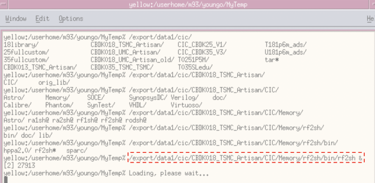
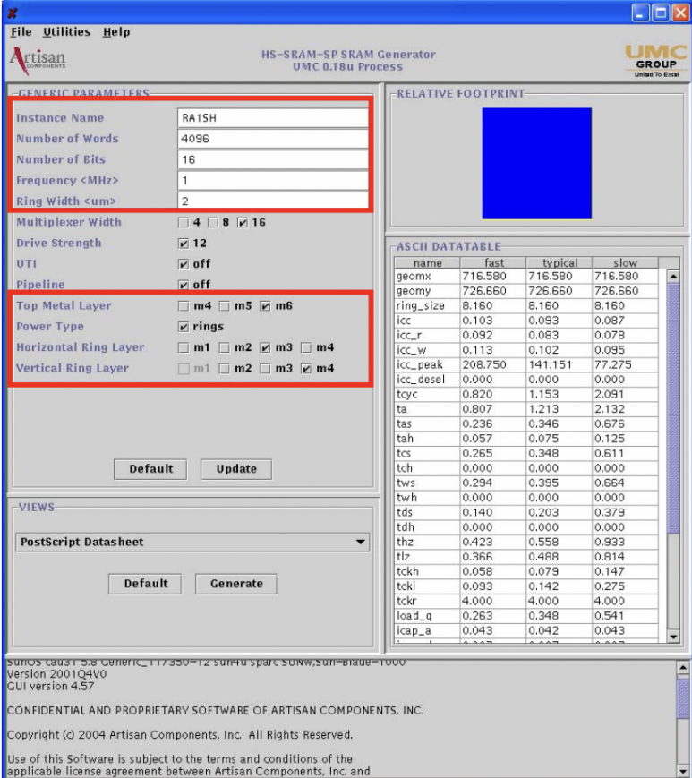

## Memory 설계하는 법 만드는법. ARM Artisan Memory compiler

메모리 설계 툴은 보통, ARM사의 Artisan Memory Compiler를 사용한다.

​

공정회사에 따라 기준이 다르므로, 보통 공정사의 Design Kit에 담아서 업데이트 후 사용한다.

​

dk의 정보대로, setenv한 후, 터미널에 tsmc의경우 rf1sh 이런식으로 써서 실행한다. 이건 공정사마다 다르다.

rf는 register file이고, 1은 1포트... 이런식으로 이름에 rule이 있다.

​

(사진은 2004년버전이다. 2022버전에는 옵션들이 더 추가되어있고... 생김새는 똑같다.)

이거로 들어오면, 기본적으로 GUI로 접속하게된다.

​

아래 화면은 이미 Update가 된 상태이다. 처음에는 각 칸들이 빈칸으로 나타난다.

비트랑 워드 수를 맞춰줘야하는데, 이건 각 공정사의 가이드에 기준 문서가 존재한다.

​

Multiplexer와 bank가 n일때는 word의 수를 x~y로 맞추고 m의 배수로... 이런식이다.

사진은 2004버전이라 옵션들이 별로 없는데, 2022버전으로 들어오면 엄청 많은 옵션들이 있다. 메모리의 수명에 관여하는 Guardband나.. Redundancy 등이 그중 하나이다.

​

옵션들을 적어주고나서,  Corner에 들어가서 내가 보고싶은 Corner를 선택하면 된다. 사진에는 FF / TT / SS만 선택 되어있는데, DSM 기준으로.. FF / TT / SS 뿐만 아니라, PVT PEX를 고려 할 수도 있다.

​

옵션과 코너를 선택하면, Update를 눌러주면, 사진의 우측과 같은 코너별 테이블이 나타난다. geox geoy의 경우, 메모리 블록의 사이즈를 나타낸다. 이것도 공정사에 따라 기준 사이즈가 um일수도 있고... 확인해봐야한다. 그리고 데이터를 쓰고 지우는데 필요한 속도.. 등이 나타나서, 이 과정에서 메모리 GEN의 가능 불가능 여부를 체크 할 수 있다.

​

GEN이 되면, VIEWS에 원하는 타입을 골라서 Generate하면된다. 보통 모든 타입을 뽑는다. verilog파일.. ATPG에 필요한 tv 파일.. AOCV파일... 등 다양한 파일들.

​

​

​

근데, 사실 GUI환경은 작업량이 적으면 쓰겠지만.. 많으면 CLI(Command Languange Interface)를 쓴다. 훨씬 빠르게 동작되기 때문.

 해시태그 : 