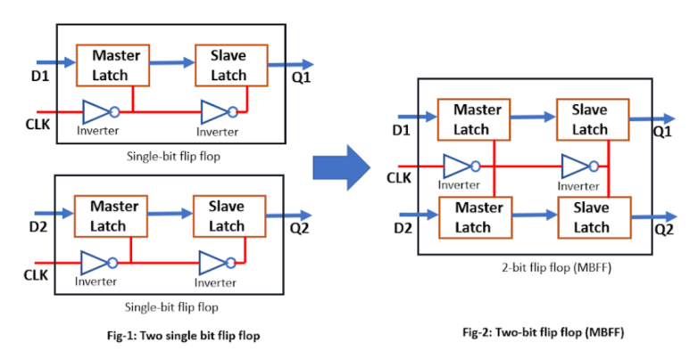
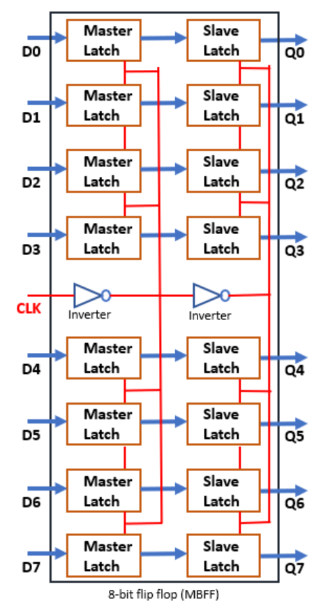
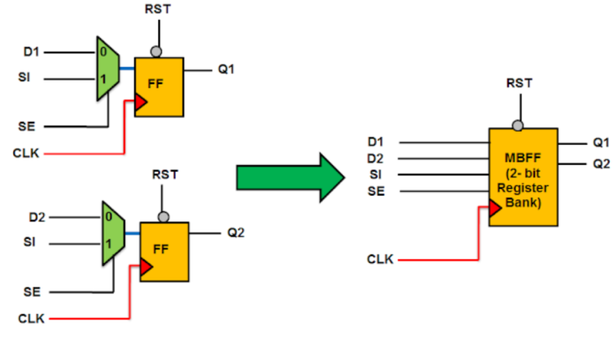
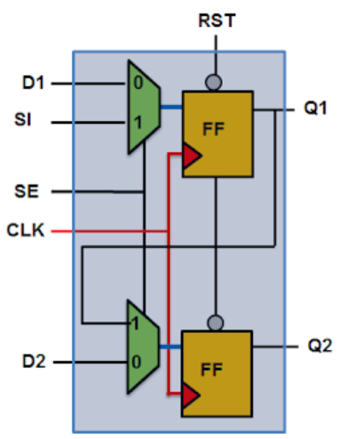
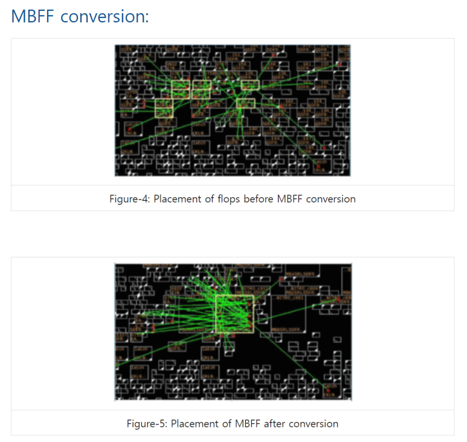

## [Low power design]Multibit Flip Flop이란? in vlsi

Multibit flip flop은 Low power, small area 때문에 쓴다.

​

21세기 미세공정으로 들어오면서, 무어의 법칙 한계가 왔다.

주어진 공정 기술을 갖고, 제한 된 트랜지스터로 설계를 해야하기 때문에 설계 기술의 중요도가 높아졌다.

​

High performance design의 경우, Power도 많이 먹고, Throttling도 심한 반면, Low power design은 그 단점들을 다 상쇄 할 수 있다. (물론 High performance chip보다 일반적으로 성능은 떨어짐.)

​

​

​

Multibit Flip Flop은 Power 성능 개선을 위해, 공정사에서 개발한 cell이고, single bit Flip flop과는 physical implementation이 약간 다르다.

​

RTL에서 Multibit Flip flop을 사용하려면 RTL을 수정,

netlist에서 Multibit Flip flop을 사용하려면 synthesis와 P&R flow를 수정해야 한다.

​

기본적인 multibit flip flop의 구조

​

Fig-1는 1-bit Flip flop 2개,

Fig-2는 2-bit Flip flop 2개.

​

2-bit Flip flop이 CTS 과정 중 clock tree에 삽입되는 Inverter 개수가 줄었고, 내부 routing도 간단해졌다.

-> 2-bit Flip flop이 Area, Power가 좋아지는 대신에, Performance는 떨어진다.

​

​

이런식으로 single bit flip flop을 n-bit flip flop으로 변환하는 것을 Bank라고 한다.

n-bit flip flop을 single bit flip flop으로 변환하는 것은 Debank라고 부른다.

​

기본 적인 컨셉은 이렇고, multibit flip flop은 2-bit, 4-bit, 8-bit.... 이런식으로 공정사에서 제공한다.

​

​

참고로, 다른 장단점도 있지만, Design by design이라 해당이 안 될 수도 있다.

예를들어 800,000개의 Flip flop cell이 들어가는 Design을 전부 Multibit으로 바꾸면 10,000개의 instance만 있으니 P&R runtime도 줄어들고 CTS도 더 간단해질 수도 있지만..

(1) 각각 멀리 있는 cell들을 banking 시키면 area는 줄어들겠지만, routing이 길어지고 timing issue가 발생하여 debank를 진행해서 runtime이 오히려 길어질 수도 있고, debank를 안하고 slvt cell replace를 하면서 오히려 power가 나빠질 수도 있다.

(2) cell 개수가 줄어 경우의 수가 줄어들다보니, Routing congestion issue 같은게 발생하면 해결하기 더 까다로워질 수 있다.

(3) DFT를 할 때도 까다로운데, Multibit Flip flop은 동일한 Control signal(CLK, PRESET, RESET SE 등..)을 쓰는 것끼리 bank 해야하고. SCAN Chain에서 routing도 더 신경써야 한다.

(4) Equivalence Check에서 RTL vs Netlist든.. Netlist vs SCAN Netlist든.. banking debanking 과정이 있었다면, 관련 정보를 EQ Tool에 알려줘야 한다. (synopsys formality tool에서는 svf파일이 해당 정보를 svfMultibitSplit에서 기록을 해준다고 하지만.. Bug가 꽤 존재했다.)

​

아래 이미지는 SCAN 2-bit Flip flop이다. 2-bit이라서 scan chain이 좀 간단해보이는데, 4bit, 8bit... 그 이상 올라가면 DFT든 P&R이든 Simulation이든.. 다 까다로워진다.

​

​

​

Multibit Flip flop implementation flow

​

EDA Tool마다 약간 다른데, 큰 흐름은 같다.

RTL에서 Multibit insertion하는 1-step flow와 Netlist에서 Multibit replace한느 2-step flow가 있는데, 개념은 둘 다 거의 비슷하니, 더 쉬운 2-step flow로 설명하겠습니다.

​

2-step flow(placement aware) : 

read RTL

->

1st compile without multibit cell

->

report (timing 확인하여, timing에 여유 있는 cell들을 찾음.)

->

incremental compile (timing에 여유 있는 1-bit flip-flop을 n-bit flip-flop으로 bank)

-> 

report (1-bit일 때는 Timing violaiton 없었는데, bank 후에 timing violaiton이 생겼다면 Debank)

->

write

​

​

P&R 후, pin2pin을 찍어보면 아래처럼 변화한 것을 확인 할 수 있다.

cell area는 확실히 줄었지만, routing congestion은 늘었다.

​

mbit Flip flop implementation을 하게되면, 설계자가 얼마나 설계를 잘했고 못했고가 더 확연하게 보이는 것 같다...

​

​

 해시태그 : 