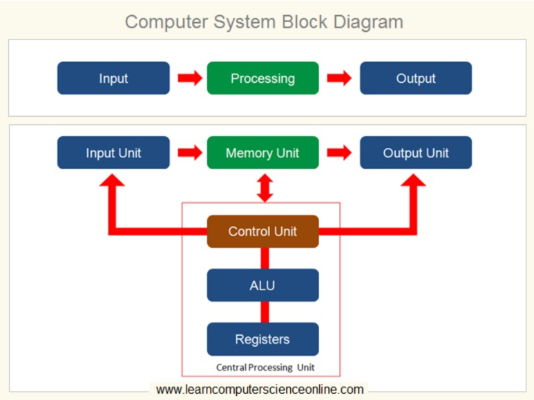
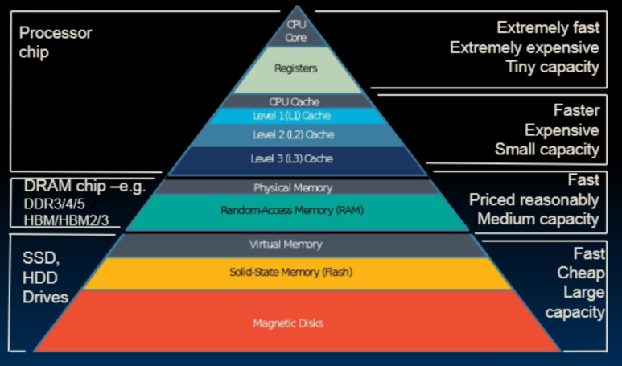
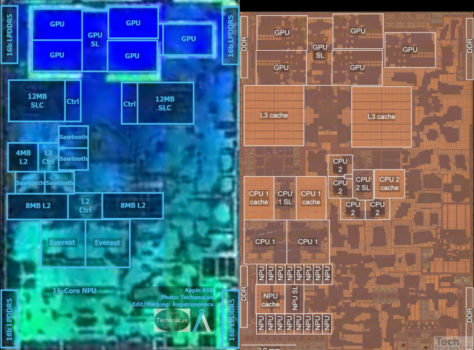
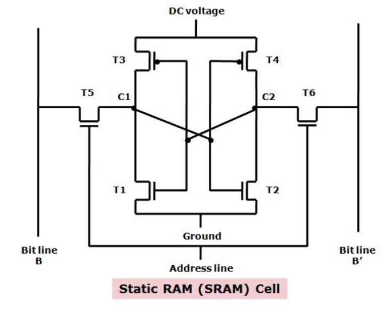

## memory hierarchy invlsi 메모리 계층 구조 정리

Memory가 무엇인지, 어떻게 접근하는지? 어떤 종류가 있고, 요즘 SoC 설계에 들어가는 어떤 Memory가 있는지? Memory는 Hard IP를 쓰는데, 각 Pin의 역할은 무엇인지 공부하고 공유합니다.

​

컴퓨터 <-> 사용자 간 인터페이스 하기 위해선 Input, Output (이하 IO)를 거치게 됩니다.

​

사용자가 Input을 통해 신호를 전달하면, Control Unit은 해당 신호를 받아 처리한 후, output으로 전달합니다.

​

데이터 Load / Store를 하는 것에 쓰이는 그릇이 메모리입니다.

​

​

메모리는 사용처에 따라 다양하게 분류가 됩니다.

아래 그림은 memory hierarchy라고 불립니다.

​

위로 갈 수록, 비싼 대신 빠르고, 아래로 내려 갈 수록 싸고 느립니다.

​

Register -> Cache -> Main Memory > Third party memory 순서로 알아두시면 됩니다.

​

​

아래 사진은 Apple의 iphone 14pro, 13pro에 들어가는 A16과 A15 Processor의 Die shot입니다.

둘 다 Floor plan은 비슷하게 되어 있네요.

Register는 CPU Block 안에 들어있을 것이고, CPU와 가장 가까이 붙어있는건 Cache네요. 구석에 DDR이 붙어있는데, 저건 DDR을 interface해주는 controller에요.

​

SoC에 DRAM을 같이 설계해 놓으면 속도는 빨라지겠지만(물리적으로 가까워지니까.. 드라마틱하진 않더라도..) 수율 문제가 생길 수 있습니다.

그래서 애플에서는 SoC엔 안 올리지만 SoC 바로 옆에 DRAM chip을 붙여놓았습니다.

​

미세공정에서는 routing에 따른 Net delay도 크고, MTTV, IR Drop 문제도 심합니다. 이렇게 되면 Performance가 떨어지더라도.. cell들을 사이 사이에 넣어줘야해요.

​

Control Unit에서 Load/store 명령을 보내면,

CPU 안에 있는 register는 1 clock 만에 받겠지만

DRAM이나 SSD에는 수십 수백 clock을 기달려야 할 것입니다.

​

​

​

​

아, 그리고 SRAM과 DRAM은 구조도 다르고 소자도 다릅니다.

SRAM은 Transistor로만 구성되고(switching 속도가 매우 빠르나, 미세공정에서 Transistor는 수율 문제 있음.)

DRAM은 Capacitor가 같이 구성됩니다. (Capacitor는 충 방전을하며 데이터를 담기 때문에 느림)

​

​

내일은 메모리 접근 방식에 대해 작성해볼게요!

 해시태그 : 