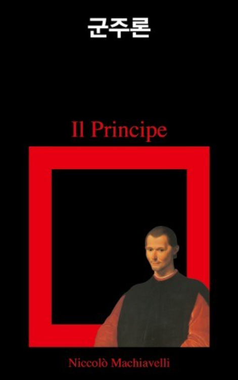

## 마키아벨리의 군주론을 또 읽고. (Machiavelli - Principe)

마키아벨리의 군주론을 처음 읽은건,

공군 15비 활주로 바로 앞 생활관이었던, 3생활관에 꽂혀있던 낡고 다 찢어져가는 책이었습니다.

어려운 내용도 없고, 흥미로운 내용은 많으며 책도 얇아서 정말 수십번 읽은 책입니다. (인간의 메모리는 volatile해서...)

​

이 책을 읽으면, 혼란의 시대(불공정, 국가간 반도체 패권, 역병)에 끝까지 살아남는 나, 기관, 국가가 되는 힌트를 볼 수 있습니다.

​

시대적 배경

당시 이탈리아는 밀라노공국 / 베네치아공화국 / 피렌체 공화국 / 로마 교황령 / 나폴리 왕국으로 쪼개져 대혼란의시대였습니다.

이 혼란의시대에, 피렌체공화국은 스페인에게 무너져 하루아침에 마키아벨리는 외교관->백수가 되어버렸습니다.

고위공무원에서 백수가 된 마키아벨리는 피렌체의 최고 명문가 '메디치 가문'에 발탁되기 위해 일종의 용비어천가 '군주론'을  헌정하게 됩니다.

​

​

​

이 '군주론'의 주요 내용은 '과거의 군주들이 국가를 잃은 이유', '문제가 발생했을 때 극복하는 법' 등이 담겨있었습니다.

​

혼란을 벗어나려면, 강력한 군주의 통치력+리더십이 가장 중요하다.

국가의 혼란과 위기를 타개하기 위한 목적이라면, 군주는 악행도 저지를 수 있어야한다.

​

- 날씨가 좋을 때 폭풍을 예상하지 못하는 것은 인간의 약점입니다.

평화의 시대에 사태가 변할 것을 예상하지 못하는 것은 무능함이다,

​

- 사람은 누구나 넘어질 수 있지만, 누군가 자신을 일으켜줄 것이라고 기대하면 안됩니다.

당신의 주도하에 당신의 역령에 기초한 방어책만이 효과적이고 확실하며 영구적입니다.

​

이런 뚜렷+명확+극단의 합리적인 내용이 들어있기에, 마키아벨리는 냉혈한으로도 불리게 됩니다.

​

재밌는 점은, 

마키아벨리가 공화정이라는 개념을 처음으로 현대적 의미로 정의한 사람이 마키아벨리입니다.

공화국(Republic)은 로마공화국이나 베네치아공화국처럼 예전부터 있었던 것이지만 공화정은 로마가 그리스의 민주정과 페르시아의 왕정, 스파르타나 여러 그리스 도시국가와 같은 과두정체제를 혼합해서 절충한 체제입니다.

그래서 공화정이라고 해도 하나의 형태만 있는 것이 아니고 + 민주정>독재정>과두(의회/귀족)정>민주정.. 순환한다고 합니다.

​

아마도 혼란을 타개하려면 강력한 군주가 힘으로 누르고, 평화의 시대가 시작되면 민주정으로 변화하고. 이런 순환이 필요하다고 본 것인 것 같습니다.

실제로 근현대에 급성장을 이룬 국가들을 보면 "왕정 -> 위기 -> 독재정 -> 과두정 -> 민주정" 순서로 정치체계가 변화하였습니다.

​

그래서 마키아벨리는 자신의 저서에서 무엇 무엇이 좋고 무엇 무엇이 답이다라고 하지 않습니다.

마키아벨리는 공화정주의자이면서 공화정체제 안에서도 결정적 시기에는 과감한 결정을 독단적으로 할 수 있는 지도자가 필요하다고 봤습니다.

이것이 "군주론"이기 때문에 따지고 보면 독재정 자체가 마키아벨리의 공화주의와 상반된 것도 아닙니다. 철저히 "시의성"과 "Case by case"를 추구한 현실주의자인 나머지 "선악의 피안"처럼 무엇 무엇이 무조건 악이고 무엇 무엇은 무조건 선이라는 평가에 거리를 둡니다.

마키아벨리에게 "실리냐 명분이냐? 물어보면 무조건 실리를 외칠 것 같습니다.

​

​

​

두려음을 주되, 미움 받지 말라.

해를 가할 수 있는자, 해를 가한자는 초반에 짧은 기간동안 철저하게 짓밟아라.

현명한 군주는 신의를 지키는 것이 국가적으로 불리할 때, 약속에 구속되어선 안된다.

그러나 이런 생각은 국민의 이익을 위해서이고, 이 모든 생각을 들키지 말아라.

​

​

​

​

​

​

 해시태그 : 