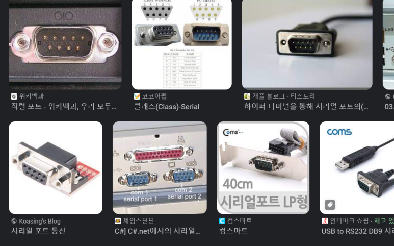
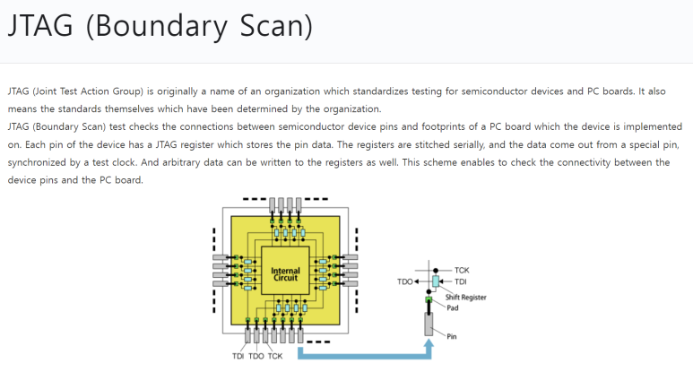
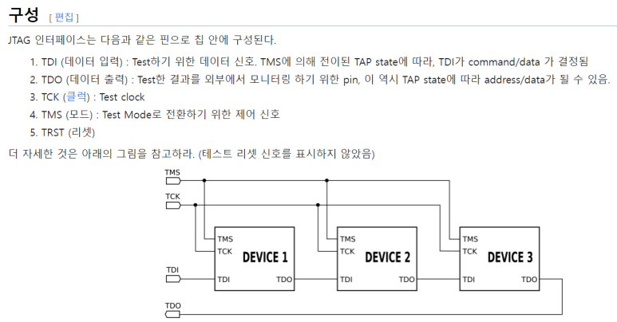
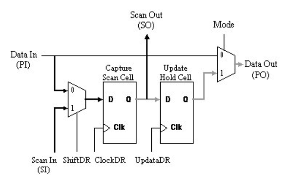

## JTAG란?(Joint Test Action Group) Standard, IEEE 1149.1 Standard Test Access Port and Boundary-Scan

JTAG은 디지털 회로 개발에서의 Chip Debugging, Chip Test, Chip Programming은 제품 품질 향상, 효율적인 개발 및 유지 보수를 위해 꼭 필요한 요소입니다.

​

이게 왜 필요하냐?

디지털회로가 엄청나게 복잡한데,

​

"이 Chip이 설계는 멀쩡한데 공정 결함으로 Chip이 동작을 안 하는건지?"

"Chip에 SW를 올리고 싶다면?"

"Chip debugging을 하고싶다면?"

-> 이런 이유들로 인해 JTAG이 필요해졌습니다.

항상 이상적이고, 아무런 실수와 공정 결함이 없고, 처음부터 완벽한 SW를 올릴 수 있다면, 사실 JTAG은 필요없지만..

양산 Chip에 공정 결함이 있는지 테스트하고, Chip에 SW 올리고, Chip을 디버그 하려면 JTAG이라는게 필요합니다.

​

용어 정리부터 하면,

디버깅(Debugging): 소프트웨어와 하드웨어의 상호 작용에서 버그와 결함은 피할 수 없습니다. 디버깅은 이러한 문제를 해결하기 위한 핵심 작업으로, 디바이스 내부의 동작을 모니터하고 문제를 식별하여 개선합니다.

​

참고로, 여기서 디버깅은 print "hello world"같은 것이 출력되는지 체크하는 디버깅이 아니라,

Chip의 SRAM까지 data write, data read가 잘 되는지? 아니면 시그널 한번 쭉 보내고, 시그널이 돌아오는지? 이런거 체크하는 디버깅입니다...... 이거 진짜 어렵더라구요. PC에서 High level language로 코딩하는 것들은 대부분 "내 코드의 실수"가 보이는데... Chip이 결함이 있으면, 동작을 할 수도 있고 안 할 수도 있고.. Chip을 하나하나 X-ray 현미경으로 볼 수도 없고.... 진짜 어렵더라구요.

​

테스트(Test): Chip 제조공정은 항상 이상적이지 않습니다. 같은 웨이퍼에서 같은 장비로 만들더라도, 일부 Chip은 먼지가 껴서 미세하게 선이 끊어지거나, 선이 굵게되어 옆 배선과 붙을 수도 있습니다. 그러므로, 양산 칩 같은 경우엔 칩 테스트가 필수입니다.

프로그래밍(Programming): Chip자체로는 사용하기 어렵습니다. 그렇기 때문에 High level language가 등장한거고.. 이런 소프트웨어를 칩에 담아야 합니다. 업데이트나 확장이 필요한 경우에도 프로그래밍이 필요합니다.

​

JTAG의 등장 이전에는 어떻게 하였는지?

Debug Port: 디버깅을 위해 시리얼 포트를 사용하는 방법이 일반적이었습니다. 하지만 이 방식은 속도와 효율성 면에서 한계가 있었습니다.

Embedded Emulator: 일부 디버깅 도구는 처음부터 디바이스 내에 에뮬레이터를 내장시켜 디버깅을 수행하는 방식이었습니다. 하지만 비용과 구현 난이도가 높습니다.

​

JTAG은 이러한 한계를 극복하면서, 하나의 표준 인터페이스로써 다양한 디바이스에서 효과적인 디버깅, 테스트, 프로그래밍을 가능하게 해주었습니다. 이로써 개발 과정에서 생산성 향상과 품질 향상을 동시에 이룰 수 있게 되었습니다.

​

JTAG(Joint Test Action Group) Standard, IEEE 1149.1 Standard Test Access Port and Boundary-Scan Architecture

​

JTAG은 IEEE 1149.x 시리즈 표준 중 하나로, 다양한 전자 제품에서 디버깅, 테스트, 프로그래밍을 위한 표준 인터페이스입니다. 이전에 사용되었던 디버깅 및 프로그래밍 방법에 비해 JTAG은 다음과 같은 이점을 가지고 있습니다.

​

​

1. 표준 인터페이스

JTAG은 업계에서 표준화된 인터페이스로, 여러 제조업체에서 공통적으로 사용할 수 있는 표준입니다. 이전에는 각각의 제조사마다 고유한 디버깅 및 프로그래밍 인터페이스를 제공했기 때문에, 호환성 문제 문제가 발생할 수 있었습니다. JTAG은 이런 문제를 해결하며, 다양한 디바이스에서 통일된 방식으로 접근 가능합니다.

​

2. 효율성

JTAG은 디바이스 내부 레지스터, 상태 등을 접근하여 디버깅, 테스트, 프로그래밍을 수행할 수 있어 개발자의 작업 효율을 크게 향상시킵니다. 이전에 사용되던 방식들은 더 복잡하고 소요 시간이 많은 경우가 많았습니다.

​

3. 다목적성

JTAG은 디버깅, 테스트, 프로그래밍 외에도 제품 수리 및 복구 등 다양한 목적으로 사용할 수 있습니다. 이로써 하나의 표준 인터페이스로 다양한 작업을 수행할 수 있게 됩니다.

​

JTAG(Joint Test Action Group)은 전자 제품의 디버깅, 테스트, 프로그래밍 등에 사용되는 표준 인터페이스입니다. JTAG 표준은 "IEEE 1149.1 Standard Test Access Port and Boundary-Scan Architecture" 문서를 기반으로 합니다. 이 문서에서 JTAG의 핵심 구성 요소를 살펴보겠습니다.

​

JTAG의 구성 요소는 다음과 같습니다:

TAP (Test Access Port) : TAP은 JTAG의 핵심 구성 요소로, 디바이스 내부로 접근하여 테스트, 디버깅, 프로그래밍을 수행하기 위한 경로를 제공합니다. TAP은 JTAG를 사용하는 디바이스와 컨트롤러 사이의 통신을 담당합니다.

​

1) 아래의 5개의 전용 핀들을 총칭하여 TAP( Test Access Port)라 하며, 이들 핀 구성은 다음과 같습니다.

4개의 전용 TEST 핀

1) Test Clock (TCK)

2) Test Data In (TDI)

3) Test Data Out (TDO)

4) Test Mode Select (TMS)

​

요약하면,

Device TDS가 active enable일 때

TCK가 active edge로 입력된 TDI를 받아 TDO로 전달하고,,, 이런식으로 DEVICE TDI -> 1 -> 2 -> 3 -> TDO까지 벡터 전달을 시킵니다.

칩에 결함이 없다면, 내가 만들어준 TDI에따라 TDO값이 잘 나와야겠죠? 그렇지 않으면 칩 어딘가에 결함이 있는 것이구요. 이런 구조 로직을 Serial scan이라고 부릅니다.

​

라고 하면, 이해가 안 될 수 있으니.. 좀 더 깊이 + 자세히 보면요.

우리가 하고싶은건, Chip에 결함이 있는건지 test하고싶은거에요.

그런데 Chip test를 어떻게 하냐?

Chip register들한테 특정 입력값을 넣고, 특정 출력이 나오는지 보는겁니다.

근데 Chip의 기본 Function 동작으로는 이 Test를 하기가 매우 까다롭고, 오랜 시간이 걸리고, Test coverage가 낮아진다는 수학/경제적인 문제가 있어요.

Chip 고장 검출율을 높에 만드는 Test vector를 입력하고, 출력을 비교하는 것이 훨씬 경제적이라는 것을 설계자들이 알게됩니다.

Data IN, Data Out만 있어도 Chip의 기본 Function mode는 동작 하겠지만, 테스팅을 위해서 SCAN Input signal과 SCAN Multiplexer를 넣어서 Chip의 Test mode를 만들어주는겁니다.

​

​

기본 개념은 이렇고, Digital chip은 항상 Initialize를 해줘야하니, TAP Reset Pin이 있습니다.

1) Test Reset (TRST)

2) 각각의 디바이스는 주요 입력과 주요 출력 핀마다 1개의 boundary-scan cell이 위치하며,

     직렬 boundary-sacn 레지스터 (Boundary Scan)가 내부적으로 연결되어있습니다.

3) TAP Controller(제어기)는 TCK, TMS 그리고 TRST*를 갖는 FSM 입니다.

​

​

위의 그림에서 Instruction Register, Bypass, Boundary-Scan, Identification, Internal Register의 연결 상태를 보시면 알 수 있습니다.

Instruction Register의 값에 따라 Data register의 출력 값이 선택되어집니다.

​

아래는 JTAG의 필수 Command입니다.

[ EXTEST, BYPASS, SAMPLE, PRELOAD ]

​

​

TAP Controller : TAP 컨트롤러는 TAP의 동작을 제어하고 관리합니다. TAP 컨트롤러는 테스트 모드와 노멀 모드 간의 전환, 테스트 데이터의 셔플링 및 전송, 레지스터 접근 등의 기능을 제어합니다.

​

Boundary-Scan Register: 시리얼 스캔체인 전체를 스캔하여 회로 연결 오류를 검출하거나 디바이스의 상태를 테스트할 수 있게 해줍니다. 이를 통해 회로 보드의 결함을 감지할 수 있습니다.

​

Instruction Register (IR) 및 Data Register (DR): Instruction Register와 Data Register는 디바이스 내부 레지스터에 접근할 수 있도록 해주는 레지스터입니다. Instruction Register는 특정 명령을 내릴 때 사용되며, Data Register는 데이터를 읽거나 쓸 때 사용됩니다.

​

​

​

​

 해시태그 : 