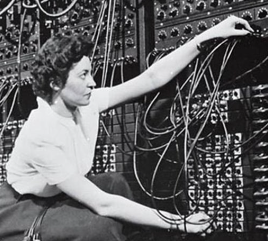
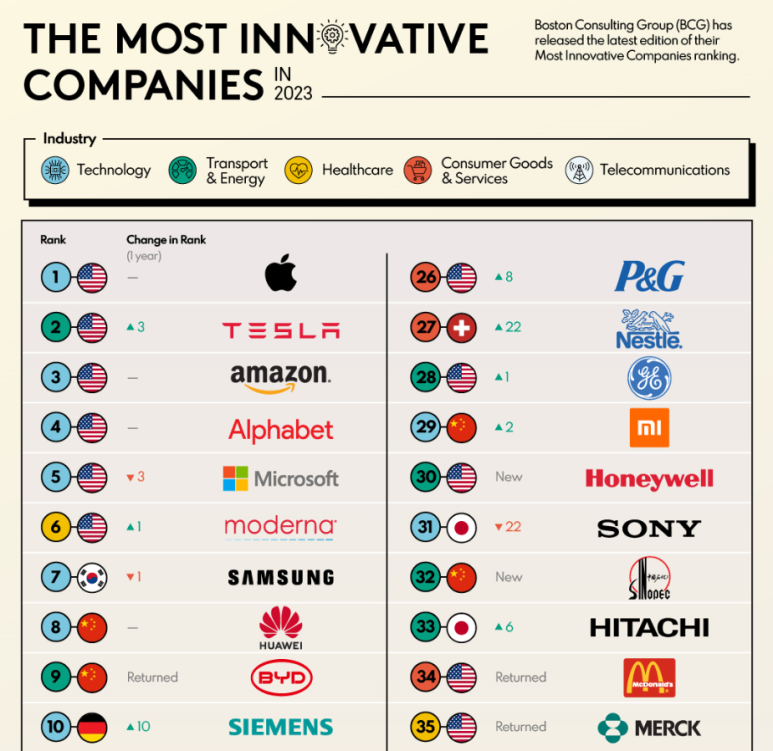
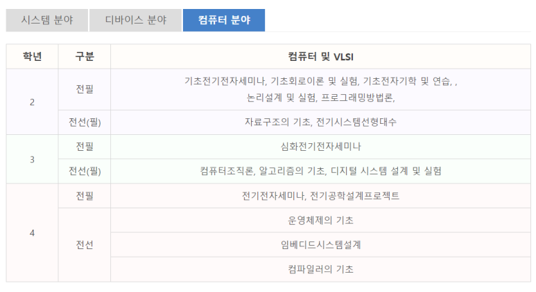
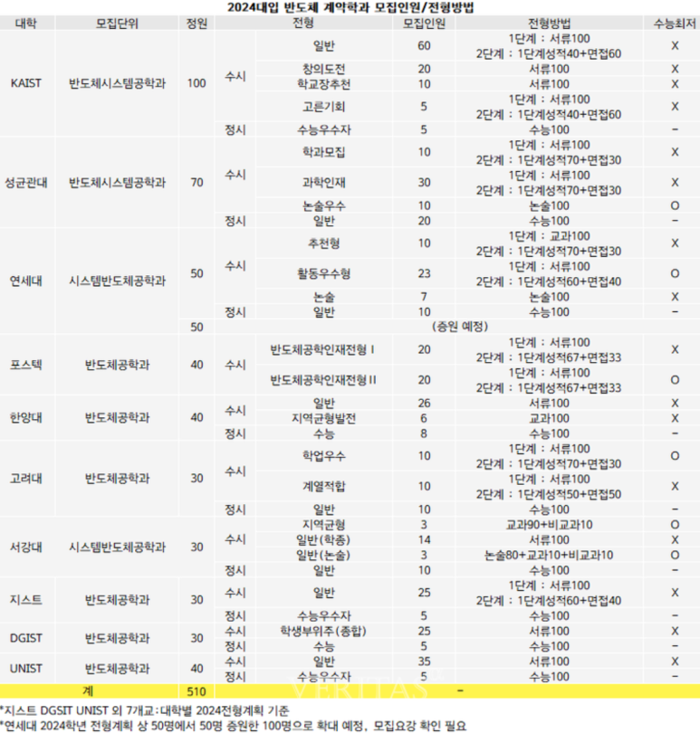
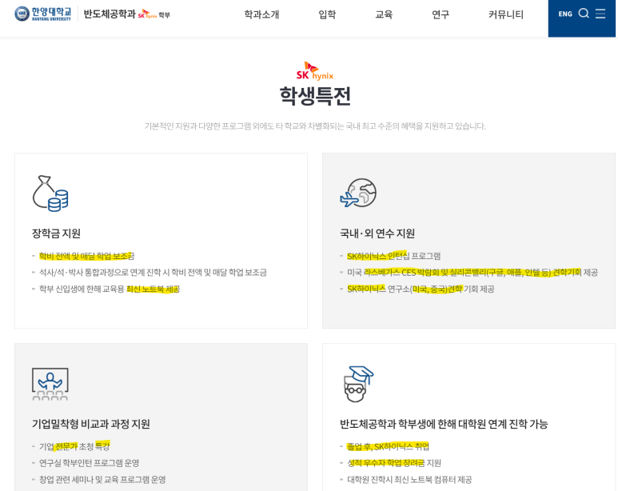
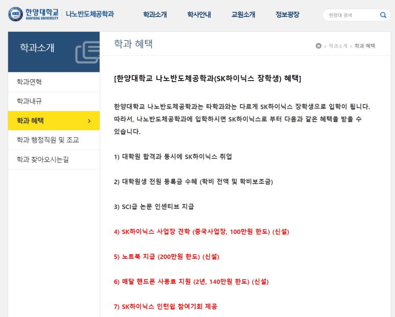
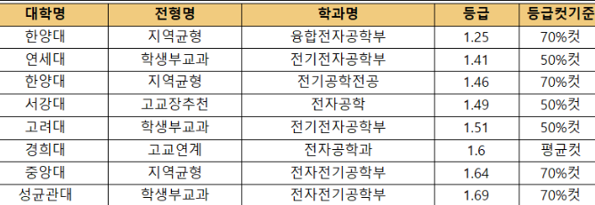

## 대학 전공 : 물리학, 전기공학, 전자공학, 반도체공학, 컴퓨터공학, 컴퓨터과학 차이를 IT 회사 직무 중심으로.

저는 학부와 대학원 전공을 전자공학으로 했습니다.

​

대학교 들어와서야, "아 A공학 말고 B공학 전공 할 걸, A 학교 말고 B 학교 갈걸" 이런 생각이 들더라구요.

곰곰히 생각해보면, 누구는 이런걸 이미 어렸을 때부터 알고 있었고, 저는 몰랐습니다. 현직 반도체 연구원이니, 누군가에게 도움이 되길 바라며 글을 써보려고 해요.

​

시작할게요.

​

전기, 전자, 컴퓨터공학이 발전하면서,

누구는 일자리를 잃고, 누구는 연봉을 올리고 있습니다.

"전기로 구동되는 반도체들이 집적된 전자제품에서 다양한 소프트웨어로 자동화" 되고 있습니다.

​

​

창조와 예술의 영역도 요즘은 컴퓨터가 대신하고 있죠.

여전히 사람이 직접 일을하고 있는 분야들이 있는데, 그것은 자동화 구현하기 어려워서라기보단, 자동화 개발비용보다 사람을 쓰는게 싸니까 그렇게 하는겁니다.

지금은 유튜브 동영상 알고리즘 구현, 맞춤형 인터넷 광고, Chat GPT 같은 것을 만드는게 가장 수익성이 높으니 대기업들이 여기에만 몰두하고 있는거죠.

​

​

아닌 것 같죠?

삼성의 창업주 이병철 회장님은 처음엔 신세계 그룹을 창립하고, 인구밀집지역에 신세계 백화점과 이마트를 만들었습니다.

전국에 백화점을 짓고 나서, 수익성이 높진 않지만, 어쨌든 매출을 높일 수 있는 산업이 "편의점"이죠.

편의점 이마트24는 신세계그룹 소속이고, 편의점 CU는 BGF 그룹 내에 소속되어 있습니다. BGF의 회장님은 이건희 회장님의 처남인 홍석조 회장님입니다.

10년 전까지만해도, 전부 다 작은 구멍가게, 슈퍼마켓이었는데... 집 근처에 이런 슈퍼마켓 있으신가요?

백화점 -> 대형마트 -> 편의점 이런식으로 대기업들이 수익성 높은 분야부터 낮은 분야로 전부 점유율을 채워나가고 있습니다.

인공지능은 모든 분야로 발전하고 있습니다. 백화점~편의점 사례처럼, 모든 분야들이 수익성 순서로 산업 구조 변화가 있을 것입니다.

​

​

인공지능도 사실 프로그램 한 줄부터 시작하고, 프로그램 한 줄을 구현하려면 반도체 칩이 있어야하고.. 반도체 칩이 동작하려면 전기가 있어야하고.. 전기를 다루려면 물리학을 알아야하고.. 복잡합니다.

​

이 산업혁명의 흐름을 타려면, 어쨌든 전기 / 전자 / 컴퓨터 / 수학 / 통계 / 물리 / 화학을 어느정도 알긴 알아야합니다.

​

전기 / 전자 / 반도체 / 컴퓨터 공학의 각 전공들은 모든 전공을 다 배우긴하지만, 심화로 배우는 쪽이 조금씩 다릅니다.

하지만 다 조금씩은 배우긴 하므로, 전기공학을 전공해도 컴퓨터 쪽으로 갈 수 있고.. 컴퓨터 쪽을 전공해도 반도체 쪽으로 갈 수 있습니다.

1~2학년동안은 4개 전공의 기초 전공필수 내용과 물리, 화학, 수학, 영어를 배우고, 3~4학년동안 심화 전공을 배웁니다.

각 전공마다 심화전공이 다른데요. 근데 어차피 심화전공은 3~4학년동안 2년간 배우게 됩니다. (석사나 박사 하시는 것 아니라면 학사 수준에선 엄청나게 깊게 들어가진 못합니다.)

​

전기는 강전을 다루고,, 전자는 약전을 다루고..

전자는 C, C++하고 전기는 Python, Java를 하고..

이런건 사실 반은 맞고 반은 틀린 말이구요.

​

대학 전공의 심화전공들을 보는게 좋을 것 같습니다. 우리나라 공학 교육은 거의 "미국 공학 인증 교육"을 따라가거나, 산학연에서 요구하는 강의를 위주로 교육과정이 편성됩니다.

그렇기 때문에 전공 별 심화전공을 통해, 4개의 전공 간 차이를 보겠습니다.

​

전공 별 심화전공 강의 이름

전기공학 : 전기 에너지를 어떻게 변환하고 옮기고 저장할 것인지?

전력과 전기기기: 전력 공급, 전기기기 제작과 운용에 관련된 분야.

전력 시스템 공학, 전력 네트워크 설계, 스마트그리드

​

전자공학: 전기를 어떻게 정보로 처리 할 것인지?

전자회로와 장치: 전자회로 설계와 반도체 장치 제작에 관련된 분야.

아날로그 설계, VLSI 설계, 통신 프로토콜 공학, 임베디드 프로그래밍

​

반도체공학: 반도체 설계 및 제조를 어떻게 할 것인지?

반도체제조공정, 반도체장비설계

​

컴퓨터공학: 디지털 정보를 통해 어떤 정보 처리를 할 것인지?

컴퓨터구조, 자료구조론, 컴퓨터 알고리즘

​

컴퓨터과학: 정보들을 통해 어떤 처리를 할 것인지?

인공신경망, 데이터베이스, 기계학습

​

예를들어 서울대학교 전기 정보공학부의 교육과정을 보겠습니다.

​

1학년은 물리 / 화학 / 수학 / 영어, 기초전공들을 배우기 때문에 교과과정에 나와있지도 않고,

2, 3학년에서도 강의이름에 "기초"라는 이름이 붙어있습니다. 4학년이 되어서야 심화적인 내용을 배우기 시작하고..

그래서 공대 선배들이 "대학원 가라" 하는거죠.

​

어쨌든 시스템 분야는 제어, 전력, 에너지 관련. 송배전 쪽 취업 희망하시는 분!

디바이스는 회로, 소자, 반도체 관련이네요. 공정 쪽 취업 희망하시는 분!

제가 몸 담고있는 컴퓨터 및 VLSI는 컴퓨터, 디지털 관련이네요. 설계쪽 취업 희망하시는 분!

​

대학교 전공도 복잡하지만, 이 분야의 기업 생태계는 더 복잡합니다. 그만큼 갈 수 있는 회사도 많습니다. 진짜 간단히 요약하면 아래처럼 볼 수 있습니다. 천천히 한 번 읽어보십쇼!

​

전기, 전자, 컴퓨터 전공으로 취업 할 수 있는 IT 기업 생태계

​

1. 프로그램 / 웹사이트 / AI를 구현하려면 "Program code"들이 필요하고 -> 컴퓨터과학, 전자공학

2. 그것을 구현하기 전에, 어떤식으로 계획이 있어야하는데, 경제적인 설계를 위해 "수학, 통계"들이 필요하고 -> 수학, 통계학 

3. 이 프로그램을 동작시키려면 컴퓨터가 필요하고.. 컴퓨터 내에 칩 설계가 필요하고 -> 컴퓨터공학, 전자공학, 반도체공학 (Intel, NVIDIA, AMD 등)

4. 칩 설계를 하려면 반도체설계용 CAD가 필요하고 -> 컴퓨터과학, 컴퓨터공학, 전자공학, 반도체공학 (Cadence, Ansys, Synopsys, SIEMENS)

5. 설계한 칩을 실제로 사용하려면 제조 공정이 필요하고 -> 반도체공학, 전자공학, 화학공학, 물리학 (tsmc, 삼성, 하이닉스)

6. 제조공정을 하려면 제조 공정에 다양한 공정에 사용할 소재, 장비들이 필요하고 -> 반도체공학, 전자공학, 화학공학, 물리학 (ASML, lam research, applied materials, Tokyo electron)

7. 제조공정, 칩 설계, 프로그램 개발, 프로그램 사용을 하려면 에너지가 필요합니다. -> 전기공학, 물리학, 화학, 재료공학, 에너지자원공학, 토목공학 (정부, 공기업)

​

사실 이 글을 보고 계실 초등학생, 중학생, 고등학생, 대학생님들은.. 직접 큰 코드를 작성해보시거나, 칩설계를 해보시거나, 공정을 해보신 적 없는데... 과연 내가 이 전공을 해도 될까? 이런 생각이 들잖아요.

-> 어쩔 수 없습니다. 정보와 경험이 중요해요. 유튜브나 블로그에 있는 반도체 글 읽지 말고, 정부, 산학연에서 하는 교육/공모전을 일단 찾아서 아무거나 신청해보고, 정보와 경험을 조금씩이라도 쌓아가야합니다. 직접 부딪히는게 가장 정확합니다.

시간 날 때 이 블로그에서 어떤 곳에서 이런 교육 / 공모전을 신청 할 수 있는지 작성해보겠습니다.

​

우리나라에서 해당 전공으로 취업 할 수 있는 15가지 분야.

​

1. 삼성전자 - 반도체 및 전자제품 제조

반도체 제조 공정, 집적회로 설계, 시스템 개발, 모바일, TV, 가전

​

2. LG전자 - 기기 및 디스플레이 제조, 스마트 솔루션

모바일, 가전, 디스플레이, 인공지능과 연계된 스마트 솔루션/ AIoT 분야

​

3. SK하이닉스 - 반도체 제조 및 연구

반도체 공정, 재료 연구. 특히 메모리 반도체

​

4. 네이버 - IT 서비스 및 인공지능

웹 개발, 앱 개발, 빅데이터 분석, AI 연구

​

5. Intel - 반도체 및 컴퓨팅 기술 개발

마이크로프로세서 설계, 제조 공정 연구, 클라우드 컴퓨팅, 인공지능

​

6. 퀄컴 - 무선 통신 및 반도체

 휴대폰, IoT 기기 등 무선 통신 기술, 반도체 칩 설계

​

7. 기업용 IT 솔루션 - SAP, Oracle 등

기업용 소프트웨어 개발 및 구현, 데이터베이스 관리

​

8. 스타트업 - 창업 및 신기술 개발

기존 대기업이 하고 있지 않았던 새로운 분야.

​

9. 한국전력공사, 신재생 에너지 기업

신재생 에너지, 스마트 그리드, 송배전

​

10. 대학교, 정출연, 연구소

연구, 교육

​

11. 컨설팅 회사

기업의 기술 컨설팅, 프로젝트 관리, 기술 마케팅 분야

​

12. KAI, 한화 에어로스페이스

정보 보안, 통신 시스템 개발, 전장 개발

​

13. 원익, 헬스케어 반도체 회사

의료기기 개발, 의료 이미징 기술, 바이오 센서 설계

​

14. 자동차 및 운송 분야

자율 주행 기술, 차량 전자 시스템, 연비 개선 기술, 전기자동차 충전 시스템

​

15. 정부 및 정책 분야

정부에서의 과학기술 정책 수립, 기술 규제, 국가 프로젝트 참여 등 정부 및 정책 분야

​

이밖에도... 배터리 회사, 로봇 회사, 정말 많은 회사가 있습니다.

​

​

몸과 정신, 학점이 건강한 상태에서 해당 학과 졸업하면, 일자리가 없어서 취직을 못 할 일은 없습니다. (워라벨이 부족하거나, 서울 근무를 희망하신다면 취업이 힘드실 수도 있음. 대부분 경기도나 지방에 있기에.)

​

그래서, 어떤 학교를 가는게 좋을지? 그냥 대학 랭킹?

일단 대학교의 선택은 다양한 방법으로 할 수 있겠습니다만,

대학교의 이름을 보거나, 유명한 교수님을 보거나,,, 이런건 사실 주관적인거잖아요?

​

 확실하고 객관적인 것은 "계약학과" 입니다. 제가 입시 할 때는 없었고, 2018년에 생겼다고 하는 시스템인데요.

계약학과란 대학과 기업이 계약을 통해 "대학생을 현장 실무역량을 갖춘 을 양성하는 기업 연계 학과 시스템"을 뜻합니다.

그렇기 때문에 기업에서 대학생들의 교육에 관여하고, 장학금

​

계약학과에 입학하는 학생들은 "이미 기업에서 이 사람을 우리 회사에 데려오겠다 생각을 하고 선발 한 것이기에" 대학 입학과 동시에 일을 할 곳이 정해지기 때문에 어지간하면 취업이 보장됩니다. 그리고 졸업 전에 엄청 빡세게 가르치고, 실무 현장으로 데려와서 실습 시키고,,, 대신에 장학금도 최대로 줍니다. 기업의 입장에서는 기업에서 일할 수 있는 인재를 맞춤으로 교육을 진행하고 미리 인력을 확보할 수 있다는 장점이 있어 수요와 공급이 함께 늘어가고 있습니다.

​

위 학과는 입학하시면 장학금과 취업이 보장되기에

대학생의 가장 큰 고민 : "돈, 진로"에 대한 걱정은 줄일 수 있습니다.

​

아래 내용들은 한양대 "계약학과"의 특전 혜택입니다.

​

​

 해시태그 : 