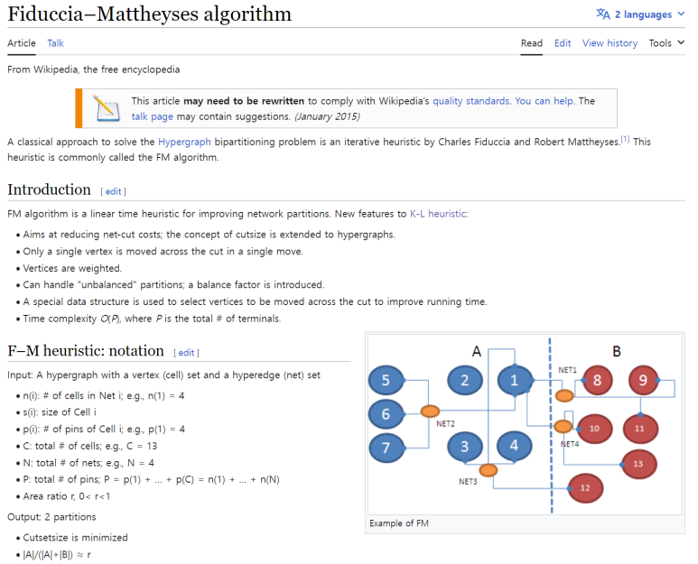

## Design Partition과 Divide and Conquer

VLSI Partitionning은 복잡한 집적 회로를, 여러개의 하위 시스템으로 작게 분할하여 각각 완성하고, 마지막 단계에 하위 시스템을 통합하는 과정입니다.

​

이렇게 해서, 아래 이점을 볼 수 있습니다.

1. 탑 하나만 하면 복잡성이 너무 높을텐데, 나눔으로써 난이도를 낮추고

2. 여러 사람이 병렬적으로 설계/검증 할 수 있고

3. EDA Tool의 runtime을 줄임

​

단점으로는,

1. 설계 과정에.. Partition이라는 과정이 필요하고, 각 Subsystem들은 나중에 Top에 integration 될 준비를 미리 해야하고, TOP에 intergration을 했을 때 다양한 검증을 다시 해야합니다.

2. 버스 인터페이스 구조 설계 시간에 더 많은 시간을 써야 합니다.

3. Partition의 끝 단에 있는 Logic들이 단일 chip에 비해 Optimization이 잘 안 됩니다.

​

Divide And rule, Divide and conquer는 고대 로마에서 영토 확장을 하며 만든 방법론입니다.

이 방법론은 VLSI에서도 똑같이 사용됩니다.

​

이것을 Design partition이라고 부릅니다. 다시 설명하면,

복잡한 System을 효율적으로 설계하기 위해서는 해당 시스템을 작은 하위 시스템으로 분할하는 것이 필요합니다.

그런 다음 각 하위 시스템을 독립적으로 설계하고 병렬적으로 설계 과정을 처리 할 수 있습니다. 이러한 분할 과정을 "Partitioning"라고 합니다.

Partitioning은 Hierarchy design라고도 불립니다.

​

​

​

​

그런데,

실제 설계를 할 때는 저런식으로 하나의 Chip을 다 설계하고, Partition을 나누는게 아니라,

애초에 Partition 설계를 하고, Interface BUS로 연결을 하는 방식입니다.

​

​

​

2022년 Apple이 설계한 M1 Ultra의 경우, 1000억개가 넘는 Transistor가 있습니다. 이걸 한번에 다 하려면 너무 많은 복잡성이 있으니,

이걸 자잘하게 나누고, 그리고 나서 위에서 통합하는 방법입니다.

파티션화의 효율성을 높이기 위해 다음 세 가지 중요한 매개변수를 고려해야 합니다.

​

1. 원래 시스템의 기능을 손상시키지 않아야합니다.

2. 분할 과정 중에 모든 하위 시스템을 연결하기 위한 Bus interface Specification을 생성해야 합니다.

3. 시스템 분할은 시스템 간의 Interface 연결을 최소화해야 합니다.

​

​

시간 있을 때 마저 정리하기로.

 해시태그 : 