## Liberty란?: Cell characterization, Timing arc, NLDM, CCS driver model, SmartScaling

Cell, Gate characterization이란?

회로 내 Cell의 물리적특성을 모델링하는 업계 Standard Cell 파일인 "Liberty" 라는 파일을 만드는 것을 말합니다.

여기서 말하는 물리적특성이란, 기능 | 속도 | 전력 | 면적 | 노이즈 등을 말합니다. 

Liberty는 주로 .lib 확장자로 저장하고, 압축한 형태는 .db파일로 저장합니다.

​

Tool은 Synopsys사의 Primelib가 대표적입니다.

​

Why Liberty?

Delay calculation도, Power estimation도, Signal Integrity도... SPICE Tool으로 측정하는게 가장 정확합니다. 근데 문제는.. SPICE Tool이 너무 크고 무겁기에, VLSI를 하기는 런타임과 하드웨어 리소스 문제가 발생합니다.

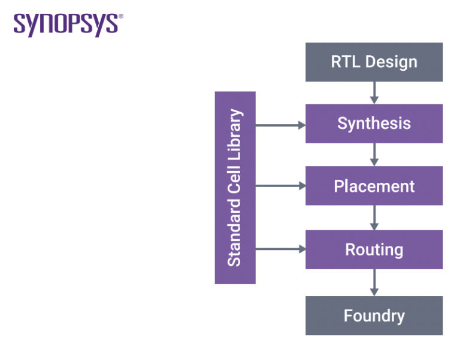

K-Factor는 미세공정에서 다소 Pessimistic하고, DCL을 쓰기엔 또 너무 무겁죠.

그래서 RTL2GDS Flow에는 뭐가 좋을까 Synopsys가 고민하다가, Liberty라는 format을 만들어 오픈소스로 공개하고, 이걸 업계 standard로 만들었습니다.

자료는 여기 있습니다.

https://www.synopsys.com/community/interoperability-programs/tap-in.html

[Technology Access Program (TAP-in)](https://www.synopsys.com/community/interoperability-programs/tap-in.html) : Synopsys Technology Access Program (TAP-in) promotes interoperability through open source licensing of interface formats. To access the following Synopsys formats, you must first register and accept the open source license agreement for each format you wish to download.

​

​

이 글에선 Cell Arc에 대해서만 알아볼 것입니다. Net Arc. Setup time. unate cell에 대한 집중 탐구는 이후 포스팅에서 하겠습니다.

​

Timing Arc란?

input attribute에서 output attribute

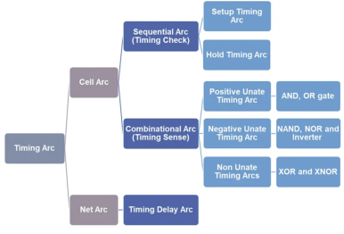

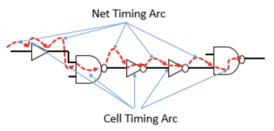

​

Cell arc delay는 Cell의 input port에서 Output port까지 걸리는 Delay_total을 말합니다.

Sequential cell이랑 Combinational cell 각각 Attribute가 조금 달라요!

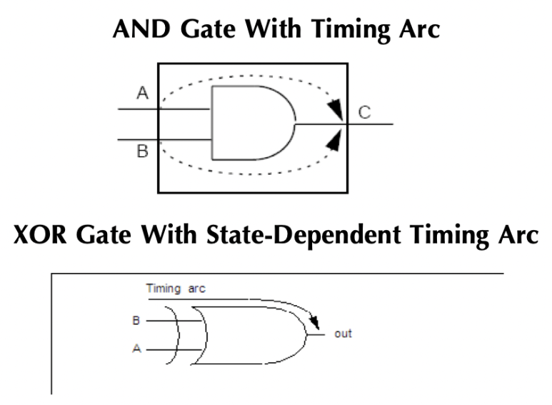

​

​

아래는 Liberty file에 들어있는 파일 내용입니다.

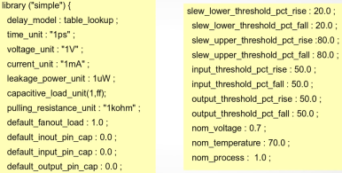

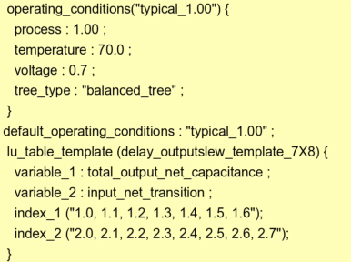

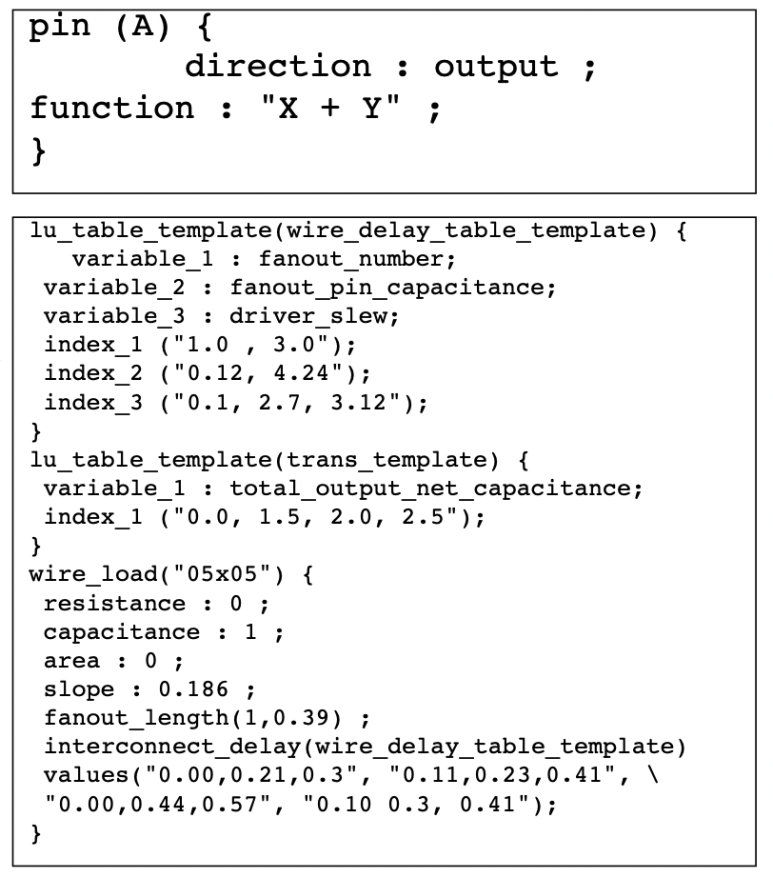

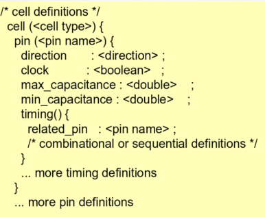

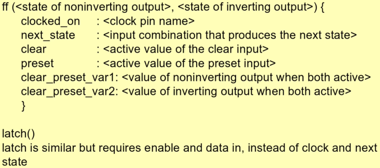

이 파일은 RTL2GDS에 전부 다 사용된다고 보시면 됩니다.

Synthesis Tools 

Place and Routing Systems 

High level Design Language (HDL) Simulators (Verilog and VHDL) 

Static Timing Analysis (STA) tools 

Power Analysis tools 

Formal Verification tools

Library Compiler 

 (근데 파일이 너무 무거우니까, 일부 정보만 담긴 파일 사용을 하기도 합니다.)

​

Library에는 아래 정보를 통해 Power Delay를 계산합니다. 

Power, Delay = Input transition &  Output capacitance의 조합으로 LUT 모델링을 합니다.

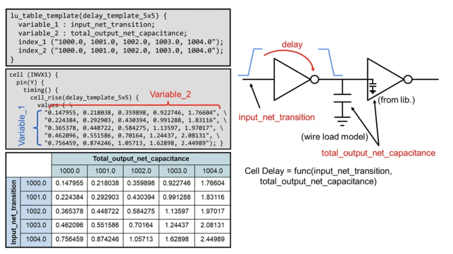

위 LUT의 경우, 내 버퍼의 Input transition(slew)이 1004.0, Output capacitance(load)가 1002.0이면, Cell의 Timing arc는 1.05713이 됩니다. 

​

예를들어 transition 값이 1005.0이면 이 LUT를 벗어나게 됩니다.

그러면 EDA Tool은 여기서 에러를 출력하거나, 테이블 형태를 유지하는 모양으로 1005.0값을 Estimation해서 Timing window를 그립니다.

-> 아건 Foundry에서 테스트하지도, 보증하는 값도 아닙니다.

Timing window를 제대로 못 보는 것은 STA에서 가장 큰 문제입니다. 그렇기 때문에 RTL2GDS 과정에 Liberty DRC violation이 발생하면, 무엇보다 이걸 수정하는 것부터 해야합니다. Synthesis, P&R Tool의 Priority algorithm도 이렇게 되어있습니다.

​

이 Liberty LUT 구성은, Transition | Capacitance | Fanout으로 됩니다.

​

Total Cell delay를 좀 더 자세히 살펴보면 아래와 같습니다.

참고로, PrimeTime으로 report_delay_calculation 하면 아래 값을 자세히 볼 수 있습니다.

Delay_Total = Delay_Slope + D_Intrinsic + D_Connect + D_Transition

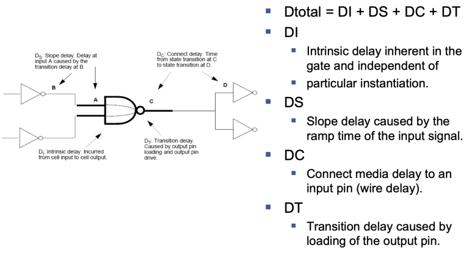

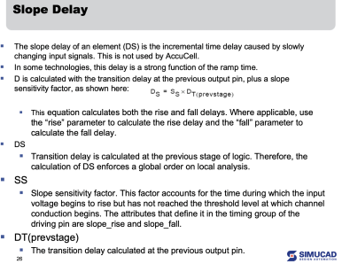

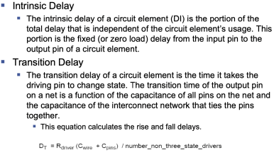

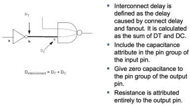

Resist, Capacitance 

Thresholds voltage

Slew calculation

아날로그 시그널인 Voltage 값을 0~10%, 90~100%를 기준으로 Signal이 0이구나.. 1이구나.. 디지털 신호를 결정하는거죠.

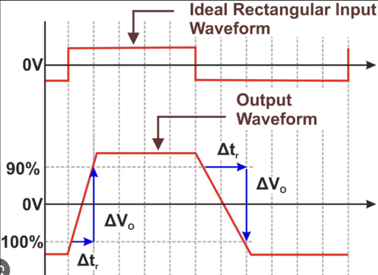

Rise Time과 Fall Time. 보통 Rise time이 약간 더 깁니다. 공정사에서 최소화를 해놓지만, 그래도 NMOS, PMOS Beta ratio가 있어서 어쩔 수 없이 Rise Time이 더 길어요. 그래서 Buffer가 연달아 달리면, 계속 Rise time은 길어지고... Fall time은 계속해서 짧아지고. 결국 Signal High상태가 없어지는 문제가 발생 할 수 있습니다. 그래서 Clock Tree Synthesis 할 때 Inverter로 넣는거에요.

 Power ( static state dependent leakage, dynamic, short- circuit, hidden, internal ) (i.e. power arcs) 

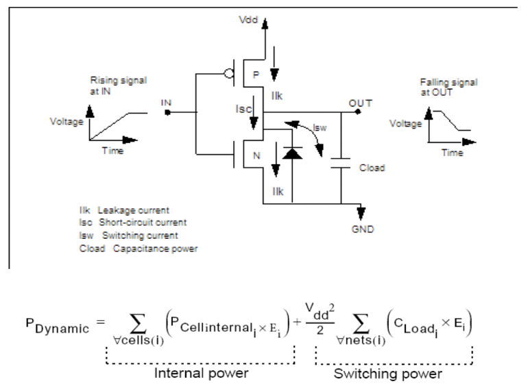

​

​

이런식으로 되어있어요. 사실 회로가 단순하면 SPICE Tool로 설계/검증하는게 제일 정확한데,

우리가 하는 회로는 VLSI잖아요? 그래서 SPICE Tool로는 감당이 안 됩니다. SPICE Tool 대안으로 RTL2GDS를 하기 위해, 좀 가볍게 논리, 물리적 내용을 요약해서 담은게 Liberty라고 보시면 되는데요.

Liberty라는게 결국 아래 정보를 담는다고 보시면 됩니다. 

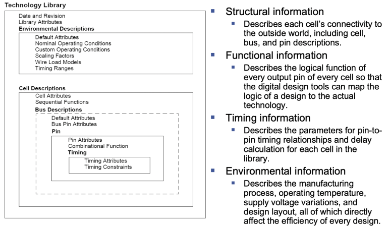

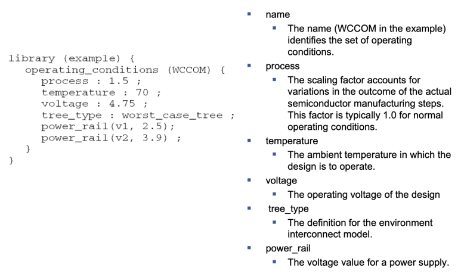

​

​

​

​

Timing, Driver model used for characterization

Static Timing Analysis Tool의 Delay calculator는 Liberty에서 Driver model을 찾아 interpolate 혹은 extrapolates한 후 Gate의 cell arc 값을 구합니다.

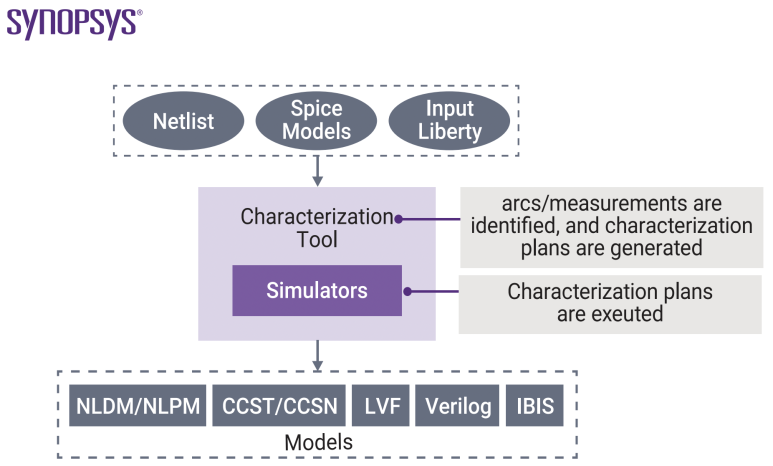

Cell Characterization 할 때 다양한 방법으로 할 수 있는데, ARM사의 설명에 덧붙여서 설명하겠습니다.

​

What is the difference between CCS, NLDM, ECSM liberty files?

https://developer.arm.com/documentation/ka005178/latest/

[Documentation – Arm Developer](https://developer.arm.com/documentation/ka005178/latest/) : This site uses cookies to store information on your computer. By continuing to use our site, you consent to our cookies. If you are not happy with the use of these cookies, please review our Cookie Policy to learn how they can be disabled. By disabling cookies, some features of the site will not wor...

1. NLDM, NLPM (Non Linear Delay Model)

NLDM Driver Model은 가장 단순한 timing model입니다.

Input transition과 Output Capacitance 값만 갖고 Delay calculation을합니다.

lib - These are Liberty models characterized with NLDM driver model

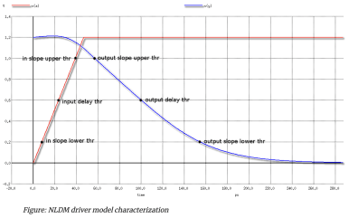

ref: Paripath Inc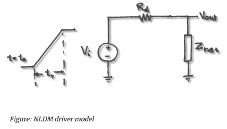

ref: Paripath Inc근데 Cell delay에 영향을 주는 요소가 2가지만 있는 것이 아니고,

65nm 이하 미세공정에선 "Miller effect" 고려가 꼭 필요해집니다.

​

그래서 Miller effect가 고려된 CCS Model이 개발되었습니다.

​

2. CCS, CCST, CCSN (Composite Current Source)

NLDM에서 발전된 형태로, CCS Driver model은 Cell의 output capacitance pin으로 흐르는 전류 파형을 고려하여 Miller effect 값을 계산해냅니다.

주로 Synopsys tool에서 사용됩니다.

NLDM보다 파일크기가 3~10배정도 더 큽니다.

​

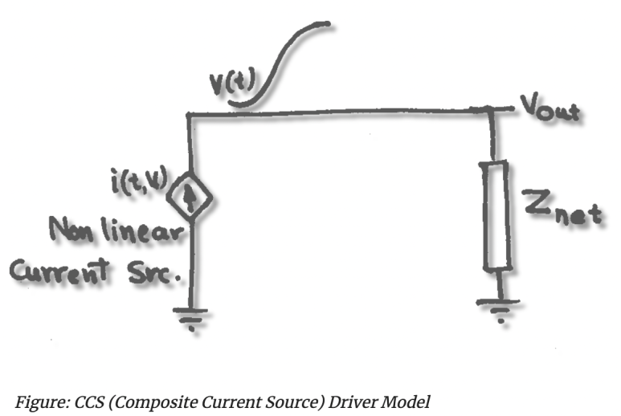

lib-ccs* - These are Liberty models characterized with CCS driver model.

lib-ccs-p - Liberty characterized using CCS model with power data. The ccs-p liberty file is used for power analysis.

These liberty files are provided only for the PVTs that have power sign-off corners.

lib-ccs-tn - Liberty characterized using CCS model with timing and noise data.

lib-ccs-tn-scm - Liberty characterized using CCS model with timing and noise data, with statistical constraint margin (SCM). SCM Liberty files contain additional hold time margin added to sequential cells to account for variation.

lib-ccs-tnv - Liberty CCS model with timing and noise data, with LVF (Liberty Variance Format) variation. Arm recommends to use the lib-ccs-tnv models for sign-off where available, as the LVF models variation better.

​

3. ECSM (Effective Current Source Model)

ECSM Driver model은 Cell의 output pin에서 전압 파형을 캡처합니다. 주로 Cadence tool에서 사용됩니다.

lib-ecsm* - These are Liberty models characterized with ECSM driver model.

lib-ecsm-tn - Liberty characterized using ECSM model with timing and noise data.

lib-ecsm-tn-scm - Liberty characterized using ESCM model with timing and noise data, with statistical constraint margin (SCM). SCM Liberty files contain additional hold time margin added to sequential cells to account for variation.

lib-ecsm-tnv - Liberty characterized using ESCM model with timing and noise data, with LVF variation. Arm recommends to use the lib-ccs-tnv models for sign-off where available, as the LVF models variation better.

​

​

OCV, AOCV, POCV, LVF

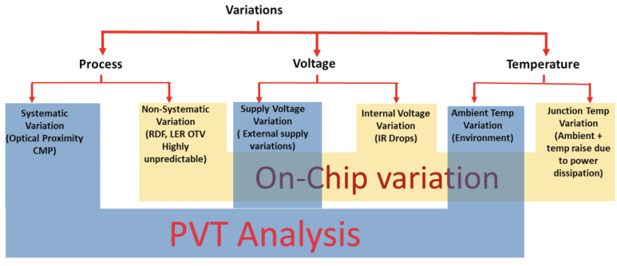

그리고 OCV라는 것도 고려해야하는데, 이거까지 쓰면 너무 길어질 것 같아서 포스팅을 따로 했습니다.

​

SmartScaling이란,

Multi-PVT Corner를 특성화할 때 발생하는 런타임 문제를 완화하는 방법론입니다. Synopsys PrimeTime의 기능 중 하나입니다.

미세공정으로 나아감에 따라,

복잡한 설계

복잡한 SDC

복잡한 UPF

다양한 모드

다양한 Variation과 Derate

를 고려해야합니다.

​

따라서 설계는 엄청난 수의 프로세스, 전압, 온도(PVT) 코너에서 Timing & Power Sign-off Closure를 달성해야 합니다.

​

감이 안 올 수도 있어서, 예시를 들면.

Process Variation : CMOS는 PMOS와 NMOS의 조합입니다. 실제 공정은 이상적이지 않기 때문에 두 MOS의 속도차이가 발생하게 됩니다.

Slow-Slow, Slow-Fast, Fast-Slow, Fast-Fast 이런 식으로 차이가 생깁니다. 여기서만 봐야 할 코너가 4개입니다.

Timing worst는 Max timing의 경우 Slow-slow가 worst하고.. Min timing은 Fast-Fast가 worst합니다.

코너를 최소화하기 위해 2개만 본다고 합시다.

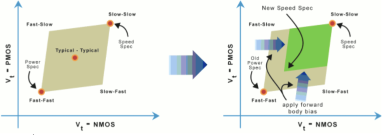

​

Voltage corner도 최소 2개 이상 있고,

Temperature corner도 최소 2개 이상 있습니다.

​

최소한으로 잡아도, 2*2*2  = 8개입니다.

1) 지금까지는 Cell에 대한 Variation을 봤고, Metal에 대한 Variation도 봐야합니다.

2) 칩 동작 모드가 여러개인경우, 각 모드에대해 따로 진행해야합니다.

그렇기에, 한개의 모듈을 검증하는 것에도 수십개의 작업을 해야합니다.

(이 작업 하나만 해도 Hardware Resource 사용이 엄청나게 큽니다.)

​

Library characterization팀과 STA팀은 수많은 PVT 코너를 특성화하면서 높은 시뮬레이션 처리 시간, 데이터베이스 디스크 공간 제한, 라이선스 서버 과부하, 하드웨어 비용과 같은 추가적인 문제에 직면하게 됩니다.

​

사용하는 입장에선, Machine learning이 "in-output 데이터셋으로 트레이닝하며 모델을 만들고, 모델을 갖고 인풋만 넣어도 출력데이터를 만들어준다"는 점만 이해하면 쉽습니다.

​

SmartScaling도 기존의 Characterization된 라이브러리를 "Anchor PVT Corner"로 사용하여 여러 개의 추가 PVT를 즉시 생성하는 방법론입니다.

​

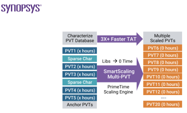

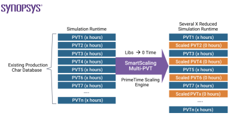

​

​

참고 서적 : 

Characterization and modeling of digital circuits, Rohit Sharma

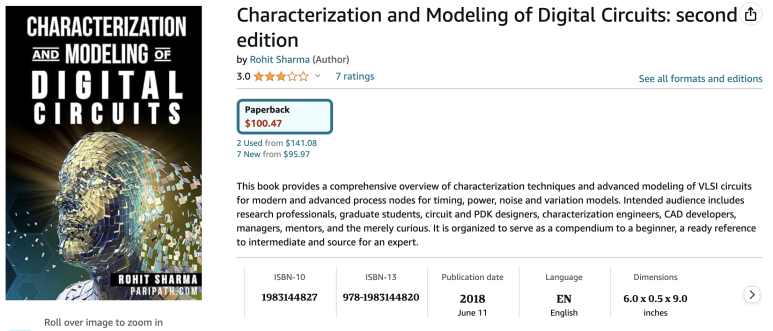

https://www.paripath.com/home

[Paripath Inc.](https://www.paripath.com/home) : Paripath offers software/services for VLSI simulation, characterization and modeling services. Click here to request a Free Guna License

​

​

분량조절 실패했다..^^~~@@

 해시태그 : 