## 온디바이스AI (Ondevice AI) AI란? AI Edge향 반도체부터 AIoT NPU ASIC 반도체까지. 온디바이스 vs 클라우드 시스템. 엔지니어 시점에서.

저는 산업현장에서 온디바이스 용 반도체 설계를 직접했기 때문에, 이것의 수요를 몸으로 느꼈습니다.

언제나 그랬듯, 논문과 기업 리서치를 중심으로 작성했습니다.

​

10년 전에는 IoT가 대세였고, 최근엔 온디바이스가 대세입니다.

일단 IoT랑 온디바이스랑 비슷한 개념인데, 온디바이스는 AI가 결합된, AIoT라고 보시면 됩니다. 삼성전자와 삼성협력사에서는 Ondevice라는 표현을 많이 쓰고, 미국에서는 Edge computing이나 Edge device, AIoT라는 표현을 더 많이 씁니다.

특히 Edge-Based AI Accelerator라는 단어를 많이 씁니다.

​

그렇기 때문에 IoT에 대해 먼저 알아보고, AIoT (온디바이스)란 무엇이고, 이걸 어떤 수요 때문에 만들어야하고, 이 Software를 구동시킬 Hardware는 어떤 것인지 알아보겠습니다.

​

온디바이스 소개 시작합니다. 다양한 용어가 나올 예정입니당.

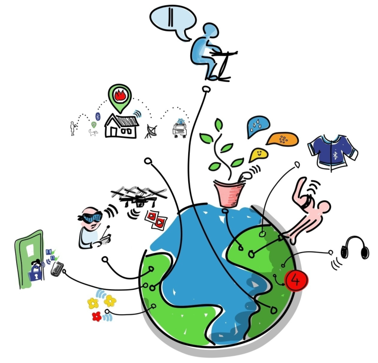

IoT란? (Internet of Things)

모든 사물이 인터넷에 연결되어 상호작용을 한다.

여기서 주목할 점은 Things입니다. 이 Things(물건)가 device(장치) 혹은 edge(통신 마지막단 제품)라고 불립니다.

아래에선 여러분의 이해를 돕기위해 "디바이스"라고 통일해서 부르겠습니다.

​

아래 사진은 최근에 LH가 신축 아파트에 IoT 스마트홈을 적용하고  공개한 사진입니다. 아래그림을 토대로 IoT를 설명해보겠습니다.

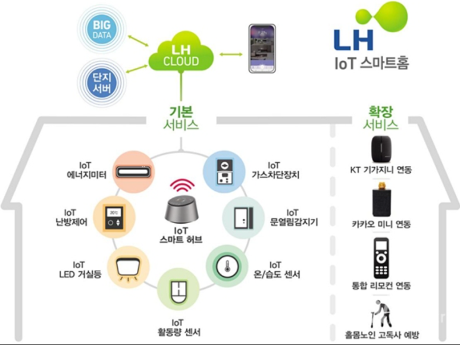

위 그림에서 보다싶이, Cloud라는게 중앙에 있습니다.

그리고 각 디바이스가 아래 항목들을 체크합니다.

에너지미터로 현재 에너지 사용량 체크

문열림 감지

온습도 체크

냉난방 제어

1.1) 각 디바이스들은 항목을 체크하고

1.2) Analog 신호를 Digital 신호로 변환하고

1.3) 이 Digital 신호를 IoT 스마트허브에 보냅니다.

그러면 스마트홈의 각 디바이스들의 작업은 끝났습니다.

2.1) 이제 IoT 스마트 허브는 LH의 CLOUD 서버에 데이터를 보냅니다.

2.2) LH CLOUD 서버는 받은 디지털신호를 계산해내어, 101동 201호의 문이 1:00에 열렸구나 정리를 하고, 이 알림을 사용자의 폰에 전송합니다.

​

이게 IoT인데요. 이렇게되면 아래와 같은 문제가 있습니다.

1) 나의 개인정보를 클라우드에 공유를 해야합니다.

2) 외부 인터넷 연결이 꼭 필요해집니다.

3) 클라우드에서 대부분의 서비스가 이뤄지므로, 클라우드 관리비를 내야합니다. 근데 엄청나게 비싸요.

4) 디바이스들이 신호에 대한 센서 역할만 할 수 있기에 간단한 작업만 할 수 있습니다.

5) 모든 신호들이 클라우드를 갔다 와야하기 때문에 통신속도로 인한 지연이 크게 발생합니다.

1,3번이슈도 크지만, 5번 이슈가 큰 문제입니다.

​

그래서, 디바이스가 스스로 AI 연산을 할 수 있는 필요성이 대두되었습니다.

​

온디바이스, AIoT란?

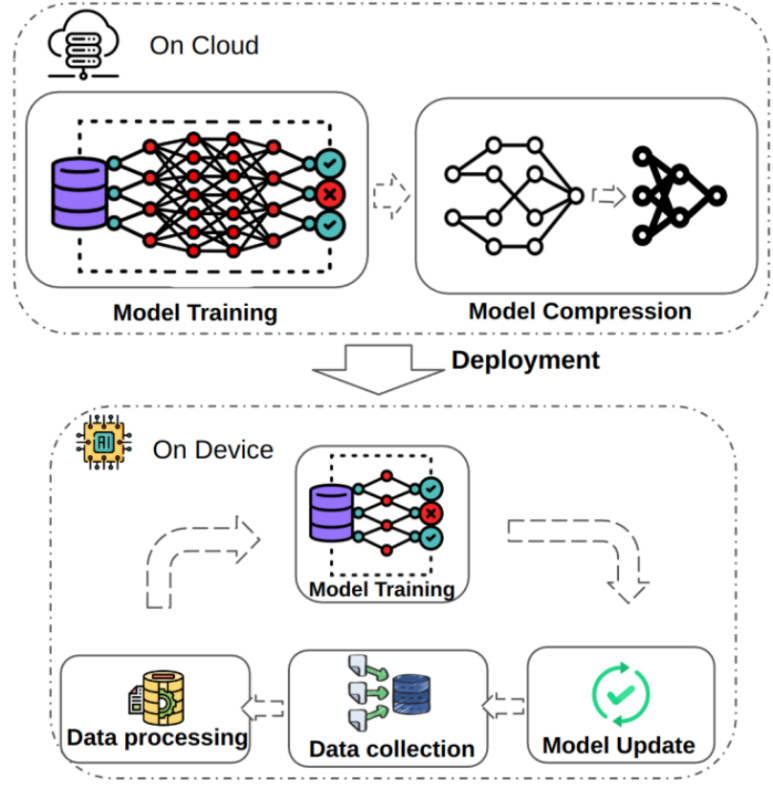

AI 연산에 필요한 기능들을 각 디바이스의 SW에 넣자는게 기본 컨셉입니다.

제가 방금 "통신속도로 인한 지연"이 큰 문제라고 했는데요. 통신속도를 지금 이상으로 올리기도 쉽지 않습니다.

자율주행을 생각해봅시다. 자율주행도 AI 기반으로 만들어질텐데요. 약간의 지연시간은 당연히 사고로 이어질 것입니다.

 6G 통신이 나온다고 하더라도, 네비게이션 같은 것들만 중앙통제형 Cloud system을 이용하고, 순간순간의 판단은 온디바이스 시스템으로 진행될겁니다.

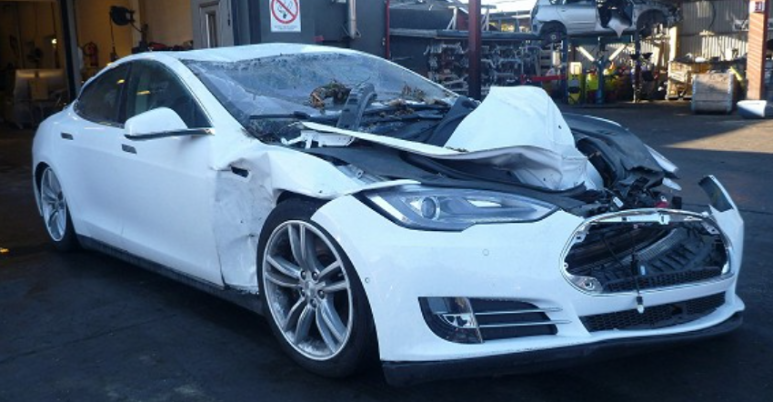

​

​

그러면 지금 서버향, 데이터센터향 반도체는 NVIDIA에서 다 해먹고 있고, 일부는 자체반도체 (Google의 TPU 등)로 ASIC 만들고 있는데, 온디바이스 반도체는 어떻게 하고있는지 보겠습니다.

​

자율주행용 반도체의 경우, 테슬라가 가장 선도하고 있습니다. 애초에 현재 테슬라 자율주행 수준이 가장 높고, 판매량도 많으며, 오래 해왔고 투자금 자체가 타사랑 비교가 안됩니다.

​

자율주행 반도체용 칩은 FSD Chip을 보시면 되고, Tesla 클라우드용 Chip은 Dojo 보시면됩니다.

아래 Floorplan은 칩설계 공부하시는 분 아니면, 그냥 이름만 보시면 됩니다. "NPU가 들어갔구나" 이정도만... 칩 설계하시는 분들을 위해서 나중에 왜 Tesla가 Floorplan 이렇게 했는지 정리해드릴게요. (테슬라가 잘 정리해줬길래 그거 보고 공부했습니다.)

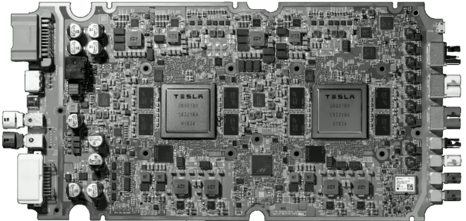

​

아래는 System on Chip 양산 전에 Place & Route 과정에 진행하는 Floorplan 개략도입니다. 실제 Chip이 아래처럼 Tape out 되었습니다.

보시다시피, Camera, ISP, GPU, Video 4개 바로 인터페이스 하게 되어있고, 2개의 NPU가 2GHz, cortex A72로 2.2GHz 36.86TOPS로 동작하네요. (2019년 Samsung LPP 14nm 공정으로 어떻게했지? 대단하다)

​

Tesla FSD Full-Chip Floorplan

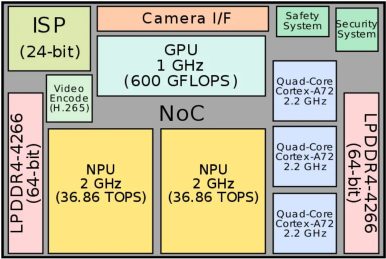

Tesla FSD Chip Floorplan, AIoT, NPU, ASIC, ondevice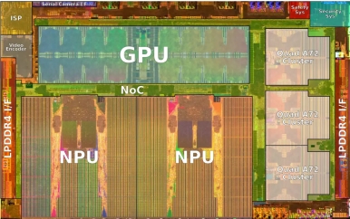

Tesla FSD Chip Floorplan, AIoT, NPU, ASIC, ondeviceTesla FSD NPU Floorplan

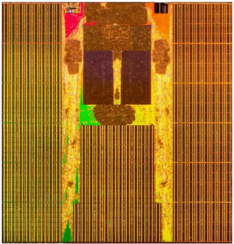

Tesla FSD NPU Floorplan, AIot, NPU, ASIC, ondevice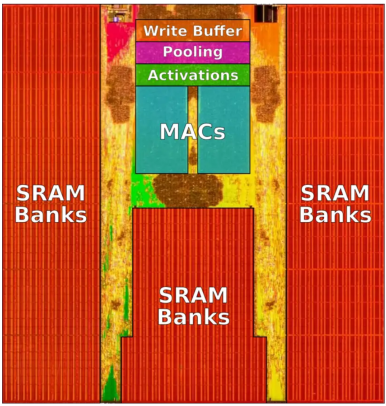

Tesla FSD NPU Floorplan, AIot, NPU, ASIC, ondevice​

Tesla FSD CPU Floorplan

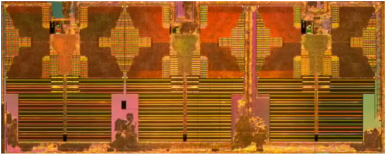

Tesla FSD CPU Floorplan, AIot, NPU, ASIC, ondevice, ARM Cortex-A72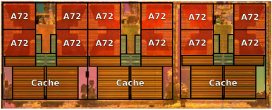

Tesla FSD CPU Floorplan, AIot, NPU, ASIC, ondevice, ARM Cortex-A72​

삼성전자에선 자동차 전장 1위 업체인 Harman을 인수하고, 전장용반도체로 Exynos Auto 시리즈를 개발 중입니다.

​

아무튼 자율주행용 온디바이스는 이렇고, 아래는 엣지단에 작은 크기의 디바이스들입니다. 사실 자율주행 칩들도 온디바이스긴한데, 지금 화두로 보고있는 온디바이스 칩은 대부분 작은 크기의 응용제품들입니다.

​

​

자율주행 반도체 외 온디바이스?

Cloud computing vs Edge computing (on-device)예를들면 무선이어폰, 스마트워치 등이죠.

요즘 AI 번역기인 "DeepL"의 번역 수준을 보면, 번역가들 일감이 많이 줄겠구나.. 싶습니다.

근데 온디바이스에서도 AI번역이 진행 중인 것 아시나요?

​

예를들어 덴마크 사람이 나에게 덴마크어로 말한다?

온디바이스 AI 기술이 적용된 무선이어폰은 듣는 즉시 한국어로 번역해서 내게 들려줄 수 있습니다.

사실 이건 지금도 가능하긴한데, 지금은 데이터센터에서 AI 처리를 하니까 빨리 빨리 안되죠.

속도 때문에 못 하고 있는 AI 기술들은 AIoT로 다 해결된다고 보시면 됩니다. 그래서 애플이 긴급으로 Siri와 온디바이스 시스템을 정비중이고, 삼성에서도 가우스라는 AI를 내놓은겁니다.

​

아직도 감이 안 오신 분들이 있을 것 같아 한번 더 설명합니다.

현재 아이폰에 Siri를 부르면, 내 폰에 있는 Siri가 대답하는게 아니라, 내 질문을 미국의 데이터센터로 보내고, 미국의 데이터센터에서 연산하여 답변을 만들고, 내 아이폰에 음성 전달을 하는건데요. (그래서 간단한 질문 답변만 할 줄 알고, 반응 속도도 몇 초 걸림)

앞으로는 데이터 센터를 거치지 않고, Siri가 진짜 내 아이폰에서 대답을 할겁니다. (더 어려운 질문이더라도, 인간이 지연시간을 못 느낄 정도로 빠른 답변)

​

NVIDIA의 Edge, ondevice는 NVIDIA Jetson으로 만들고 있고,

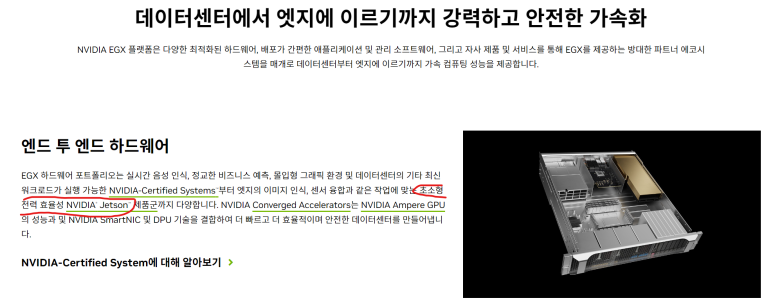

​

Google에서는 Edge TPU로 불립니다. 일반 개별 소비자에게 판매도 합니다. 10만원이면 하나 삽니다.

https://coral.ai/products/

[Products | Coral](https://coral.ai/products/) : Helping you bring local AI to applications from prototype to production

​

​

데이터센터향 반도체와 엣지향 반도체의 차이점

​

​

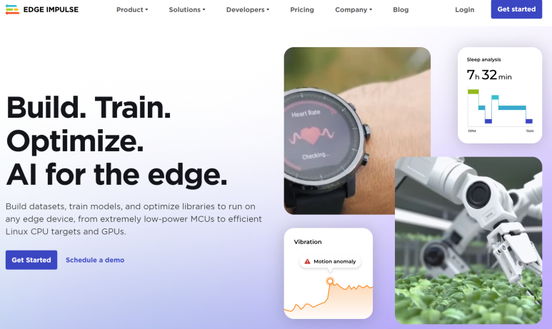

전장용 반도체나 서버용 반도체의 경우, 크기에 대한 제한이 별로 없지만.. 웨어러블 반도체의 경우엔 크기에 대한 제한이 큽니다.

- 데이터센터향 반도체는 크기가 커지더라도 HBM, CXL 같은 기술들을 쓸 수 있죠. 그런데 온디바이스에서는 어쩔 수 없이 로컬메모리 통합해서 외부 메모리 액세스를 최소화 하여야 크기도 줄이고 전력 소비도 줄여야 합니다. HBM, CXL, PIM 다 쓰긴 할텐데, 크기 문제 때문에 제한적입니다.

- 데이터센터향 반도체는 Systolic array 많이 쓰는데 AI NPU는 크기를 최소화해야하니... 좀 다른 형태의 Systolic array를 사용합니다. 뉴로모픽 구조니, adder tree니, 다른 방법도 있긴한데 결국 jetson이랑 google edge tpu 둘 다 systolic array로 만들어졌습니다.

​

​

​

어쨌든! 전용반도체에서 가장 중요한건 어떤 응용프로그램을 타겟으로 하여 최적 동작을 만드는가? 입니다. (전용반도체란, 한 타겟만 동작하는 대신 한 타겟에 대해 최고 효율의 성능과 전력)

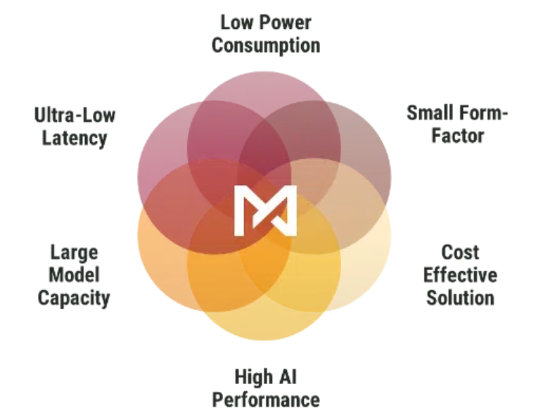

High-end Edge AI Requirements - MythicAI는 AI Model을 통해 동작을 하구요.

결국, "On-device향 NPU에서 가장 중요한건 어떤 AI Model을 올리는가?" 입니다.

온디바이스 향 Model은 TinyML(엣지 디바이스용 경량화 모델)이라고 불리는 경량화 모델입니다.

​

​

​

다 살펴보았는데요. 누가 "온디바이스 반도체가 뭔가요?"라고 물어보면,

"특정 목적에 대한 TinyML를 최적화하여 운용할 수 있는 반도체입니다. 현재는 클라우드 중심 AI 시스템으로, 통신과 전력 문제가 있습니다. 앞으로는 분산된 AI 시스템으로 전망됩니다."라고 대답하시면 됩니다.

​

Edge device는 면적은 최소화하고 성능과 전력 효율은 극대화 해야합니다. 그래서 응용프로그램에 대한 범용성은 포기하고, 하나에 집중하는게 기본입니다.

​

​

​

TinyML, 온디바이스 AI 추세

CNN 기반으로 하면 Layer 사이즈가 커질 수 밖에 없고, 온디바이이스 하드웨어는 Area에 대한 제한이 강력합니다.

온디바이스 AI 모델에서 Convoultion 연산을 최소화하기위해 최근 BNN, 즉 Binarized Neural Network (XNOR-Net* 등)과 같은 초경량모델이 연구되고 있습니다.

​

​

온디바이스 관련주

2020년부터 정부 과학기술정보통신부에서 "차세대 지능형 반도체 기술개발 사업"으로 엣지 기술을 이미 연구개발을 해왔습니다.

관련주, 관련 회사, 관련학교로는 "넥스트칩, 리트빅, 세미파이브, KETI, 충북대, 아크릴, ETRI, 서울대, 경희대, 옥타코, 오픈엣지테크놀로지, 라온피플, 대구대, 서울대, 딥엑스, 한양대, KAIST"가 있습니다.

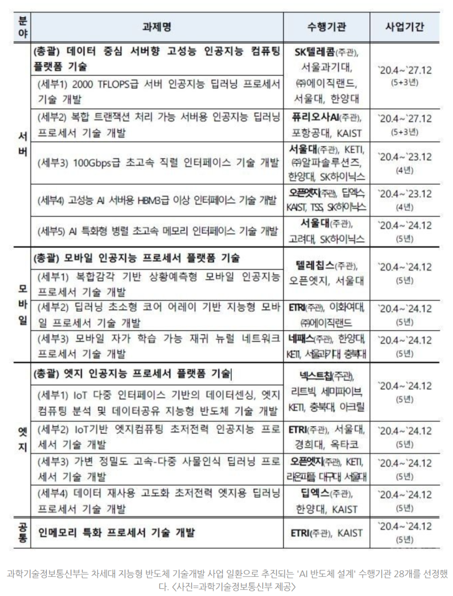

추가로, 퀄리타스반도체, 제주반도체도 엣지향 반도체 IP 설계를 하고 있고, 에이직랜드와 가온칩스에서 디자인서비스를 합니다.

​

궁금하신 것 있으시면 댓글로 남겨주세요.

 해시태그 : 