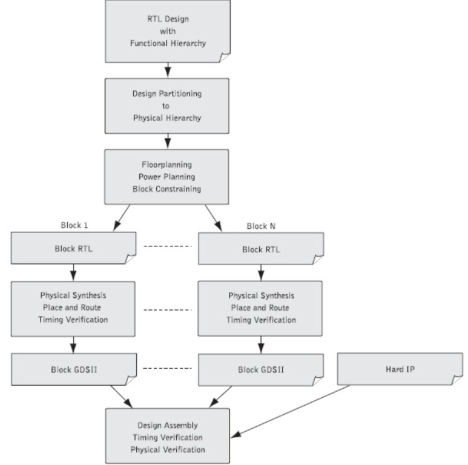
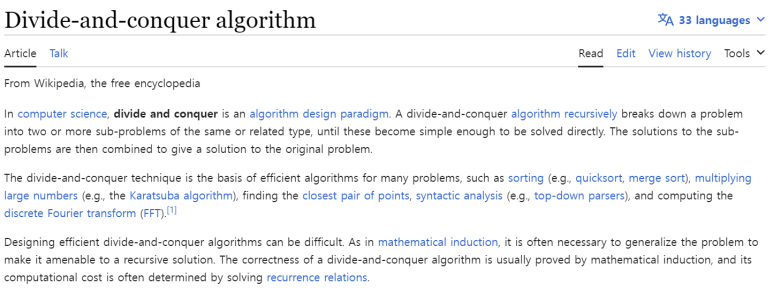
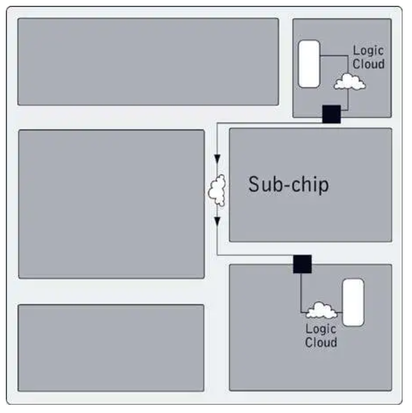

## Flatten Design이란? Hierarchical Design : Flat design, 계층적 디자인, runtime, vlsi, 회로 설계

현대의 AI를 가동되는 칩은 손바닥보다도 작은 칩부터 시작한다는 것을 알고 계신가요?

이런 작은 칩에 트랜지스터는 엄청나게 많은 트랜지스터들이 들어갑니다. 그 수는 수백억 단위이구요.

너무 많은 경우의 수가 존재하다보니, 다양한 설계 검증을 할 때 엄청나게 큰 하드웨어 리소스 + 런타임이 필요합니다.

Introduce the concept of design styles in VLSI

Flatten design과 Hierarchical Design이라는 기본적인 개념이 수십년 동안 VLSI 업계에서 사용되고 있습니다.

(지난 몇 년간에는 Flatten과 Hierarchical 방법 외에도 다양한 방법들이 출시되었습니다. Synopsys의 HyperScale, HyperGrid 등이 그런 예시이죠.)

​

어쨌든 여전히 Flatten design과 Hierarchical design이라는 두 디자인 기본 스타일이  VLSI 환경을 지배하고 있습니다.

겉보기에는 비슷해 보이지만 설계 효율성부터 칩 성능까지 모든 것에 영향을 미치는 이 두 가지 스타일은 뚜렷한 장점과 과제를 제공합니다.

​

Flatten design: "하나의 설계도"

Hierarchical Design: "여러개로 분리한 설계도"

이렇게 이해시면 쉬울 것 같습니다.

​

reference: EE Times​

Flatten Design이 실제 칩과 비슷해보이는데, 왜 Hierarcical Design?

일단 이 회로도가 엄청나게 많은 숫자의 트랜지스터가 들어간다는 점을 아셔야 합니다.

이렇게 많은 숫자의 트랜지스터에 대해 엄청나게 많은 숫자의 트랜지스터를 검증해야 해요.

Flatten design은 하나의 회로도에 엄청나게 많은 트랜지스터가 들어있습니다.

오늘 아침에 검증/설계 EDA Tool을 실행시켰는데, 내일 아침에도 안 끝나 있을 수 있는거죠. 그러다가 실수가 발견되었다? 그러면 며칠 날린겁니다.

엔지니어의 직업 자체가 엄청나게 많은 실패를 겪다가, 성공을 하고 최고의케이스를 찾아가야하는 직업이니까요.

그래서 제 블로그를 보셨다면 지겹게 보셨을 내용인 "Divide and conquer"입니다.

​

1) 하나의 설계도를 여러개로 쪼개고,

2) 병렬적으로 실행하면서,

3) 설계/검증이 완료된 Block은 대기시키고

4) 설계/검증 수정이 필요한 Block만 설계/검증을 반복시킨 후에 이것도 완성되면

5) 마지막에 Flatten design으로 검증만 하여 Sign-off 하고 Tape-out 하는겁니다.

​

예를들어 하나의 Core가 16개 있다던가.. 중복 디자인이 하나의 칩에 여러개가 있을 수 있잖아요?

Flatten design에서는 하나의 칩에 있는 16개의 Core를 항상 모두 설계/검증해야하는데,

Hierarchical design에서는 사실 1개의 Core만 설계/검증해서 하나로 모듈화를 하면 되니까..

-> 하드웨어 리소스도 줄고 런타임도 줄게되죠

그리고 한 사람이 하나의 작업을 돌리고 여럿이 보는게 아니라,

여러 사람이 각자 여러개의 작은 작업으로 보고.. 작은 이슈들을 해결하고 마지막에 보는 방법이라, 이슈 해결이 쉽죠.

​

그리고 이런식으로 하다보면,

누군가는 "ARM Core integration 전문가", "PCIe P&R 전문가" 이런식으로 전문화되니까 나중에 작업도 더 쉬워지구요.

구조

ref: vlsi concepts위 그림처럼 만든다고 보시면 됩니다.

fig-a는 하나의 설계로 Flatten하게 만든것.

fig-b는 b1, b2, b3로 디자인을 나누고, 각자 설계한다음 모듈 형태로 최상위 모듈에서 불러오고 마지막에 Flatten 검증.

​

어떤식으로 계층을 나누는가?

기능 단위

IP 단위 

디자인 크기 (런타임 단위)

다른 방법도 많긴 함.

​

Hierarchical Design의 단점은?

모듈화 되는 중복 디자인이 없다면, 오히려 하드웨어 리소스 사용량은 더 클 수도 있습니다.

Glue logic 같은 부분들이 설계 당시에 Flatten 대비 덜 최적화됩니다.

로직 시뮬레이션을 할 때, 실제 Chip level에서 하는 시뮬레이션과 Hierarchical level에서 하는 Simulation이 Sync가 맞도록 추가적인 작업이 필요합니다. 그러지 못하면, 칩 레벨 시뮬레이션을 하다가 버그를 발견 할 수도 있습니다.

각 하위 디자인 간에 타이밍을, "하위 디자인 스스로가 가상적으로" 고려해야한다. 회로 설계는 어쨌든 Clock이라는 시간을 단위로 동기적으로 동작합니다. 그래서 하위 디자인1과 하위 디자인2 간에 정상적으로 데이터가 오가려면 input delay, output delay를 서로 고려를 해줘야 Chip Top에서 제대로 동작 될 수 있어요.

그러다보니 하위 디자인의 설계 제약조건, 상위 디자인의 설계제약조건 또 각각 고려해서 만들어야 합니다.

​

어쨌든 마지막엔 Flatten으로 검증을 해야 합니다. 그게 Chip Top이니까요.

이 Flatten의 Runtime은 굉장히 길구요. 그래서 Synopsys 등 EDA사의 최신 기술을 보면 어떤식으로 했을 때 Flatten처럼 설계/검증을 하지만, 더 빠른 속도로 더 적은 하드웨어로 하는 방법론들이 계속 나오고 있습니다.

​

아예 다른 Design Flow를 사용하는 방법들... 하드웨어 레벨에서 다른 방식으로 EDA를 작업시키는 방법론들.. Timing model이라는 가벼운 파일을 사용하는 방법론들... 다양하게 있습니다.

​

사실 설명을 VLSI / 디지털 논리 회로 설계에 집중하여 작성하였는데,

아날로그 회로 설계 / Full-custom / PCB 설계 / 회사의 팀 경영 등에도 Flatten과 Hierarchical은 많이 사용되는 개념입니다.

​

​

 해시태그 : 