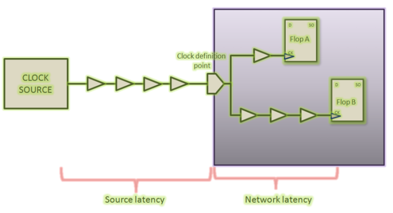
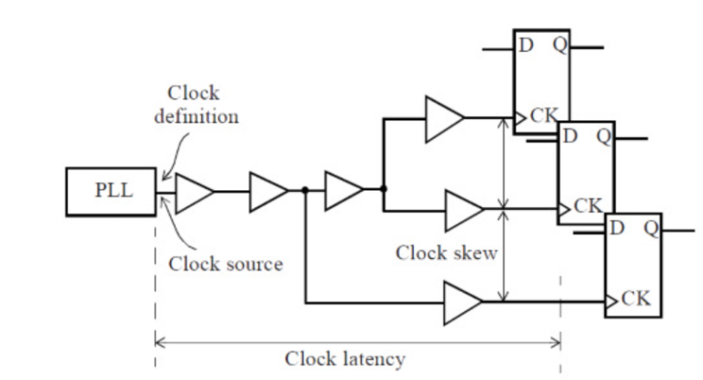
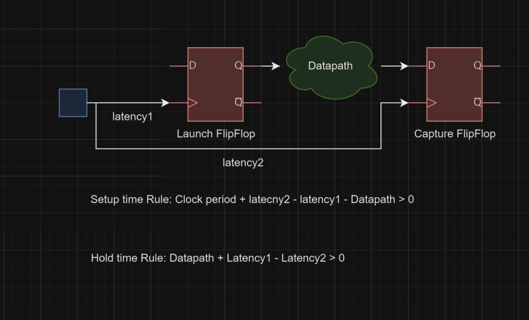
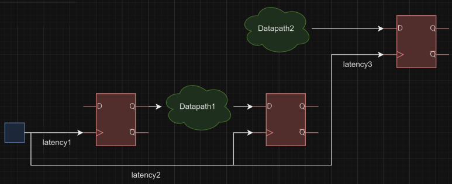

## Useful skew란?: Skew, Latency 용어 정리

VLSI(Very Large Scale Integration) 설계에서 Timing은 시스템의 성능과 신뢰성을 결정짓는 핵심 요소입니다.

Physical Design에서 중요한 개념인 Clock tree, Skew에 대해 용어 정리를 해보겠습니다.

​

​

Clock latency란?

Clock latency는 Clock Source로부터 특정 Flipflop의 Clock pin까지 Clock Signal이 이동하는 데 걸리는 시간입니다

UNDERSTANDING AND APPLYING USEFUL SKEW, Ahnaf Bin AftabSource latency란?

Source Latency는 Clock Source에서 Clock definition point까지 이동하는 데 걸리는 시간으로 정의됩니다.

이는 소스 삽입 지연(source insertion delay)이라고도 알려져 있습니다."

​

Definition은 create_clock으로 선언하는 Master clock과

create_generated_clock으로 선언하는 Slave clock이 있습니다.

​

Network latency란?

Network latency는 Clock Signal이 Clock Definition 부분에서 Sequentia cell의 Sink pin까지 이동하는 데 걸리는 시간으로 정의됩니다.

Skew란?

2개의 Sink pin사이의 Clock Latency 차이입니다.

​

https://support.xilinx.com/s/question/0D52E00006iHvxwSAC/what-would-be-difference-between-clock-latency-and-propagation-delay?language=en_US옛날에는 Zero Skew라고 해서 모든 Flip flop의 latency를 동일하게 맞춰놓고 설계하는 방식을 사용했다고 합니다.

최근에는 Useful skew라고해서, skew를 어느정도 이용하는 방법으로 설계를 많이 하고 있습니다.

Timing 관련 규칙은 뭐 사실 아래 두가지만 보셔도 됩니다.

Setup time Rule: Clock period + latecny2 - latency1 - Datapath > 0

Hold time Rule: Datapath + Latency1 - Latency2 > 0

Clock period - Datapath >  Latency1 - Latency2 > -Datapath

이런식으로, 최적의 PPA를 목표로 Clock Tree Synthesis를 합니다.

​

​

Positive Skew란? Negative Skew란?

Positive skew는 Capture Flipflop의 Latency와 Launch Flipflop의 Latency 계산했을 때 값,

Capture Flipflop이 더 길게 Latency가 있으면 Positive -> Setup time 맞추기 유리해짐

위 수식에서는 Latenct2-Latency1

​

Negative skew는 Capture Flipflop의 Latency와 Launch Flipflop의 Latency 계산했을 때 값,

Launch Flipflop이 더 길게 Latency가 있으면 Positive -> Hold time 맞추기 유리해짐

위 수식에서는 Latenct1-Latency2

​

​

Local Skew란?  Global Skew란?

Local skew는 Datapath가 연결되어있는 "Logically related timing path"의 Latency 차.

아래 그림에서는  Local skew = Latency2 - Latency1

​

Global skew는 현재 회로에서 가장 긴 Latency와 가장 짧은 Latency의 차.

아래 그림에서는 Gobal skew = Latency3 - Latency1

​

​

​

​

​

 해시태그 : 