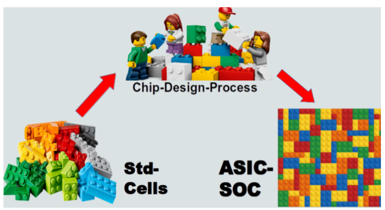
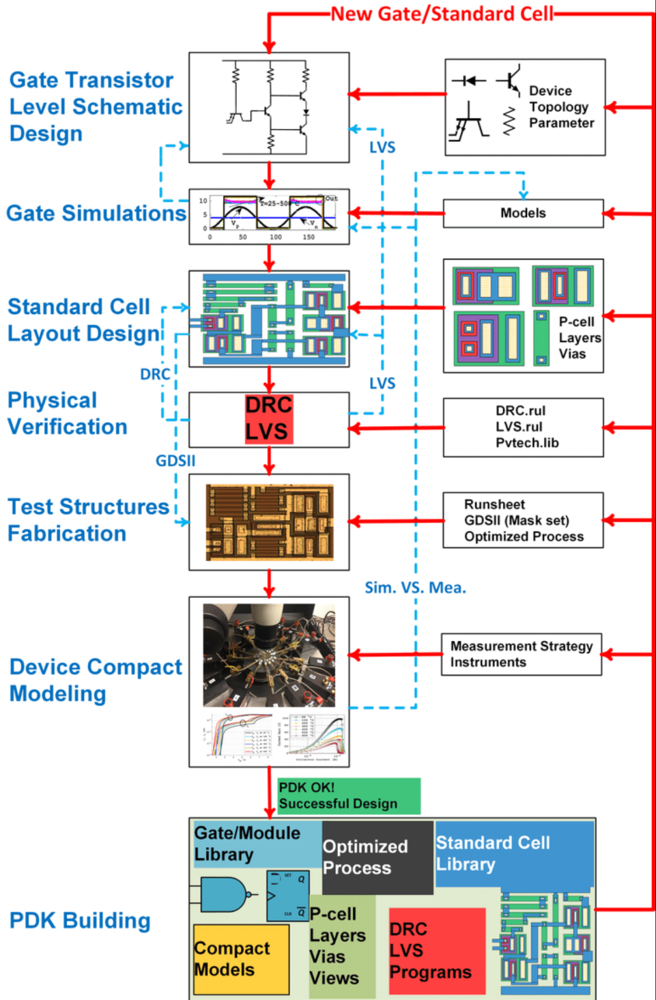

## PDK란? Process Design Kit

반도체 Very Large Scale Integration (VLSI) 설계 세계에서, Process Design Kit (PDK)는 silicon fabrication과 integrated circuit 설계 사이의 근본적인 다리 역할을 합니다.

​

레고 블록 모듈이라고 보면 좋을 것 같아요. 칩 설계 엔지니어들은 이 레고블록으로 건물을 만들구요.

​

Technology Computer-Aided Design (TCAD), SPICE modeling, 그리고 Device characterization까지 보고,

Post silicon validation 후에 Calibration과 Silicon re-charac은 어떻게 진행되는지.. PDK version 1.0, 2.0 3.0 어떻게 바뀌어나가는건지... 살펴봅시다.

PDK란 무엇인가?

생성 flow에 대해 살펴보기 전에, PDK가 무엇인지 명확히 이해해 봅시다. Process Design Kit은 semiconductor foundry가 design team에 제공하는 파일과 문서의 집합입니다. 여기에는 특정 process technology를 사용하여 integrated circuit을 설계, 검증 및 제조하는 데 필요한 모든 정보가 포함되어 있습니다. PDK의 주요 구성 요소는 다음과 같습니다:

​

0. Standard cell libraries

1. Design rules

2. Device models

3. Parasitic extraction rules

4. I/O libraries

5. Memory

6. Physical verification decks

7. Document

... 수십개 되는데, 간단히 나타내면 위와 같습니다.

​

PDK는 Foundry에서 Designer에게 전달하는 기본적인 Design Kit입니다.

30년 전에는 PDK에 대한 개념도 없었고 SPICE로 만든 Behavior Model 과 unit Square 당 R.C 값 정도만 가지고 회로 설계를 하였습니다.

PDK는 설계된 circuit이 target process technology로 fabrication 되었을 때 미세공정으로 들어가면서, 설계도와 Chip간 괴리가 커지게 되었습니다. 이를 보완하기 위해 설계 엔지니어 <-> 공정 엔지니어 간 회의를 통해 주고받던 data 들이 정리가 되어 외부 고객들에게 제공 되었습니다.

​

PDK의 스펙이 좋아 Timing을 잘 맞출 수 있는지 + PDK와 실제 칩 큰 차이가 없는지 + IP와 document 수준 등에 따라.. ASIC Chip 설계 난이도가 결정됩니다.

SAMSUNG, tsmc, IFS 등 여러 PDK 접근 가능하신 분들은 다 아시겠지만, 똑같은 STD cell도 사이즈가 어떤 회사 공정이 더 작고(P&R이 용이하고).. 어떤 회사 공정이 더 빠르고(Signoff가 쉽고).. 이런 특징이 있으니까요.

​

​

​

PDK Generation Flow

1. TCAD Process and Device Simulation

2. SPICE Model Generation and Optimization

3. Device Characterization

4. Standard Cell and I/O Library Development

5. Physical Verification and Extraction Rule Development

6. PDK Integration and Validation

좀 더 DK 입장에서 보면,

TCAD Process and Device Simulation

Technology Computer-Aided Design (TCAD)는 PDK 생성의 기초입니다. 다들 아시는 semiconductor fabrication process를 simulate하고 결과로 나오는 device의 electrical characteristics를 예측하는 것을 포함합니다. 이 단계는 process variation이 device performance에 어떤 영향을 미치는지 이해하고 manufacturing process를 최적화하는 데 중요합니다.

​

bsim level, doping profile, layer thickness, material interface를 포함한 device structure의 virtual representation을 생성성하고....

Carrier transport modeling, Hot carrier effects, Mobility models...... 등등 device level simulation 하고....

복잡한 equation을 풀어 device의 electrical characteristics를 Predict합니다.

​

electrical characteristic이라 하면,

- vth, threshold voltage

- subthreshold slope

- on-current, off-current

- RC

이런 것들입니다.

​

주요 TCAD tool에는 Synopsys Sentaurus Process, Silvaco Athena 등이 있습니다.

​

​

​

​

Calibration and Validation

PDK 생성에서 가장 중요한 것은 real-world data에 대한 Calibration과 Validation입니다. 

1. Simulated result를 test structure의 measurement와 비교

2. Experimental data와 일치하도록 simulation parameter 조정

3. 다양한 device geometry와 operating condition에 걸쳐 calibrated model 검증

Test vehicle

SPICE 모델링, simulation, Characterazation 부분은 현업과 맞닿은 부분이라 이런것들은 검색 키워드만 드릴게요

SPICE extraction

Parameter Extraction

SPICE Model optimization

SPICE modeling

SPICE simulation

Device Characterization

​

이렇게 하면~ 버전 0.x PDK가 나오고, EDA Tool들에서 문제 없는지 확인 하고, 실제 wafer에서 뜬 test vehicle이랑 비교 및 교정 진행하면서 version 1.0이 나오면 이제 Chip 설계자들이 이걸 갖고 설계하는겁니다.

​

PDK 생성은 반도체 제조 공정의 특성을 정확히 이해하고, 이를 설계자가 사용할 수 있는 형태로 변환하는 복잡한 과정입니다. 정확한 SPICE model, 잘 설계된 standard cell, 그리고 철저한 verification rule은 성공적인 chip 설계의 기초가 됩니다. 

​

아, 그리고 DK는 보통 liberty와 compiled db가 들어있는 키트를 의미합니다.

 해시태그 : 