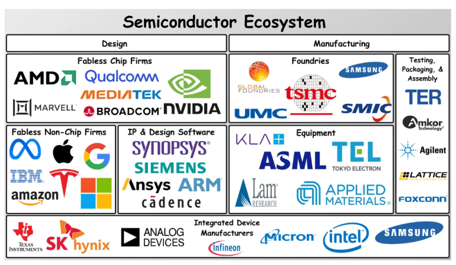
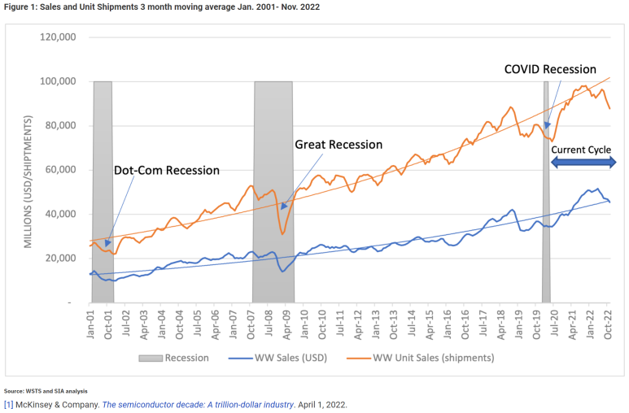

## [반도체 엔지니어 커리어 관리] 반도체 슈퍼 사이클을 따라서

최근 한 PD, RTL 엔지니어 친구와 대화를 나눴습니다. 인도 출신에 5년차가 되어가는 Physical Design 엔지니어와, 한국인 RTL Design Engineer 친구들이었는데, 요즘 취업 시장이 너무 어렵다며 고충을 털어놓았습니다. 그 친구의 말은 아마 많은 설계 엔지니어들이 공감할 이야기일 것 같습니다.

​

PD Engineer: "요즘 경력 5년 미만인 엔지니어에게 현재 시장은 최악이야. 왜 이렇게 괜찮은 회사가 없냐. EDA 3사, 삼성, 하이닉스, 다른 외국계 반도체 게업들은 서류를 통과해서 면접까지 가는 것 조차 힘들고..... 인터뷰 과정에서  하나라도 실수하면 그냥 끝일 정도로, 완벽한 서류에 완벽한 면접을 통과해야만 이직에 성공 할 수 있는 것 같아. 근데 웃긴건, India나 Vietnam은 우리보다 더 심하다더라."

​

​

PD 경력 5년 미만 엔지니어, 왜 기회가 줄었을까?

사실 Physical Design는 반도체 분야에서 핵심 역할을 맡고 있음에도, 채용 시장은 점점 더 경력직 중심으로 돌아가고 있습니다. 특히 다음과 같은 몇 가지 이유가 작용하는 것 같습니다.

​

분야가 너무 깊어져서 주니어 엔지니어는 신입과 비슷하다.

0~3년차까지는 정신 없이 배우고, 3~4년차까지는 이제 좀 터득하고 내가 Run 했던 script들을 다시 되돌아보는 때임

-> 3~4년차 경력차들 조차도, "저도 아직 혼자서 뭔가 할 수 있는 레벨은 아니에요...." 라고 말하게 되고, 혼자서 프로젝트를 다 주도 할 수 있는 경력직이 선호된다.

​

2. 회사 입장에서는 즉시 프로젝트에 투입할 수 있는 인력을 원한다.

경력 10년 이상의 엔지니어들은 매우 제한된 PPA, 처음 진입하는 선진공정에서 Tape-out 경험이 있고, 프로젝트의 에이스로 진출하는 것에 얼마 시간이 걸리지 않습니다.

-> 경력이 짧은 엔지니어들은 상대적으로 더 완만한 학습 곡선이 필요하기 때문에 채용 우선순위에서 밀릴 수밖에 없다.

​

3. 면접 수준이 높아졌다.

-> 최근 반도체 시장이 경쟁적으로 변하면서, 인터뷰 수준도 높아지고 있다.

과거에는 반도체 엔지니어 풀도 적고, 연봉도 낮고, 인터넷 상에 정보도 적었으며, 과거의 PD 엔지니어들은 테크니션들이 하는 Layout 정도 직무였는데, "무어의법칙"을 따라 트랜지스터 특히 PD 분야는 실무 경험이 그대로 드러나는 질문이 많다. Signoff, ECO 경험 등에서 구체적인 결과와 성과를 보여줘야 한다.

​

반도체의 부가가치가 높아지면서, 신입 엔지니어들의 연봉도 높아졌고,(성과급 제외, 기본급만 하더라도 중소기업들도 4000 초반은 나오고, 대기업의 경우, 5000 후반) "반도체 엔지니어"가 되길 희망하는 무경력자들은 많아졌다. 결국, 면접 경쟁률이 더 높아졌음.

​

결론: 대기업 및 주요 외국계 기업들은 시장 수요의 변화 많은 회사들이 경력직 채용에 집중하면서, 신입 및 주니어 경력 엔지니어에 대한 기회는 자연히 줄어들고 있다.

​

​

RTL 엔지니어의 현실: 재사용되는 IP와 줄어드는 기회

최근 반도체 업계의 흐름을 살펴보면, 많은 회사들이 RTL Engineer 인력 비율을 줄이고, Design Verification 엔지니어와 Physical Design 엔지니어에 더 많은 비중을 두고 있다는 것을 알 수 있다.

이 변화는 단순히 설계 방식의 변화뿐만 아니라, 산업 전체의 Design reuse가 깊숙이 자리 잡았기 때문.

​

RTL Engineer: "대부분의 회사에서 RTL은 이전 제품의 80%가 재사용된 RTL과 IP로 이루어져있고, 나머지 20% RTL조차도 그냥 손으로 작성하는 코딩이 아니라, Code조차도 Generation 해주는 툴이 있어... 좋은 면으로 보면, 매우 효율적이고, 적은 인원으로도 반도체를 설계 할 수 있지. 결국 새롭게 작업해야 하는 건 20%도 안되는 것인데, 점점 더 RTL 엔지니어는 많아지고 있어. 왜 요즘신입 엔지니어들이 RTL 엔지니어 하고싶어하는지 모르겠다. 솔직히 PD가 우리보다 낫지 않냐? 너네는 Run치고 커피 마시고 오잖아.ㅋㅋ 그리고 매 새로운 공정 할 때마다 처음부터 다시해야해서, 일감도 점점 많아지고."

---

1. RTL 설계의 현재 상황: 재사용과 IP화의 시대

RTL 설계는 반도체 개발의 초기 단계를 담당하는 중요한 역할. 하지만 최근 반도체 기업들은 다음과 같은 전략을 통해 설계 효율성을 높이고 있다.

IP 재사용의 극대화

반도체는 무어의 법칙 아래에서 공정의 발전이 있고, 이에 따라 새로운 설계를 한다. 그런데... 기능적으로 보면 사실 크게 바뀌는 것이 아님. 10세대 CPU나 11세대 CPU나... Logic 설계가 수정 되는 부분은 많지 않다.

결국, 대부분의 제품이 이전 릴리스에서 이미 검증된 IP를 재사용한다. 이를 통해 개발 기간을 단축하고 비용을 절감할 수 있다.

핵심 기능을 담당하는 IP 블록들은 이미 충분한 검증을 거쳤기 때문에 굳이 처음부터 다시 설계할 필요가 없다. 만약 똑같은 공정을 사용한다면, 이미 Hard IP로 Hardening이 되었기에, RTL 수정을 할 부분 조차 없음.

​

2. 오픈 소스 및 라이선스 IP

ARM, Synopsys, RISC-V와 같은 IP Provider들로 인해, CPU, 인터커넥트, 메모리 컨트롤러 등 다양한 블록을 제공한다. 결국 모든 회사들이 독자적으로 모든 SoC를 설계 할 필요 없이, 본인만의 개성을 갖춘 일부 블록만 설계하고, 나머지는 IP로 사와서 SoC Level으로 Integration하면 된다.

​

3. 설계의 자동화

현대 EDA 도구들은 RTL 설계 단계를 자동화하거나 최적화하는 데 크게 기여하고 있다. 이는 결국 설계 인력을 더 적게 필요하게 만든다.

​

DV 엔지니어는 이 대화에 없었지만, 나름의 고충이 있을거라고 생각합니다.ㅎㅎ

​

​

​

그래서 어떻게 해야할까?

이 질문에 대한 명확한 답은 없다. 시장 상황을 고려했을 때 두 가지 변화가 일어날 때 기회가 늘어날 가능성이 있다.

반도체 수요의 회복: 반도체는 사이클을 탄다. 최근 몇 년간 서버, AI 반도체, 전기차 시장은 성장했지만 여전히 시장은 수요와 공급의 균형을 찾아가는 중이다. 특히 AI 칩과 HPC(High-Performance Computing) 분야의 수요가 증가하면서 물리 설계 인력에 대한 수요도 늘어날 것이다.

인력 부족 문제의 심화: 반도체 설계, 검증은 여전히 전문화된 분야다. 시간이 지날수록 숙련된 엔지니어의 부족 현상은 심화될 것이고, cycle에 잘 물리면 경력 5년 미만의 엔지니어들도 결국 중요한 기회를 맞이할 것이다.

​

반도체 커리어 관리 조언:

우리가 확실하게 알고 있는 사실은 반도체는 슈퍼사이클이라는 것을 탄다는 것.

저점에 있을 때: 투자하고

고점에 있을 때: 수익을 실현하고

​

무슨 말이냐면, 회사 일은 계속 최선을 다해야하고,

- 반도체 시장이 하강점일 때: 취직도 어렵고 이직도 어려움. 면접을 붙더라도, 높은 연봉을 받기가 어렵다. 이런 때에는 "새로운 학위 취득", "자격증/기술/언어 습득"을 하는 것이 투자 대비 소득이 좋고,

Bestcase: 석/박사 학위, 자격증/언어 습득

​

- 반도체 시장이 상승점일 때: 취직도 쉽고, 이직도 쉽고, 면접을 붙어도 높은 연봉 부르는 것이 가능. 현 회사에 남고싶다면, 옆 회사에서 받아온 Offer letter를 통해 현 회사의 연봉을 높인다던가 이런 것들이 필요함.

Bestcase: 연봉 인상 + 승진

​

 해시태그 : 