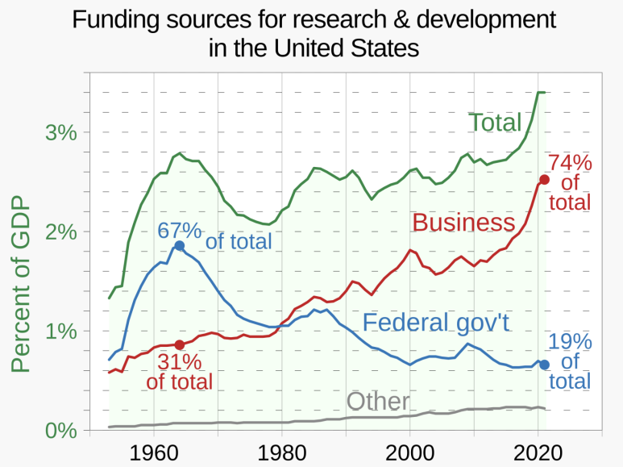
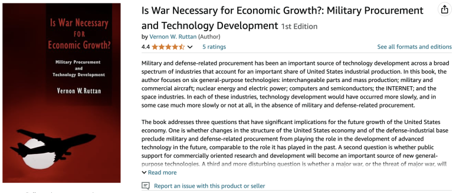

## 미국 과학기술 정책: FFRDC 모델과 Pipeline 모델

미국 과학기술 정책: 주요 모델과 비판적 고찰

미국의 과학기술 정책은 제2차 세계대전 이후 급격히 발전하며 다양한 모델과 논쟁을 통해 현재의 체계를 구축해왔습니다. 이번 글에서는 미국 과학기술 정책의 두 가지 대표적인 모델과 이에 대한 비판을 중심으로 논의하며, 현대 과학기술 정책에 주는 시사점을 탐구하겠습니다.

---

1. 두 가지 주요 모델: FFRDC와 Pipeline 모델

(1) FFRDC 모델

FFRDC(Federally Funded Research and Development Centers)는 정부 주도의 연구개발 기관으로, MIT의 레이더 연구소(Rad Lab) 모델을 기반으로 합니다. 알프레드 리 룸미스가 주도한 이 모델은 정부, 학계, 산업계 간의 협력을 통해 신속한 기술 혁신을 추구합니다. 이는 전시와 같은 긴박한 상황에서 특히 효과를 발휘하며, 현대 과학기술 발전의 토대를 마련했습니다.

Source: Anderson, G.; Moris, F. Federally Funded R&D Declines as a Share of GDP and Total R&D. National Science Foundation, National Center for Science and Engineering Statistics (2023).​

(2) Vannevar Bush의 Pipeline 혁신 모델

반네버 부시(Vannevar Bush)는 그의 저서 Science, The Endless Frontier에서 기본 연구에 대한 지속적인 연방 정부의 투자를 주장하며, 이를 기술 발전의 원동력으로 보았습니다. 이 모델은 기본 연구가 응용 연구와 기술 개발로 이어지는 선형적 구조를 강조하며, 연방 지원 연구 대학(Federally Funded Research Universities) 설립과 같은 기초 과학 연구의 제도적 강화를 뒷받침했습니다.

---

2. Donald Stokes의 비판: Pasteur의 Quadrant

도널드는 Pasteur's Quadrant에서 부시의 선형적 모델을 비판하며, 과학과 기술의 관계가 단순한 일방향이 아니라 상호작용적임을 주장했습니다. 그는 연구를 두 축으로 구분하여 과학 활동의 다양성을 설명했습니다.

기초 이해 추구 여부

실용적 사용 고려 여부

이를 기반으로 연구는 다음 네 가지로 분류됩니다.

순수 기초 연구 (Pure Basic Research)

기초 이해만을 추구 (예: 니엘스 보어의 원자 이론)

​

2. 순수 응용 연구 (Pure Applied Research)

실용적 목적만 중시 (예: 에디슨의 전구 개발)

​

2. 사용-영감을 받은 기초 연구 (Use-Inspired Basic Research)

기초 이해와 실용적 사용 모두 추구 (예: 루이 파스퇴르의 미생물학 연구)

​

4. 비순수 연구 (Non-Pure Research)

기초 이해와 실용적 사용 모두 고려하지 않는 연구 (드물게 존재)

스토크스는 부시 모델이 순수 기초 연구와 응용 연구만 강조하며, 과학과 기술의 복합적 상호작용을 간과했다고 비판했습니다.

​

---

3. Vernon Ruttan의 시각: 전쟁과 기술 혁신

반너 루탄(Vernon Ruttan)은 저서 "Is War Necessary for Economic Growth?"에서 방위산업 연구개발(R&D)이 미국 과학기술 혁신과 경제 성장에 미친 영향을 분석했습니다.

(1) 모든 무기에 호환 가능한 표준 부품 설계와 무기 양산

19세기 초, 조지 워싱턴과 알렉산더 해밀턴은 무기 제조에서 비효율성을 개선하기 위해 정부 주도의 제조 공장을 설립했습니다. John Hall의 노력으로 양산 시스템과 높은 호환성의 부품이 도입되었습니다.

​

(2) 방위 부문의 R&D와 첨단 기술 발전

ENIAC과 같은 초기 컴퓨터와 휠윈드(Whirlwind) 프로젝트는 군사적 필요에서 출발했지만, 민간 기술 발전으로 이어졌습니다. 이는 인터넷과 개인용 컴퓨터의 기초가 되었습니다.

​

(3) 루탄 모델의 시사점

루탄은 방위산업의 연구개발 지원이 단순한 기초 연구 투자보다 기술 혁신을 더 빠르게 이끌었다고 주장했습니다. 이는 부시의 "Pipeline" 모델과 대조되며, 정부의 적극적 개입과 협력이 기술 발전의 핵심임을 강조합니다.

​

 해시태그 : 