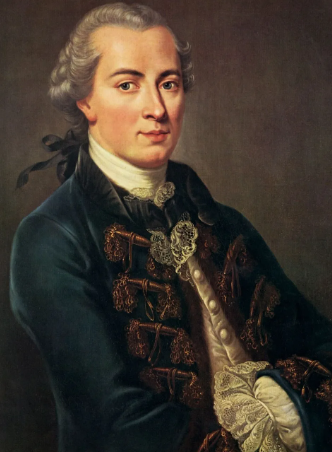
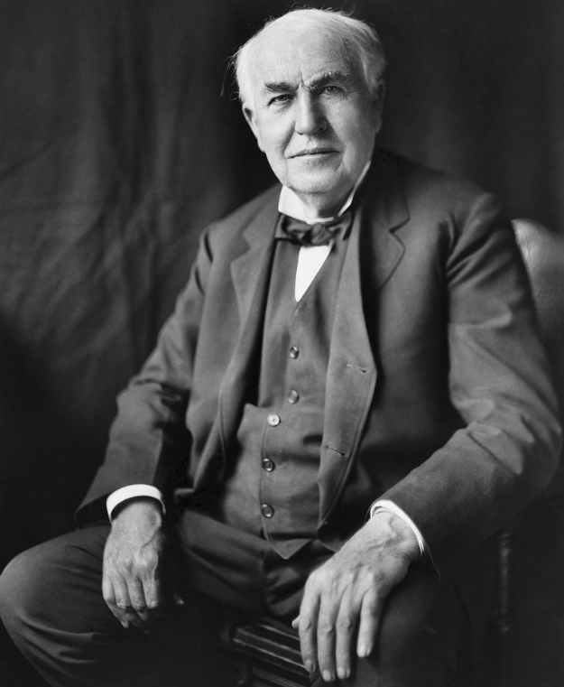

## 과학기술조직론: Team building

> 혁신은 사람 간의 상호작용에서 태어난다

출처 : No Site

대학, 기업, 연구소 등 기관 단위에서의 혁신, 그 근본에는 개인이 가진 아이디어와 사람과 사람의 만남이 자리 잡고 있다는 것입니다.

산업혁명 시기에 인간의 ‘창의적인 손’(the intelligent hand) 개념을 소개해보려고 합니다. 이는 철학자 임마누엘 칸트(Immanuel Kant)가 “손은 마음에 이르는 창문”이라고 표현한 것에서 비롯되었습니다.

요점: 혁신은 지식뿐만 아니라, 부딪히고 만들어보는 과정에서 탄생한다.

---

발상의 순간은 뚝 떨어지지 않는다.

창조와 혁신의 대표적인 예시로 흔히 “반짝 떠오르는 순간💡”을 떠올립니다.

(1) 제임스 와트(James Watt)가 증기기관 아이디어를 골프장 산책 도중 순식간에 떠올렸다는 일화가 유명하죠. 그런데 정말 ‘순간적으로’ 아이디어가 생긴 걸까요?

(2) 대학생 A는 하루종일 컴퓨터 앉아서 코드 버그를 고민하다가... 공원 산책 도중에 갑자기 ABC.py 파일에 문제가 있을 것 같다는 느낌이 들었습니다.

> 이 순간은 사실 엄청난 사전 노력과 지식 축적의 산물

출처 : No Site

즉, 보이지 않는 치열한 학습과 경험이 있었기 때문에 그 아이디어가 스파크처럼 떠오를 수 있었다는 겁니다.

Anders Ericsson: 10,000시간의 법칙, Outlier의 저자인 Anderson 교수님은 ‘전문가로서의 탁월함’을 달성하려면 재능만으로는 부족하고, 반복 훈련(Time on Task)이 필수적이라고 주장합니다.

Michael Polanyi: “손으로 부딪혀가며 습득하는 지식(tacit knowledge)”의 중요성을 강조했습니다.

Eric Kandel: 경험이 뇌를 바꿔 “학습과 경험이 뇌에 물리적 변화를 일으킨다”고 설명

​

결국, 제대로 배우고, 경험하고, 고민해야 배워야 ‘떠오르는 아이디어’를 낳을 수 있다는 메시지입니다.

​

그런데, 이건 프로그램의 디버그 수준의 이야기입니다.

만약에 좀 더 큰 프로젝트, 큰 프로그램을 성공하려면 어떻게 해야할까요?

첫 단추는 "Team building"입니다.

​

영국 산업혁명 팀: 3개 역할

영국 산업혁명의 사례를 보면, 혁신은 한 세대에 걸쳐 완성되는 것이 아니라 서로 다른 배경과 역량을 지닌 사람들이 이어달리기하듯 참여해야 시너지가 난다는 점이 드러납니다.

장인(Craftsmen)

실용적 기술과 실험에 능숙한 사람들

기구제작이나 수학적 이론 교육은 적었지만, 해당 분야의 Field에서 직접 부딪히며 쌓은 실무 지식이 탁월

​

2. 기구 제작자(Instrument Makers)

정밀한 측정과 표준화에 필요한 도구를 만드는 전문가들

이들이 만든 ‘도구’가 혁신의 기반 기술로 작용

​

3.기술 학습자(Technical Learning Community)

수학적·이론적 배경 지식을 갖춘 엔지니어, 과학자

실험 분석을 통해 발명을 체계적이고 재현 가능하게 끌어올림

이 세 그룹이 서로 협업해야 혁신이 폭발적으로 이뤄집니다. 이렇게 3개가 하나의 팀이 됩니다. 그리고 이런 팀의 규모가 클 수록 성과가 큰 경향이 있습니다.

실제로 Nature index 랭킹을 보면, 연구비, 인적자원 함수에 비례합니다.

​

지식경제와 경제성장

Fritz Machlup은 지식경제(Knowledge Economy) 개념을 주창하면서, “더 많은 발명가를 양성하고, 이들이 기술 혁신을 이끌 수 있도록 사회가 적극적으로 뒷받침해야 한다”라고 역설합니다. 여기서 말하는 정책 예시는 다음과 같습니다.

Paul Romer의 이론처럼, 연구개발에 참여하는 ‘인적 자본’이 많을수록 기술 발전이 가속

혁신가를 ‘영웅’으로 만드는 사회 분위기 조성 

사람들이 발명·혁신 분야로 진출하도록 유도

교육 제도 및 연구투자 확충

이처럼 사회적·정책적 지원을 통해 ‘혁신 집단(Innovation Workforce)’을 확대하는 것이 핵심입니다.

참고로... 강조하고싶은 점은, "무작정 R&D 투자 예산을 늘리고, 인적자본을 무작정 늘리라는 것"이 아닙니다.

​

> 이제는 ‘팀’이 답이다: Great Group Theory

출처 : No Site

혁신의 단계(발명의 구현 및 양산)로 가면 혼자만의 아이디어나 역량으로는 부족하다는 사실입니다. 여러 기술과 역량이 결합해야 하고, 이는 필연적으로 ‘사람들 간의 협력’, 곧 팀을 요구합니다.

​

에디슨: ‘전체 시스템의 혁신’

우리가 흔히 ‘에디슨은 전구를 발명했다’라고만 알고 있지만, 사실 그는 발명에서 그치지 않고 전기 인프라 전체를 설계했습니다.

발전기부터 배선, 화재 안전 장치, 공공 서비스 모델까지

전구를 실제로 가정과 도시에서 쓸 수 있도록, 거대한 전력망 시스템을 함께 구축했습니다.

이를 뉴욕 시내 한 블록에 시범 설치하면서, 위험한 가스등 대신 전기 조명을 쓰게 한 건 유명한 ‘첫 시연’ 이벤트였죠.

이처럼, 단일 제품이 아닌 시스템 전체를 바라보는 통합적 접근이 에디슨 팀의 진짜 업적이었다고 볼 수 있습니다.

​

​

‘과학’도, ‘실무’도 동시에: 양방향 연구

에디슨은 스스로를 “단순한 땜장이(tinkerer)”로 표현했지만, 그의 팀은 기초 과학과 실무 기술 사이를 오가며 연구했습니다.

전구를 만들다 발견한 ‘에디슨 효과(Edison Effect)’는 후에 전자 이론 발전의 실마리가 되었습니다.

이는 응용 연구가 결국 기초 과학으로 이어지기도 한다는, 즉 과학 발전이 한 방향이 아니라 양방향으로 이뤄진다는 좋은 예죠.

​

그리고 에디슨은 투자도 잘 받았으니... 사업가적으로도 소질이 있었던 것 같습니다.

---

연구와 몰입

에디슨의 전기를 읽어보면, "몰입, 협업, 열정"에 엄청나게 집착을 하는 것을 알 수 있습니다. 

에디슨이 발명 공장을 도심과 떨어진 외곽에 지은 것은, “집중하고 몰입할 수 있는 혁신의 섬”을 만들기 위함이었습니다. 그리고 공장 내에 벽시계도 설치하지 않았습니다.

에디슨은 JP 모건 같은 투자자와 월스트리트의 “결정권자”들과 긴밀히 연결되어 있었습니다.

이 ‘발명 공장’이라는 섬에서 완성된 아이디어들은, 자본과 인맥이라는 다리를 통해 빠르게 세상에 적용되었습니다.

​

방향이 잘 정해진 상태에서 "몰입, 열정, 협업, 투자"의 연결이라는 네 박자가 맞아떨어지면, 그 끝에는 언제나 신기술과 새로운 가치가 탄생하니까요.

> 위대한 발명은 혼자서는 불가능하다.서로 다른 재능을 가진 사람들과 몰입 할 수 있는 환경이 준비 되었을 때비로소 빛을 발하게 된다.

출처 : No Site

​

 해시태그 : 